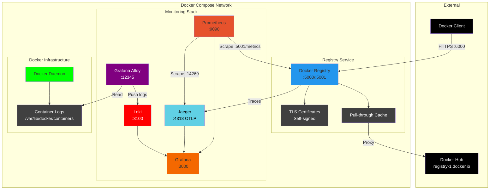

# Local Docker Registry Mirror with TLS and Monitoring Stack

This repository provides a complete setup for a local Docker registry that acts as a Docker Hub mirror (pull-through cache). The registry is secured with TLS using self-signed certificates and includes a full monitoring stack with Prometheus, Jaeger, and Grafana. Once configured, all Docker Hub image pulls will automatically use this local cache, significantly improving download speeds and reducing bandwidth usage.

- [Local Docker Registry Mirror with TLS and Monitoring Stack](#local-docker-registry-mirror-with-tls-and-monitoring-stack)
  - [Overview](#overview)
  - [Prerequisites](#prerequisites)
    - [Required Software](#required-software)
    - [Optional Tools](#optional-tools)
    - [System Requirements](#system-requirements)
    - [Docker Hub Account](#docker-hub-account)
  - [Architecture](#architecture)
  - [Available Commands](#available-commands)
  - [Quick Start](#quick-start)
  - [CFSSL Configuration](#cfssl-configuration)
    - [1. Root CA Configuration (`cfssl/ca.json`)](#1-root-ca-configuration-cfsslcajson)
    - [2. Intermediate CA Configuration (`cfssl/intermediate-ca.json`)](#2-intermediate-ca-configuration-cfsslintermediate-cajson)
    - [3. Registry Certificate Configuration (`cfssl/registry.json`)](#3-registry-certificate-configuration-cfsslregistryjson)
    - [4. Certificate Profiles (`cfssl/cfssl.json`)](#4-certificate-profiles-cfsslcfssljson)
    - [Common Customizations](#common-customizations)
    - [Example for Local Development](#example-for-local-development)
  - [Certificate Generation with CFSSL](#certificate-generation-with-cfssl)
  - [Registry Configuration](#registry-configuration)
    - [Key Configuration Settings](#key-configuration-settings)
      - [Storage Configuration](#storage-configuration)
      - [HTTP/TLS Configuration](#httptls-configuration)
      - [Proxy Cache Configuration](#proxy-cache-configuration)
      - [Health Checks](#health-checks)
  - [Services Architecture](#services-architecture)
    - [Docker Registry (port 6000)](#docker-registry-port-6000)
    - [Jaeger (port 16686)](#jaeger-port-16686)
    - [Prometheus (port 9090)](#prometheus-port-9090)
    - [Grafana (port 3000)](#grafana-port-3000)
  - [Testing the Registry](#testing-the-registry)
    - [Configure Docker to Trust the Registry](#configure-docker-to-trust-the-registry)
      - [Step 1: Configure TLS Trust](#step-1-configure-tls-trust)
        - [Option A: Configure Docker daemon certificates (Recommended)](#option-a-configure-docker-daemon-certificates-recommended)
        - [Option B: System-wide trust (macOS)](#option-b-system-wide-trust-macos)
      - [Step 2: Configure Docker Hub Mirror](#step-2-configure-docker-hub-mirror)
        - [macOS (Docker Desktop)](#macos-docker-desktop)
        - [Linux](#linux)
        - [Verify Mirror Configuration](#verify-mirror-configuration)
    - [Test Registry Access](#test-registry-access)
  - [Monitoring and Observability](#monitoring-and-observability)
    - [Grafana Dashboard](#grafana-dashboard)
    - [Prometheus Queries](#prometheus-queries)
    - [Jaeger Traces](#jaeger-traces)
  - [Management Commands](#management-commands)
    - [Docker Compose Operations](#docker-compose-operations)
    - [Registry Maintenance](#registry-maintenance)
  - [Security Considerations](#security-considerations)
  - [Troubleshooting](#troubleshooting)
    - [Certificate Issues](#certificate-issues)
    - [Registry Connection Issues](#registry-connection-issues)
    - [Metrics Not Appearing](#metrics-not-appearing)
  - [File Structure](#file-structure)
  - [Performance Tuning](#performance-tuning)
  - [References](#references)

## Overview

This setup creates a production-ready local Docker registry with:

- **Docker Hub Mirror**: Acts as a pull-through cache that automatically intercepts and caches Docker Hub images
- **TLS Security**: Self-signed certificates using CFSSL with proper certificate chain
- **Bandwidth Optimization**: Caches images locally to reduce repeated downloads from Docker Hub
- **Distributed Tracing**: OpenTelemetry integration with Jaeger
- **Metrics Collection**: Prometheus scraping with pre-configured dashboards
- **Log Aggregation**: Loki for centralized log collection and querying
- **Visualization**: Grafana dashboards for monitoring registry performance and logs

When properly configured, all `docker pull` commands for Docker Hub images will automatically use your local registry mirror, significantly improving pull speeds and reducing bandwidth usage.

## Prerequisites

### Required Software

1. **Docker** (20.10.0 or later)
   - macOS: `brew install --cask docker` or download from [Docker Desktop](https://www.docker.com/products/docker-desktop)
   - Linux: Follow the [official Docker installation guide](https://docs.docker.com/engine/install/)
   - Verify: `docker --version`

2. **Docker Compose** (2.0.0 or later)
   - Usually included with Docker Desktop on macOS/Windows
   - Linux: `sudo apt-get install docker-compose-plugin` or follow [official guide](https://docs.docker.com/compose/install/)
   - Verify: `docker-compose --version`

3. **CFSSL** (CloudFlare's PKI toolkit)
   - macOS: `brew install cfssl`
   - Linux: `sudo apt-get install golang-cfssl` or download from [CFSSL releases](https://github.com/cloudflare/cfssl/releases)
   - Verify: `cfssl version`

4. **Make** (GNU Make 3.81 or later)
   - macOS: Included with Xcode Command Line Tools or `brew install make`
   - Linux: `sudo apt-get install build-essential`
   - Verify: `make --version`

5. **OpenSSL** (for certificate verification)
   - macOS/Linux: Usually pre-installed
   - Verify: `openssl version`

### Optional Tools

- **curl** or **wget**: For testing endpoints (usually pre-installed)
- **jq**: For parsing JSON responses (`brew install jq` or `apt-get install jq`)

### System Requirements

- **Disk Space**: At least 10GB free for Docker images and registry storage
- **Memory**: Minimum 4GB RAM (8GB recommended for full monitoring stack)
- **Ports**: Ensure the following ports are available:
  - 6000: Registry API
  - 3000: Grafana
  - 9090: Prometheus
  - 16686: Jaeger UI
  - 3100: Loki
  - 12345: Alloy UI

### Docker Hub Account

You'll need a Docker Hub account for the pull-through cache functionality:

1. Create a free account at [hub.docker.com](https://hub.docker.com)
2. Note your username and password for the `.env` configuration

## Architecture



## Available Commands

Run `make help` to see all available commands:

```bash
make help         # Show all available commands
make quickstart   # One-command setup: generates certs and starts services
make certs        # Generate all TLS certificates
make up           # Start all services
make down         # Stop all services
make status       # Check service status and URLs
make logs         # View logs from all services
make clean        # Stop services and remove volumes

# TLS configuration
make configure-docker-tls                # Configure Docker to trust registry
make trust-cert                          # Trust CA in system keychain (macOS)

# Registry API commands
make list-repos                          # List all repositories
make list-tags REPO=library/alpine       # List tags for a repository
make get-manifest REPO=library/alpine TAG=latest  # Get image manifest
```

## Quick Start

1. **Set up environment variables**:

   ```bash
   cat <<EOF > .env
   REGISTRY_PROXY_USERNAME=<your_docker_hub_username>
   REGISTRY_PROXY_PASSWORD=<your_docker_hub_password>
   GF_SECURITY_ADMIN_USER=admin
   GF_SECURITY_ADMIN_PASSWORD=admin
   EOF
   ```

2. **Quick start (generates certs and starts services)**:

   ```bash
   make quickstart
   ```

3. **Configure Docker to trust the registry**:

   ```bash
   # Required: Configure Docker daemon to trust the registry
   make configure-docker-tls

   # Optional: Add to system keychain (macOS)
   make trust-cert
   ```

4. **Access services**:

   ```bash
   make status  # Shows all service URLs and status
   ```

   Service URLs:
   - Registry API: <https://localhost:6000/v2/> (Docker Registry HTTP API V2)
   - Grafana: <http://localhost:3000> (admin/admin)
   - Prometheus: <http://localhost:9090>
   - Jaeger: <http://localhost:16686>
   - Loki: <http://localhost:3100>
   - Alloy: <http://localhost:12345> (Grafana Alloy UI)

5. **View logs in Grafana**:
   - Navigate to <http://localhost:3000>
   - Login with admin/admin
   - Go to Explore → Select Loki datasource
   - Try queries like `{container_name="registry"}` or `{job="docker_logs"}`

## CFSSL Configuration

Before generating certificates, you need to customize the CFSSL configuration files for your environment. The following files contain default values that should be updated:

### 1. Root CA Configuration (`cfssl/ca.json`)

Edit the following fields in `cfssl/ca.json`:

```json
{
  "CN": "Your Organization Root CA",     // Replace with your root CA name
  "names": [{
    "C": "US",                           // Your country code
    "L": "Your City",                    // Your city
    "O": "Your Organization",            // Your organization name
    "OU": "Your Department",             // Your department/unit
    "ST": "Your State"                   // Your state/province
  }]
}
```

### 2. Intermediate CA Configuration (`cfssl/intermediate-ca.json`)

Update the same fields in `cfssl/intermediate-ca.json`:

```json
{
  "CN": "Your Organization Intermediate CA",
  "names": [{
    "C": "US",
    "L": "Your City",
    "O": "Your Organization",
    "OU": "Your Department",
    "ST": "Your State"
  }],
  "ca": {
    "expiry": "42720h"    // 5 years - adjust as needed
  }
}
```

### 3. Registry Certificate Configuration (`cfssl/registry.json`)

This is the most important configuration to customize:

```json
{
  "CN": "registry.yourdomain.com",        // Your registry's FQDN
  "hosts": [
    "registry.yourdomain.com",            // Your registry's domain
    "registry",                           // Short hostname
    "localhost",                          // Keep for local testing
    "127.0.0.1",                          // Localhost IP
    "10.0.0.100"                          // Your registry's IP (if static)
  ],
  "names": [{
    "C": "US",
    "L": "Your City",
    "O": "Your Organization",
    "OU": "Your Department",
    "ST": "Your State"
  }]
}
```

### 4. Certificate Profiles (`cfssl/cfssl.json`)

The default profiles are suitable for most use cases, but you can adjust certificate expiry times:

```json
{
  "signing": {
    "profiles": {
      "intermediate_ca": {
        "expiry": "8760h",    // 1 year - adjust as needed
        ...
      },
      "server": {
        "expiry": "8760h",    // 1 year for server certs
        ...
      }
    }
  }
}
```

### Common Customizations

1. **For Local Development**:
   - Keep "localhost" and "127.0.0.1" in the hosts array
   - Add your machine's hostname
   - Use a simple organization name like "Development"

2. **For Production**:
   - Use proper FQDN for the registry
   - Add all possible access names (load balancer DNS, service names, etc.)
   - Set appropriate certificate expiry times
   - Use official organization details

3. **For Kubernetes**:
   - Add service names: `registry.namespace.svc.cluster.local`
   - Add service IPs if using ClusterIP
   - Include any ingress hostnames

### Example for Local Development

Here's a complete example for local development:

```bash
# Edit ca.json
sed -i '' 's/Smigula Root CA/My Local Root CA/g' cfssl/ca.json
sed -i '' 's/Smigula/My Organization/g' cfssl/ca.json
sed -i '' 's/Tampa/My City/g' cfssl/ca.json
sed -i '' 's/FL/My State/g' cfssl/ca.json

# Edit registry.json for local use
cat > cfssl/registry.json <<EOF
{
  "CN": "localhost",
  "hosts": [
    "localhost",
    "127.0.0.1",
    "registry",
    "registry.local",
    "*.local"
  ],
  "key": {
    "algo": "rsa",
    "size": 2048
  },
  "names": [{
    "C": "US",
    "L": "My City",
    "O": "My Organization",
    "OU": "Development",
    "ST": "My State"
  }]
}
EOF
```

## Certificate Generation with CFSSL

After customizing the configuration files, you can generate the certificates. This setup uses a proper PKI hierarchy with root and intermediate CAs:

```bash
# Generate all certificates at once
make certs

# Or generate them step by step:
make cert-ca              # Generate root CA
make cert-intermediate    # Generate intermediate CA
make cert-registry        # Generate registry certificates

# Verify the certificate chain
make verify-certs
```

The Makefile automates the following steps:

1. Generates root CA certificate
2. Generates intermediate CA certificate
3. Signs intermediate CA with root CA
4. Generates registry certificates (peer, server, client profiles)
5. Creates certificate chain for the registry

## Registry Configuration

The Docker Registry is configured via `config.yaml`. For detailed configuration options, see the [official registry documentation](https://distribution.github.io/distribution/about/configuration/).

### Key Configuration Settings

Our configuration (`config.yaml`) includes:

#### Storage Configuration

```yaml
storage:
  delete:
    enabled: true                         # Allows deletion of image blobs
  cache:
    blobdescriptor: inmemory              # In-memory cache for blob metadata
  filesystem:
    rootdirectory: /var/lib/registry
```

#### HTTP/TLS Configuration

```yaml
http:
  addr: :5000                               # Main API port
  debug:
    addr: :5001                             # Debug/metrics endpoint
    prometheus:
      enabled: true                         # Expose Prometheus metrics
      path: /metrics
  tls:
    certificate: /etc/ssl/certs/domain.crt  # Full cert chain
    key: /etc/ssl/private/domain.key        # Private key
    minimumtls: tls1.2                      # Enforce TLS 1.2 minimum
```

#### Proxy Cache Configuration

```yaml
proxy:
  remoteurl: https://registry-1.docker.io  # Docker Hub
  username: ${DOCKER_HUB_USERNAME}         # From environment
  password: ${DOCKER_HUB_PASSWORD}         # From environment
```

#### Health Checks

```yaml
health:
  storagedriver:
    enabled: true
    interval: 10s
    threshold: 3
```

## Services Architecture

### Docker Registry (port 6000)

- **Purpose**: Local Docker image storage and Docker Hub proxy cache
- **Features**:
  - TLS encryption with self-signed certificates
  - Pull-through cache for Docker Hub
  - OpenTelemetry tracing to Jaeger
  - Prometheus metrics exposure
- **API Endpoints** (accessible at `https://localhost:6000`):
  - `/v2/` - API version check
  - `/v2/_catalog` - List all repositories
  - `/v2/{name}/tags/list` - List tags for a repository
  - `/v2/{name}/manifests/{reference}` - Get/Put/Delete manifests
  - `/v2/{name}/blobs/{digest}` - Get/Put/Delete blobs
- **Internal endpoints**:
  - `:5000` - Main API (mapped to host port 6000)
  - `:5001` - Debug/metrics (internal only)

### Jaeger (port 16686)

- **Purpose**: Distributed tracing for registry operations
- **Features**:
  - Collects traces via OTLP protocol
  - Provides trace visualization and analysis
- **Internal endpoints**:
  - `:4317` - OTLP gRPC
  - `:4318` - OTLP HTTP
  - `:14269` - Metrics for Prometheus

### Prometheus (port 9090)

- **Purpose**: Metrics collection and storage
- **Scrape targets**:
  - Docker Registry metrics (HTTP with mutual TLS authentication)
  - Jaeger metrics
  - Self-monitoring
- **Configuration**: `prometheus/prometheus.yml`
- **TLS Setup**: Uses registry certificates for client authentication when scraping metrics

### Loki (port 3100)

- **Purpose**: Log aggregation system for collecting and querying logs
- **Features**:
  - Collects logs from Docker containers via Grafana Alloy
  - Supports LogQL query language for log searching
  - Uses TSDB (Time Series Database) index for efficient storage
  - Schema v13 with structured metadata support
  - 7-day retention policy with automatic cleanup
  - Integrates seamlessly with Grafana for visualization
- **Configuration**: `loki/loki-config.yaml`
  - Storage: Filesystem-based with TSDB shipper
  - Retention: 168 hours (7 days)
  - Ingestion limits: 4MB/s rate, 6MB burst
- **Internal endpoints**:
  - `:3100/ready` - Health check endpoint
  - `:3100/loki/api/v1/push` - Log ingestion endpoint
  - `:3100/loki/api/v1/query_range` - Query endpoint for log ranges
- **Log Collection**: Uses Grafana Alloy to collect Docker container logs

### Grafana Alloy (port 12345)

- **Purpose**: Modern observability collector that replaces Promtail
- **Features**:
  - Automatically discovers Docker containers via Docker API
  - Collects and processes container logs
  - Extracts metadata and labels from containers
  - Parses JSON log format and extracts fields
  - Provides a web UI for monitoring collection status
  - Supports complex processing pipelines
- **Configuration**: `alloy/config.alloy`
- **UI Access**: <http://localhost:12345>
- **Note**: Requires access to Docker socket and container log files

### Grafana (port 3000)

- **Purpose**: Metrics visualization and dashboards
- **Features**:
  - Pre-configured datasources (Prometheus, Jaeger, Loki)
  - Docker Registry dashboard included
  - Log exploration with Loki integration
  - Anonymous viewer access enabled
- **Default credentials**: Configured in `.env`

## Testing the Registry

### Configure Docker to Trust the Registry

Before Docker can communicate with the registry, you need to configure both TLS trust and registry mirroring:

#### Step 1: Configure TLS Trust

##### Option A: Configure Docker daemon certificates (Recommended)

**Linux:**

```bash
# Create Docker certificate directory for the registry
sudo mkdir -p /etc/docker/certs.d/localhost:6000

# Copy the CA certificate (required)
sudo cp certs/ca.pem /etc/docker/certs.d/localhost:6000/ca.crt

# Set proper permissions
sudo chmod 644 /etc/docker/certs.d/localhost:6000/ca.crt

# Optional: For mutual TLS authentication
sudo cp certs/registry-peer.pem /etc/docker/certs.d/localhost:6000/client.cert
sudo cp certs/registry-peer-key.pem /etc/docker/certs.d/localhost:6000/client.key
sudo chmod 644 /etc/docker/certs.d/localhost:6000/client.cert
sudo chmod 600 /etc/docker/certs.d/localhost:6000/client.key
```

**macOS:**

```bash
# Create Docker certificate directory for the registry
mkdir -p $HOME/.docker/certs.d/localhost:6000

# Copy the CA certificate (required)
cp certs/ca.pem $HOME/.docker/certs.d/localhost:6000/ca.crt

# Optional: For mutual TLS authentication
cp certs/registry-peer.pem $HOME/.docker/certs.d/localhost:6000/client.cert
cp certs/registry-peer-key.pem $HOME/.docker/certs.d/localhost:6000/client.key
chmod 644 $HOME/.docker/certs.d/localhost:6000/client.cert
chmod 600 $HOME/.docker/certs.d/localhost:6000/client.key
```

##### Option B: System-wide trust (macOS)

```bash
# This command adds all certificates to system keychain
make trust-cert

# Or manually add each certificate:
sudo security add-trusted-cert -d -r trustRoot -k /Library/Keychains/System.keychain certs/ca.pem
sudo security add-trusted-cert -d -r trustRoot -k /Library/Keychains/System.keychain certs/intermediate_ca.pem
sudo security add-trusted-cert -d -r trustRoot -k /Library/Keychains/System.keychain certs/registry-server.pem
```

#### Step 2: Configure Docker Hub Mirror

To use this registry as a pull-through cache for Docker Hub, update your Docker daemon configuration:

##### macOS (Docker Desktop)

1. Open Docker Desktop preferences
2. Go to Docker Engine settings
3. Update the JSON configuration:

```json
{
  "registry-mirrors": ["https://localhost:6000"]
}
```

4. Click "Apply & Restart"

##### Linux

1. Edit or create `/etc/docker/daemon.json`:

```bash
sudo nano /etc/docker/daemon.json
```

2. Add or update the configuration:

```json
{
  "registry-mirrors": ["https://localhost:6000"]
}
```

3. Restart Docker:

```bash
sudo systemctl restart docker
```

##### Verify Mirror Configuration

```bash
# Check Docker daemon configuration
docker info | grep -A1 "Registry Mirrors"

# Should show:
# Registry Mirrors:
#  https://localhost:6000/
```

### Test Registry Access

1. **Test the registry mirror (pull-through cache)**:

   ```bash
   # With registry-mirrors configured, this automatically uses your local registry
   docker pull alpine:latest

   # Check that the image was cached in your registry
   curl -sk https://localhost:6000/v2/_catalog
   # Should show: {"repositories":["library/alpine"]}
   ```

2. **Test direct registry access**:

   ```bash
   # Pull directly from the registry (bypasses mirror config)
   make test-pull
   # Or: docker pull localhost:6000/library/alpine:latest
   ```

3. **Test pushing to the registry**:

   ```bash
   # Push a local image to the registry
   make test-push
   # Or: docker tag alpine:latest localhost:6000/myimage:latest
   #     docker push localhost:6000/myimage:latest
   ```

   Note: When configured as a mirror, the registry only caches images from Docker Hub. 
   To push your own images, you must use the full registry URL (localhost:6000).

4. **Access the Registry API directly**:

   The registry implements the [Docker Registry HTTP API V2](https://docs.docker.com/registry/spec/api/). Common endpoints:

   ```bash
   # Check registry availability
   curl -k https://localhost:6000/v2/

   # List all repositories
   curl -k https://localhost:6000/v2/_catalog

   # List tags for a specific repository
   curl -k https://localhost:6000/v2/library/alpine/tags/list

   # Get manifest for a specific tag
   curl -k https://localhost:6000/v2/library/alpine/manifests/latest

   # Get image configuration
   curl -k -H "Accept: application/vnd.docker.distribution.manifest.v2+json" \
        https://localhost:6000/v2/library/alpine/manifests/latest
   ```

   Note: The registry does not have a web UI. All interactions are through the Docker client or the HTTP API.

## Monitoring and Observability

### Grafana Dashboard

1. Access at <http://localhost:3000>
2. Login with configured credentials
3. Navigate to **Dashboards → Docker Registry**
4. Monitor:
   - HTTP request rates and latencies
   - Cache hit ratios
   - Response code distribution
   - Storage metrics
5. For log exploration:
   - Navigate to **Explore → Loki**
   - Query registry logs using LogQL

### Prometheus Queries

Access at <http://localhost:9090> and try these queries:

```promql
# Request rate by method
rate(registry_http_requests_total[5m])

# 99th percentile latency
histogram_quantile(0.99, rate(registry_http_request_duration_seconds_bucket[5m]))

# Cache hit ratio
rate(registry_storage_cache_hits_total[5m]) / rate(registry_storage_cache_requests_total[5m])
```

### Jaeger Traces

1. Access at <http://localhost:16686>
2. Select service: `docker-registry`
3. View traces for:
   - Image pulls/pushes
   - Manifest operations
   - Blob uploads/downloads

### Loki Log Queries

Access Loki through Grafana's Explore interface or use these example LogQL queries:

```logql
# View all Docker container logs
{job="docker_logs"}

# View logs from the registry container
{container_name="registry"}

# Filter by compose service
{compose_service="registry"}

# Filter registry logs by level
{container_name="registry"} |= "level=error"

# Search for specific operations in registry
{container_name="registry"} |= "pull" |= "manifest"

# View logs from all monitoring stack containers
{compose_project="registry"} |> {container_name=~"registry|prometheus|grafana|loki|alloy"}

# Parse and filter registry logs by HTTP status
{container_name="registry"} | json | line_format "{{.log}}" | regexp `(?P<method>\S+)\s+(?P<path>\S+)\s+(?P<status>\d{3})` | status >= 400

# Show logs for specific image pulls
{container_name="registry"} |= "library/alpine"

# Rate of errors over time
rate({container_name="registry"} |= "error" [5m])

# View Alloy collector logs
{container_name="alloy"}
```

## Management Commands

### Docker Compose Operations

```bash
# Start all services
make up

# Stop all services
make down

# Restart all services
make restart

# View logs
make logs              # All services
make logs-registry     # Registry only
make logs-prometheus   # Prometheus only
make logs-grafana      # Grafana only
make logs-jaeger       # Jaeger only
make logs-loki         # Loki only
make logs-alloy        # Alloy only

# Clean up (including volumes)
make clean

# Check service status
make status
```

### Registry Maintenance

```bash
# Garbage collection (remove unused blobs)
make gc

# Check registry health
make health

# List repositories in registry
curl -k https://localhost:6000/v2/_catalog

# Get repository tags
curl -k https://localhost:6000/v2/<repository>/tags/list

# View registry metrics
make metrics
```

## Security Considerations

1. **Self-signed certificates**: Not suitable for production environments
2. **Credentials**: Stored in `.env` file - ensure it's in `.gitignore`
3. **Network isolation**: Internal service ports not exposed to host
4. **TLS enforcement**: Minimum TLS 1.2 with strong cipher suites
5. **Mutual TLS**: Prometheus authenticates to registry using client certificates
6. **Access control**: Consider implementing token authentication for production

## Troubleshooting

### Loki/Alloy Issues

1. **No logs appearing in Grafana**:
   - Check if Alloy is running and healthy:
     ```bash
     docker-compose logs alloy
     ```
   - Access Alloy UI at <http://localhost:12345> to check status
   - Verify Docker container logs location exists:
     ```bash
     ls -la /var/lib/docker/containers/
     ```
   - Check if Alloy is discovering containers properly in the UI

2. **"failed to tail file" errors in Alloy logs**:
   - This usually means the log file path pattern is incorrect
   - Docker logs are stored as `<container_id>/<container_id>-json.log`
   - Ensure the Alloy config uses the correct path pattern

3. **Loki configuration errors**:
   - Modern Loki requires schema v13 and TSDB index type
   - If you see schema-related errors, ensure you're using the latest config
   - Check Loki logs: `docker-compose logs loki`

4. **Permission denied errors**:
   - Alloy needs read access to Docker container logs
   - The Docker socket mount is required for container discovery
   - On some systems, you may need to adjust permissions

5. **Debugging tips**:
   - Access the Alloy UI at <http://localhost:12345>
   - Navigate to the graph page to see component status
   - Check discovered targets and their labels
   - Use Loki's API to verify log ingestion:
     ```bash
     curl -G -s --data-urlencode 'query={job="docker_logs"}' \
          --data-urlencode 'limit=5' \
          http://localhost:3100/loki/api/v1/query_range
     ```

### Certificate Issues

```bash
# Verify certificate chain
make verify-certs

# Test TLS connection
make test-tls
```

### Registry Connection Issues

```bash
# Check if registry is responding
make health

# Test specific API endpoints
curl -k https://localhost:6000/v2/
curl -k https://localhost:6000/v2/_catalog

# View detailed logs
make logs-registry
```

### Metrics Not Appearing

1. Check Prometheus targets:

   ```bash
   make prometheus-targets
   ```

2. Verify registry metrics endpoint:

   ```bash
   make metrics
   ```

3. Check Prometheus logs:

   ```bash
   make logs-prometheus
   ```

4. Verify TLS certificates are properly mounted in Prometheus container:

   ```bash
   make verify-prometheus-certs
   ```

5. Check Docker certificate configuration:

   ```bash
   # Linux
   ls -la /etc/docker/certs.d/localhost:6000/

   # macOS
   ls -la $HOME/.docker/certs.d/localhost:6000/
   ```

## File Structure

```text
.
├── cfssl/                    # Certificate configurations
│   ├── ca.json               # Root CA config
│   ├── intermediate-ca.json  # Intermediate CA config
│   ├── cfssl.json            # Certificate profiles
│   └── registry.json         # Registry certificate config
├── certs/                    # Generated certificates (git ignored)
├── prometheus/               # Prometheus configuration
│   └── prometheus.yml        # Scrape configurations with TLS client auth
├── loki/                     # Loki configuration
│   └── loki-config.yaml      # Loki server configuration
├── alloy/                    # Grafana Alloy configuration
│   └── config.alloy          # Alloy collector configuration
├── grafana/                  # Grafana provisioning
│   └── provisioning/
│       ├── datasources/      # Pre-configured datasources (Prometheus, Jaeger, Loki)
│       └── dashboards/       # Pre-configured dashboards
├── config.yaml               # Registry configuration
├── docker-compose.yaml       # Service definitions
├── .env.example              # Environment template
└── .gitignore                # Git ignore patterns
```

## Performance Tuning

- **Cache size**: Adjust blob descriptor cache size for larger deployments
- **Concurrent operations**: Modify `tag.concurrencylimit` based on load
- **Storage driver**: Consider S3 or other drivers for production
- **Resource limits**: Add CPU/memory limits in docker-compose.yaml

## References

- [Docker Registry Configuration Reference](https://distribution.github.io/distribution/about/configuration/)
- [Docker Hub Registry Mirror Documentation](https://docs.docker.com/docker-hub/image-library/mirror/)
- [CFSSL Documentation](https://github.com/cloudflare/cfssl)
- [OpenTelemetry Registry Instrumentation](https://opentelemetry.io/)
