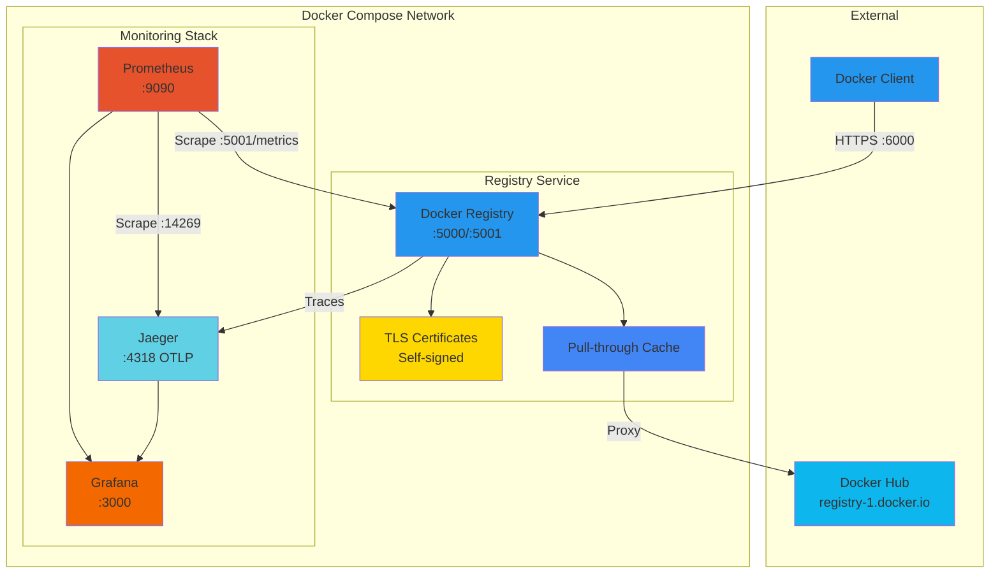

# Local Docker Registry with TLS and Monitoring Stack

This repository provides a complete setup for a local Docker registry secured with TLS using self-signed certificates. The registry is configured as a pull-through cache for Docker Hub and includes a full monitoring stack with Prometheus, Jaeger, and Grafana.

- [Local Docker Registry with TLS and Monitoring Stack](#local-docker-registry-with-tls-and-monitoring-stack)
  - [Overview](#overview)
  - [Prerequisites](#prerequisites)
    - [Required Software](#required-software)
    - [Optional Tools](#optional-tools)
    - [System Requirements](#system-requirements)
    - [Docker Hub Account](#docker-hub-account)
  - [Architecture](#architecture)
  - [Available Commands](#available-commands)
  - [Quick Start](#quick-start)
  - [Certificate Generation with CFSSL](#certificate-generation-with-cfssl)
  - [Registry Configuration](#registry-configuration)
    - [Key Configuration Settings](#key-configuration-settings)
      - [Storage Configuration](#storage-configuration)
      - [HTTP/TLS Configuration](#httptls-configuration)
      - [Proxy Cache Configuration](#proxy-cache-configuration)
      - [Health Checks](#health-checks)
  - [Services Architecture](#services-architecture)
    - [Docker Registry (port 6000)](#docker-registry-port-6000)
    - [Jaeger (port 16686)](#jaeger-port-16686)
    - [Prometheus (port 9090)](#prometheus-port-9090)
    - [Grafana (port 3000)](#grafana-port-3000)
  - [Testing the Registry](#testing-the-registry)
  - [Monitoring and Observability](#monitoring-and-observability)
    - [Grafana Dashboard](#grafana-dashboard)
    - [Prometheus Queries](#prometheus-queries)
    - [Jaeger Traces](#jaeger-traces)
  - [Management Commands](#management-commands)
    - [Docker Compose Operations](#docker-compose-operations)
    - [Registry Maintenance](#registry-maintenance)
  - [Security Considerations](#security-considerations)
  - [Troubleshooting](#troubleshooting)
    - [Certificate Issues](#certificate-issues)
    - [Registry Connection Issues](#registry-connection-issues)
    - [Metrics Not Appearing](#metrics-not-appearing)
  - [File Structure](#file-structure)
  - [Performance Tuning](#performance-tuning)
  - [References](#references)


## Overview

This setup creates a production-ready local Docker registry with:

- **TLS Security**: Self-signed certificates using CFSSL with proper certificate chain
- **Pull-through Cache**: Caches images from Docker Hub to reduce bandwidth and improve speed
- **Distributed Tracing**: OpenTelemetry integration with Jaeger
- **Metrics Collection**: Prometheus scraping with pre-configured dashboards
- **Visualization**: Grafana dashboards for monitoring registry performance

## Prerequisites

### Required Software

1. **Docker** (20.10.0 or later)
   - macOS: `brew install --cask docker` or download from [Docker Desktop](https://www.docker.com/products/docker-desktop)
   - Linux: Follow the [official Docker installation guide](https://docs.docker.com/engine/install/)
   - Verify: `docker --version`

2. **Docker Compose** (2.0.0 or later)
   - Usually included with Docker Desktop on macOS/Windows
   - Linux: `sudo apt-get install docker-compose-plugin` or follow [official guide](https://docs.docker.com/compose/install/)
   - Verify: `docker-compose --version`

3. **CFSSL** (CloudFlare's PKI toolkit)
   - macOS: `brew install cfssl`
   - Linux: `sudo apt-get install golang-cfssl` or download from [CFSSL releases](https://github.com/cloudflare/cfssl/releases)
   - Verify: `cfssl version`

4. **Make** (GNU Make 3.81 or later)
   - macOS: Included with Xcode Command Line Tools or `brew install make`
   - Linux: `sudo apt-get install build-essential`
   - Verify: `make --version`

5. **OpenSSL** (for certificate verification)
   - macOS/Linux: Usually pre-installed
   - Verify: `openssl version`

### Optional Tools

- **curl** or **wget**: For testing endpoints (usually pre-installed)
- **jq**: For parsing JSON responses (`brew install jq` or `apt-get install jq`)

### System Requirements

- **Disk Space**: At least 10GB free for Docker images and registry storage
- **Memory**: Minimum 4GB RAM (8GB recommended for full monitoring stack)
- **Ports**: Ensure the following ports are available:
  - 6000: Registry API
  - 3000: Grafana
  - 9090: Prometheus
  - 16686: Jaeger UI

### Docker Hub Account

You'll need a Docker Hub account for the pull-through cache functionality:

1. Create a free account at [hub.docker.com](https://hub.docker.com)
2. Note your username and password for the `.env` configuration

## Architecture



## Available Commands

Run `make help` to see all available commands:

```bash
make help         # Show all available commands
make quickstart   # One-command setup: generates certs and starts services
make certs        # Generate all TLS certificates
make up           # Start all services
make down         # Stop all services
make status       # Check service status and URLs
make logs         # View logs from all services
make clean        # Stop services and remove volumes
```

## Quick Start

1. **Set up environment variables**:

   ```bash
   cat <<EOF > .env
   REGISTRY_PROXY_USERNAME=<your_docker_hub_username>
   REGISTRY_PROXY_PASSWORD=<your_docker_hub_password>
   GF_SECURITY_ADMIN_USER=admin
   GF_SECURITY_ADMIN_PASSWORD=admin
   EOF
   ```

2. **Quick start (generates certs and starts services)**:

   ```bash
   make quickstart
   ```

3. **Trust the CA certificate (macOS)**:

   ```bash
   make trust-cert
   ```

4. **Access services**:

   ```bash
   make status  # Shows all service URLs and status
   ```

   Service URLs:
   - Registry API: <https://localhost:6000>
   - Grafana: <http://localhost:3000> (admin/admin)
   - Prometheus: <http://localhost:9090>
   - Jaeger: <http://localhost:16686>

## Certificate Generation with CFSSL

This setup uses a proper PKI hierarchy with root and intermediate CAs:

```bash
# Generate all certificates at once
make certs

# Or generate them step by step:
make cert-ca              # Generate root CA
make cert-intermediate    # Generate intermediate CA
make cert-registry        # Generate registry certificates

# Verify the certificate chain
make verify-certs
```

The Makefile automates the following steps:

1. Generates root CA certificate
2. Generates intermediate CA certificate
3. Signs intermediate CA with root CA
4. Generates registry certificates (peer, server, client profiles)
5. Creates certificate chain for the registry

## Registry Configuration

The Docker Registry is configured via `config.yaml`. For detailed configuration options, see the [official registry documentation](https://distribution.github.io/distribution/about/configuration/).

### Key Configuration Settings

Our configuration (`config.yaml`) includes:

#### Storage Configuration

```yaml
storage:
  delete:
    enabled: true                         # Allows deletion of image blobs
  cache:
    blobdescriptor: inmemory              # In-memory cache for blob metadata
  filesystem:
    rootdirectory: /var/lib/registry
```

#### HTTP/TLS Configuration

```yaml
http:
  addr: :5000                               # Main API port
  debug:
    addr: :5001                             # Debug/metrics endpoint
    prometheus:
      enabled: true                         # Expose Prometheus metrics
      path: /metrics
  tls:
    certificate: /etc/ssl/certs/domain.crt  # Full cert chain
    key: /etc/ssl/private/domain.key        # Private key
    minimumtls: tls1.2                      # Enforce TLS 1.2 minimum
```

#### Proxy Cache Configuration

```yaml
proxy:
  remoteurl: https://registry-1.docker.io  # Docker Hub
  username: ${DOCKER_HUB_USERNAME}         # From environment
  password: ${DOCKER_HUB_PASSWORD}         # From environment
```

#### Health Checks

```yaml
health:
  storagedriver:
    enabled: true
    interval: 10s
    threshold: 3
```

## Services Architecture

### Docker Registry (port 6000)

- **Purpose**: Local Docker image storage and Docker Hub proxy cache
- **Features**:
  - TLS encryption with self-signed certificates
  - Pull-through cache for Docker Hub
  - OpenTelemetry tracing to Jaeger
  - Prometheus metrics exposure
- **Internal endpoints**:
  - `:5000` - Main API (mapped to host port 6000)
  - `:5001` - Debug/metrics (internal only)

### Jaeger (port 16686)

- **Purpose**: Distributed tracing for registry operations
- **Features**:
  - Collects traces via OTLP protocol
  - Provides trace visualization and analysis
- **Internal endpoints**:
  - `:4317` - OTLP gRPC
  - `:4318` - OTLP HTTP
  - `:14269` - Metrics for Prometheus

### Prometheus (port 9090)

- **Purpose**: Metrics collection and storage
- **Scrape targets**:
  - Docker Registry metrics (HTTP with mutual TLS authentication)
  - Jaeger metrics
  - Self-monitoring
- **Configuration**: `prometheus/prometheus.yml`
- **TLS Setup**: Uses registry certificates for client authentication when scraping metrics

### Grafana (port 3000)

- **Purpose**: Metrics visualization and dashboards
- **Features**:
  - Pre-configured datasources (Prometheus, Jaeger)
  - Docker Registry dashboard included
  - Anonymous viewer access enabled
- **Default credentials**: Configured in `.env`

## Testing the Registry

1. **Trust the CA certificate** (macOS):

   ```bash
   make trust-cert
   ```

2. **Test pulling an image through the cache**:

   ```bash
   make test-pull
   ```

3. **Test pushing an image**:

   ```bash
   make test-push
   ```

## Monitoring and Observability

### Grafana Dashboard

1. Access at <http://localhost:3000>
2. Login with configured credentials
3. Navigate to **Dashboards → Docker Registry**
4. Monitor:
   - HTTP request rates and latencies
   - Cache hit ratios
   - Response code distribution
   - Storage metrics

### Prometheus Queries

Access at <http://localhost:9090> and try these queries:

```promql
# Request rate by method
rate(registry_http_requests_total[5m])

# 99th percentile latency
histogram_quantile(0.99, rate(registry_http_request_duration_seconds_bucket[5m]))

# Cache hit ratio
rate(registry_storage_cache_hits_total[5m]) / rate(registry_storage_cache_requests_total[5m])
```

### Jaeger Traces

1. Access at <http://localhost:16686>
2. Select service: `docker-registry`
3. View traces for:
   - Image pulls/pushes
   - Manifest operations
   - Blob uploads/downloads

## Management Commands

### Docker Compose Operations

```bash
# Start all services
make up

# Stop all services
make down

# Restart all services
make restart

# View logs
make logs              # All services
make logs-registry     # Registry only
make logs-prometheus   # Prometheus only
make logs-grafana      # Grafana only
make logs-jaeger       # Jaeger only

# Clean up (including volumes)
make clean

# Check service status
make status
```

### Registry Maintenance

```bash
# Garbage collection (remove unused blobs)
make gc

# Check registry health
make health

# View registry metrics
make metrics
```

## Security Considerations

1. **Self-signed certificates**: Not suitable for production environments
2. **Credentials**: Stored in `.env` file - ensure it's in `.gitignore`
3. **Network isolation**: Internal service ports not exposed to host
4. **TLS enforcement**: Minimum TLS 1.2 with strong cipher suites
5. **Mutual TLS**: Prometheus authenticates to registry using client certificates
6. **Access control**: Consider implementing token authentication for production

## Troubleshooting

### Certificate Issues

```bash
# Verify certificate chain
make verify-certs

# Test TLS connection
make test-tls
```

### Registry Connection Issues

```bash
# Check if registry is responding
make health

# View detailed logs
make logs-registry
```

### Metrics Not Appearing

1. Check Prometheus targets:

   ```bash
   make prometheus-targets
   ```

2. Verify registry metrics endpoint:

   ```bash
   make metrics
   ```

3. Check Prometheus logs:

   ```bash
   make logs-prometheus
   ```

4. Verify TLS certificates are properly mounted in Prometheus container:

   ```bash
   make verify-prometheus-certs
   ```

## File Structure

```text
.
├── cfssl/                    # Certificate configurations
│   ├── ca.json               # Root CA config
│   ├── intermediate-ca.json  # Intermediate CA config
│   ├── cfssl.json            # Certificate profiles
│   └── registry.json         # Registry certificate config
├── certs/                    # Generated certificates (git ignored)
├── prometheus/               # Prometheus configuration
│   └── prometheus.yml        # Scrape configurations with TLS client auth
├── grafana/                  # Grafana provisioning
│   └── provisioning/
│       ├── datasources/      # Pre-configured datasources
│       └── dashboards/       # Pre-configured dashboards
├── config.yaml               # Registry configuration
├── docker-compose.yaml       # Service definitions
├── .env.example              # Environment template
└── .gitignore                # Git ignore patterns
```

## Performance Tuning

- **Cache size**: Adjust blob descriptor cache size for larger deployments
- **Concurrent operations**: Modify `tag.concurrencylimit` based on load
- **Storage driver**: Consider S3 or other drivers for production
- **Resource limits**: Add CPU/memory limits in docker-compose.yaml

## References

- [Docker Registry Configuration Reference](https://distribution.github.io/distribution/about/configuration/)
- [CFSSL Documentation](https://github.com/cloudflare/cfssl)
- [OpenTelemetry Registry Instrumentation](https://opentelemetry.io/)
