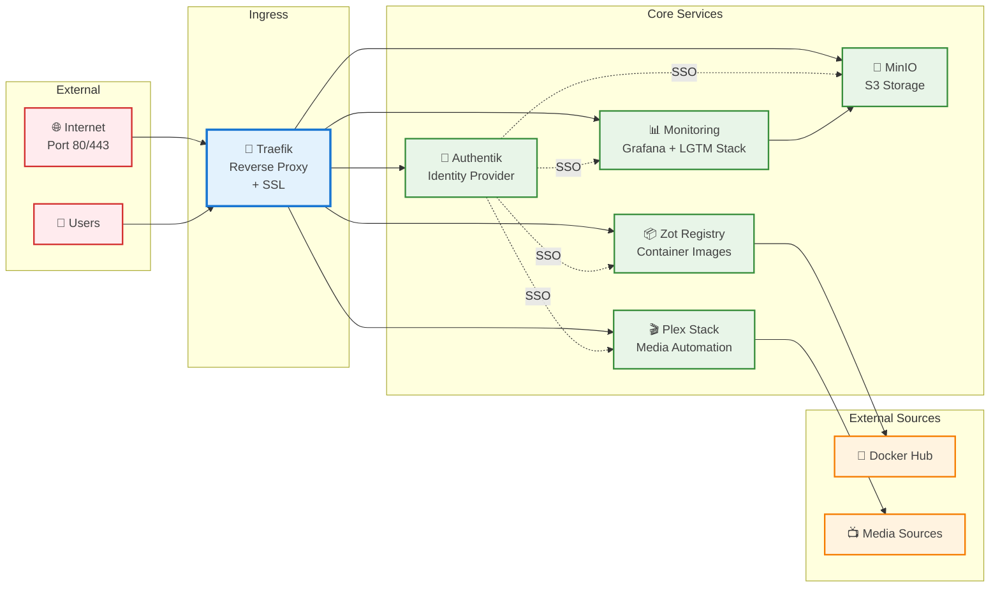
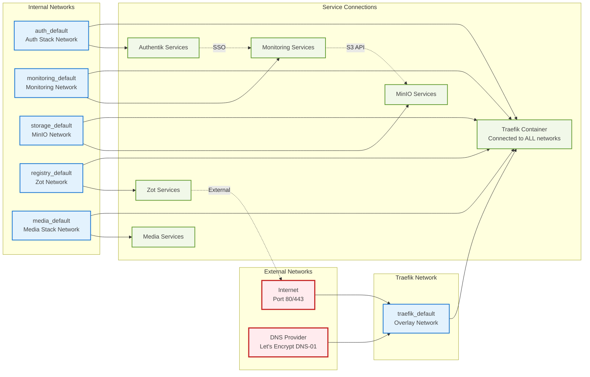

# Multi-Stack Container Infrastructure

This repository provides a comprehensive, production-ready container infrastructure with six integrated Docker Compose stacks for identity management, observability, storage, registry services, and media automation. The architecture emphasizes security, observability, and operational excellence.

## Infrastructure Stacks

- **Authentication Stack** (`auth/`): Authentik identity provider with PostgreSQL and Redis
- **Traefik Stack** (`traefik/`): Reverse proxy with automatic SSL termination and service discovery
- **Monitoring Stack** (`monitoring/`): Complete observability platform with Mimir cluster, Grafana, Loki, Tempo, and Alloy
- **Storage Stack** (`minio/`): S3-compatible object storage for monitoring backends
- **Registry Stack** (`zot/`): OCI-compliant container registry with pull-through caching
- **Media Stack** (`mediaserver/`): Automated media server with Plex and content management

The infrastructure uses external Docker networks for service isolation, Traefik for centralized ingress, and Authentik for unified authentication across all services.

## Table of Contents

- [Multi-Stack Container Infrastructure](#multi-stack-container-infrastructure)
  - [Infrastructure Stacks](#infrastructure-stacks)
  - [Table of Contents](#table-of-contents)
  - [Architecture Overview](#architecture-overview)
    - [Overall Infrastructure Architecture](#overall-infrastructure-architecture)
    - [Key Features](#key-features)
  - [Prerequisites](#prerequisites)
    - [System Requirements](#system-requirements)
    - [Required Software](#required-software)
    - [Port Requirements](#port-requirements)
    - [Storage Structure](#storage-structure)
  - [Rootless Docker Setup](#rootless-docker-setup)
  - [Stack Documentation](#stack-documentation)
    - [Individual Stack Guides](#individual-stack-guides)
  - [Network Architecture](#network-architecture)
  - [Registry Authentication](#registry-authentication)
    - [Accessing the Registry](#accessing-the-registry)
      - [Via HTTPS (External Access)](#via-https-external-access)
      - [Via HTTP (Local Access)](#via-http-local-access)
    - [Authentication Flow](#authentication-flow)
  - [Available Commands](#available-commands)
    - [Zot Registry Commands](#zot-registry-commands)
    - [Monitoring Stack Commands](#monitoring-stack-commands)
  - [Quick Start](#quick-start)
  - [Configuration](#configuration)
    - [TLS Certificates](#tls-certificates)
    - [Registry Configuration](#registry-configuration)
  - [Services Architecture](#services-architecture)
    - [Core Services](#core-services)
  - [Docker Compose Configuration](#docker-compose-configuration)
  - [Testing and Monitoring](#testing-and-monitoring)
    - [Testing the Registry](#testing-the-registry)
    - [Monitoring and Observability](#monitoring-and-observability)
  - [Security Considerations](#security-considerations)
  - [Troubleshooting](#troubleshooting)
  - [File Structure](#file-structure)
  - [Performance Tuning](#performance-tuning)
  - [References](#references)

## Architecture Overview

This infrastructure provides a comprehensive, enterprise-grade container platform with the following capabilities:

### Overall Infrastructure Architecture



### Key Features

- **Unified Authentication**: Authentik provides SSO across all services
- **Automatic HTTPS**: Traefik with Let's Encrypt certificate automation
- **Complete Observability**: Grafana LGTM stack with Mimir clustering
- **Container Registry**: OCI-compliant registry with pull-through caching
- **S3 Storage**: MinIO provides scalable object storage
- **Media Automation**: Complete Plex-based media management pipeline
- **Production-Ready**: Resource limits, health checks, and persistent storage

## Prerequisites

### System Requirements

- **Hardware**: Minimum 8GB RAM, 50GB free disk space
- **Operating System**: Linux (Ubuntu 20.04+ recommended) or macOS with Docker support
- **Docker**: Docker Engine 24.0+ with Docker Compose v2
- **Network**: Internet connectivity for image pulls and certificate generation

### Required Software

- **Docker Engine**: Latest stable version with compose plugin
- **Git**: For repository management
- **Make**: For automation commands (optional)

### Port Requirements

The following ports should be available on your system:

| Port      | Service   | Description             |
| --------- | --------- | ----------------------- |
| 80/443    | Traefik   | HTTP/HTTPS ingress      |
| 8080      | Traefik   | Dashboard               |
| 9008/9443 | Authentik | Identity provider       |
| 3000      | Grafana   | Visualization dashboard |
| 9009      | Mimir     | Metrics storage         |
| 3100      | Loki      | Log aggregation         |
| 3200      | Tempo     | Distributed tracing     |
| 5000      | Zot       | Container registry      |
| 9000/9001 | MinIO     | Object storage          |
| 32400     | Plex      | Media server            |

### Storage Structure

The infrastructure expects the following directory structure:

```bash
/mnt/data/
├── postgres/         # PostgreSQL data
├── redis/            # Redis data
├── authentik/        # Authentik media/templates
├── mimir-{1,2,3}/    # Mimir cluster data
├── grafana/          # Grafana dashboards/config
├── loki/             # Loki log data
├── zot/              # Registry storage
├── minio/            # MinIO object storage
└── logs/             # Application logs
```

## Rootless Docker Setup

For detailed Docker installation and configuration, see the [Rootless Docker Setup Guide](docs/configuration/rootless-docker.md).

## Stack Documentation

### Individual Stack Guides

- **[Traefik Stack](docs/stacks/traefik.md)** - Reverse proxy with automatic HTTPS
- **[Authentication Stack](docs/stacks/authentik.md)** - Unified identity provider with SSO
- **[Monitoring Stack](docs/stacks/monitoring.md)** - Complete observability platform
- **[Storage Stack](docs/stacks/storage.md)** - S3-compatible object storage
- **[Registry Stack](docs/stacks/registry.md)** - OCI-compliant container registry
- **[Media Stack](docs/stacks/media.md)** - Automated media server with Plex

## Network Architecture

The infrastructure uses external Docker networks for service isolation:



## Registry Authentication

Authentication is handled externally by Authentik through Traefik. The Zot registry itself does not require local authentication.

### Accessing the Registry

#### Via HTTPS (External Access)

```bash
# Pull images through the registry (authentication handled by Traefik/Authentik)
docker pull registry.smigula.io/docker/nginx:latest

# Push images to the registry
docker tag myapp:latest registry.smigula.io/myapp:latest
docker push registry.smigula.io/myapp:latest
```

#### Via HTTP (Local Access)

```bash
# For local development, you can also use localhost:5000
docker pull localhost:5000/docker/nginx:latest
```

### Authentication Flow

1. **External Access**: Traefik handles authentication via Authentik
1. **Local Access**: Direct access to port 5000 bypasses authentication
1. **Metrics Access**: Prometheus can access `/metrics` endpoint without authentication

## Available Commands

### Zot Registry Commands

```bash
# From the zot/ directory
docker-compose up -d        # Start Zot registry
docker-compose down         # Stop Zot registry
docker-compose logs -f      # View Zot logs
docker-compose ps           # Check Zot status

# Registry API commands
curl http://localhost:5000/v2/_catalog                    # List all repositories
curl http://localhost:5000/v2/docker/nginx/tags/list      # List tags for a repository
```

### Monitoring Stack Commands

```bash
# From the monitoring/ directory
docker-compose up -d        # Start monitoring stack
docker-compose down         # Stop monitoring stack
docker-compose logs -f      # View all monitoring logs
docker-compose ps           # Check monitoring services status

# View specific service logs
docker-compose logs -f mimir
docker-compose logs -f grafana
docker-compose logs -f loki
docker-compose logs -f tempo
```

## Quick Start

For a complete installation guide, see the [Quick Start Guide](docs/guides/quick-start.md).

## Configuration

### Authentication

For complete Authentik identity provider setup and configuration, see the [Authentik Setup Guide](docs/guides/authentik-setup.md).

For secret management with SOPS encryption, see the [SOPS Configuration Guide](docs/configuration/sops.md).

### Reverse Proxy

For Traefik reverse proxy setup and configuration, see the [Traefik Configuration Guide](docs/configuration/traefik.md).

### TLS Certificates

For TLS certificate generation with CFSSL, see the [CFSSL Configuration Guide](docs/configuration/cfssl.md).

### Registry Configuration

For detailed Zot registry configuration, see the [Zot Registry Configuration Guide](docs/configuration/zot-registry.md).

For Zot OIDC authentication with Authentik, see the [Zot OIDC Setup Guide](docs/configuration/zot-oidc.md).

## Services Architecture

### Core Services

- **Zot Registry** (port 5000): OCI-compliant registry with pull-through caching
- **Grafana** (port 3000): Observability dashboards and visualization
- **Grafana Mimir** (port 9009): Long-term metrics storage with S3 backend
- **Grafana Tempo** (ports 3200, 4317, 4318): Distributed tracing system
- **Grafana Loki** (port 3100): Log aggregation and querying
- **Grafana Alloy** (port 12345): Unified observability data collector
- **MinIO** (ports 9000, 9001): S3-compatible object storage backend

For detailed service configurations, see the respective `docker-compose.yaml` files in each stack directory.

## Docker Compose Configuration

The project uses multiple docker-compose files for each stack:

- **Zot Registry**: See [`zot/docker-compose.yaml`](zot/docker-compose.yaml)
- **Monitoring Stack**: See [`monitoring/docker-compose.yaml`](monitoring/docker-compose.yaml)
- **Traefik Proxy**: See [`traefik/docker-compose.yaml`](traefik/docker-compose.yaml)
- **Authentication**: See [`auth/docker-compose.yaml`](auth/docker-compose.yaml)
- **Storage**: See [`storage/docker-compose.yaml`](storage/docker-compose.yaml)
- **Media Server**: See [`mediaserver/docker-compose.yaml`](mediaserver/docker-compose.yaml)

## Testing and Monitoring

### Testing the Registry

For detailed testing procedures, see the [Testing Guide](docs/guides/testing.md).

### Monitoring and Observability

For monitoring setup and query examples, see the [Monitoring Guide](docs/guides/monitoring.md).

## Security Considerations

1. **Rootless Docker**: Provides better security isolation with user-namespace separation
1. **Self-signed certificates**: Not suitable for production environments
1. **Credentials**: Stored in `.env` file - ensure it's in `.gitignore`
1. **Network isolation**: Internal service ports not exposed to host
1. **TLS enforcement**: Minimum TLS 1.2 with strong cipher suites
1. **Mutual TLS**: Prometheus authenticates to registry using client certificates
1. **User services**: Alloy runs as user service with limited privileges
1. **Socket access**: Rootless Docker socket has restricted access
1. **Volume permissions**: Init containers ensure proper ownership

## Troubleshooting

For troubleshooting common issues, see the [Troubleshooting Guide](docs/guides/troubleshooting.md).

## File Structure

```text
.
├── zot/                          # Zot registry directory
│   ├── docker-compose.yaml       # Zot service definition
│   ├── auth/                     # Authentication files (if using local auth)
│   │   └── (empty - auth handled externally)
│   └── config/                   # Zot configuration files
│       ├── config.yaml           # Main Zot configuration
│       └── credentials.yaml      # Registry credentials (git ignored)
├── monitoring/                   # Monitoring stack directory
│   ├── docker-compose.yaml       # Monitoring services definition
│   ├── .grafana-secrets.env      # Grafana credentials (git ignored)
│   ├── .alloy-secrets.env        # Alloy secrets (git ignored)  
│   ├── mimir/                    # Mimir configuration
│   │   └── config.yaml           # Mimir server configuration
│   ├── loki/                     # Loki configuration
│   │   └── loki-config.yaml      # Loki server configuration
│   ├── grafana/                  # Grafana provisioning
│   │   └── provisioning/
│   │       ├── datasources/      # Pre-configured datasources
│   │       └── dashboards/       # Pre-configured dashboards
│   └── alloy/                    # Alloy configuration
│       └── config.alloy          # Alloy collection config
├── caddy/                        # Caddy reverse proxy
│   ├── docker-compose.yaml       # Caddy service definition
│   ├── Caddyfile                 # Caddy configuration
│   └── logs/                     # Caddy access logs
├── cfssl/                        # Certificate configurations (if needed)
│   ├── ca.json                   # Root CA config
│   ├── intermediate-ca.json      # Intermediate CA config
│   ├── cfssl.json                # Certificate profiles
│   └── registry.json             # Registry certificate config
├── certs/                        # Generated certificates (git ignored)
├── .gitignore                    # Git ignore patterns
├── Makefile                      # Make commands (if using)
└── README.md                     # This file

# User-specific files (rootless Docker)
~/.config/docker/daemon.json  # Docker daemon configuration
~/.local/share/docker/        # Docker data directory
```

## Performance Tuning

- **Cache size**: Adjust blob descriptor cache size for larger deployments
- **Concurrent operations**: Modify `tag.concurrencylimit` based on load
- **Storage driver**: Consider S3 or other drivers for production
- **Resource limits**: Add CPU/memory limits in docker-compose.yaml
- **Rootless optimizations**:
  - Use cgroup delegation for better resource control
  - Consider running critical services natively (like Alloy)
  - Monitor resource usage with `docker stats`

## References

- [Zot Registry Documentation](https://zotregistry.dev)
- [OCI Distribution Specification](https://github.com/opencontainers/distribution-spec)
- [Rootless Docker Documentation](https://docs.docker.com/engine/security/rootless/)
- [CFSSL Documentation](https://github.com/cloudflare/cfssl)
- [Grafana Alloy Documentation](https://grafana.com/docs/alloy/)
- [OpenTelemetry Registry Instrumentation](https://opentelemetry.io/)
- [Loki LogQL Documentation](https://grafana.com/docs/loki/latest/logql/)
