# Zot Registry with Pull-Through Cache and Monitoring Stack (Rootless Docker)

This repository provides a complete setup for a local Zot registry that acts as a pull-through cache for multiple container registries including Docker Hub, ghcr.io, gcr.io, quay.io, and registry.k8s.io. The project is organized into three main components:

- **Zot Registry** (`zot/`): The OCI-compliant registry with pull-through caching and authentication
- **Monitoring Stack** (`monitoring/`): Full observability stack with Prometheus, Jaeger, Grafana, Loki, and Alloy
- **Caddy Reverse Proxy** (`caddy/`): HTTPS reverse proxy with automatic TLS certificate management

This setup is optimized for **rootless Docker** with native Alloy installation for better security and performance. The registry is accessible via HTTPS at `registry.smigula.io` with basic authentication.

- [Zot Registry with Pull-Through Cache and Monitoring Stack (Rootless Docker)](#zot-registry-with-pull-through-cache-and-monitoring-stack-rootless-docker)
  - [Overview](#overview)
  - [Prerequisites](#prerequisites)
    - [Required Software](#required-software)
    - [Optional Tools](#optional-tools)
    - [System Requirements](#system-requirements)
    - [Docker Hub Account](#docker-hub-account)
  - [Rootless Docker Setup](#rootless-docker-setup)
    - [1. Remove Regular Docker (if installed)](#1-remove-regular-docker-if-installed)
    - [2. Install Docker CE](#2-install-docker-ce)
    - [3. Install Rootless Docker](#3-install-rootless-docker)
    - [4. Start Rootless Docker](#4-start-rootless-docker)
    - [5. Configure Docker Daemon](#5-configure-docker-daemon)
  - [Install and Configure Alloy](#install-and-configure-alloy)
    - [1. Download and Install Alloy](#1-download-and-install-alloy)
    - [2. Create Alloy Configuration](#2-create-alloy-configuration)
    - [3. Create Systemd User Service](#3-create-systemd-user-service)
  - [Architecture](#architecture)
  - [Registry Authentication](#registry-authentication)
  - [Available Commands](#available-commands)
  - [Quick Start](#quick-start)
  - [CFSSL Configuration](#cfssl-configuration)
    - [1. Root CA Configuration (`cfssl/ca.json`)](#1-root-ca-configuration-cfsslcajson)
    - [2. Intermediate CA Configuration (`cfssl/intermediate-ca.json`)](#2-intermediate-ca-configuration-cfsslintermediate-cajson)
    - [3. Registry Certificate Configuration (`cfssl/registry.json`)](#3-registry-certificate-configuration-cfsslregistryjson)
    - [4. Certificate Profiles (`cfssl/cfssl.json`)](#4-certificate-profiles-cfsslcfssljson)
    - [Common Customizations](#common-customizations)
    - [Example for Local Development](#example-for-local-development)
  - [Certificate Generation with CFSSL](#certificate-generation-with-cfssl)
  - [Zot Registry Configuration](#zot-registry-configuration)
    - [Key Configuration Settings](#key-configuration-settings)
      - [Storage Configuration](#storage-configuration)
      - [HTTP Configuration](#http-configuration)
      - [Multi-Registry Sync Configuration](#multi-registry-sync-configuration)
      - [Extensions](#extensions)
  - [Services Architecture](#services-architecture)
    - [Zot Registry (port 5000)](#zot-registry-port-5000)
    - [Jaeger (port 16686)](#jaeger-port-16686)
    - [Prometheus (port 9090)](#prometheus-port-9090)
    - [Loki (port 3100)](#loki-port-3100)
    - [Grafana Alloy (port 12345) - Native Installation](#grafana-alloy-port-12345---native-installation)
    - [Grafana (port 3000)](#grafana-port-3000)
  - [Docker Compose Configuration](#docker-compose-configuration)
  - [Testing the Registry](#testing-the-registry)
    - [Configure Docker to Trust the Registry](#configure-docker-to-trust-the-registry)
      - [Step 1: Configure TLS Trust](#step-1-configure-tls-trust)
        - [Option A: Configure Docker daemon certificates (Recommended)](#option-a-configure-docker-daemon-certificates-recommended)
        - [Option B: System-wide trust (macOS)](#option-b-system-wide-trust-macos)
      - [Step 2: Configure Docker Hub Mirror](#step-2-configure-docker-hub-mirror)
        - [Rootless Docker](#rootless-docker)
        - [macOS (Docker Desktop)](#macos-docker-desktop)
        - [Linux (Regular Docker)](#linux-regular-docker)
        - [Verify Mirror Configuration](#verify-mirror-configuration)
    - [Test Registry Access](#test-registry-access)
  - [Monitoring and Observability](#monitoring-and-observability)
    - [Grafana Dashboard](#grafana-dashboard)
    - [Prometheus Queries](#prometheus-queries)
    - [Jaeger Traces](#jaeger-traces)
    - [Loki Log Queries](#loki-log-queries)
  - [Management Commands](#management-commands)
    - [Docker Compose Operations](#docker-compose-operations)
    - [Registry Maintenance](#registry-maintenance)
    - [Alloy Management](#alloy-management)
  - [Security Considerations](#security-considerations)
  - [Troubleshooting](#troubleshooting)
    - [Rootless Docker Issues](#rootless-docker-issues)
    - [Alloy Issues](#alloy-issues)
    - [Volume Permission Issues](#volume-permission-issues)
    - [Certificate Issues](#certificate-issues)
    - [Authentication Issues](#authentication-issues)
    - [Registry Connection Issues](#registry-connection-issues)
    - [Metrics Not Appearing](#metrics-not-appearing)
  - [File Structure](#file-structure)
  - [Performance Tuning](#performance-tuning)
  - [References](#references)

## Overview

This setup creates a production-ready local Zot registry with:

- **Rootless Docker**: Enhanced security with user-namespace isolation
- **Multi-Registry Pull-Through Cache**: Acts as a caching proxy for multiple registries:
  - Docker Hub (`/docker` prefix)
  - GitHub Container Registry (`/ghcr` prefix)
  - Google Container Registry (`/gcr` prefix)
  - Quay.io (`/quay` prefix)
  - Kubernetes Registry (`/k8s` prefix)
- **Zot Registry**: High-performance OCI-compliant registry with advanced features
- **HTTPS Access**: Secure external access via Caddy reverse proxy with automatic TLS certificates
- **Authentication**: HTTP basic authentication for registry access
- **Bandwidth Optimization**: Caches images locally to reduce repeated downloads from upstream registries
- **Native Alloy**: Grafana Alloy runs as a native systemd service for better Docker socket access
- **Distributed Tracing**: OpenTelemetry integration with Jaeger
- **Metrics Collection**: Prometheus scraping with pre-configured dashboards
- **Log Aggregation**: Loki for centralized log collection and querying
- **Visualization**: Grafana dashboards for monitoring registry performance and logs
- **Advanced Features**: Built-in UI, search capabilities, and sync management

When properly configured, Zot will automatically cache images from multiple registries, significantly improving pull speeds and reducing bandwidth usage.

## Prerequisites

### Required Software

1. **CFSSL** (CloudFlare's PKI toolkit)

   - macOS: `brew install cfssl`
   - Linux: `sudo apt-get install golang-cfssl` or download from [CFSSL releases](https://github.com/cloudflare/cfssl/releases)
   - Verify: `cfssl version`

1. **Make** (GNU Make 3.81 or later)

   - macOS: Included with Xcode Command Line Tools or `brew install make`
   - Linux: `sudo apt-get install build-essential`
   - Verify: `make --version`

1. **OpenSSL** (for certificate verification)

   - macOS/Linux: Usually pre-installed
   - Verify: `openssl version`

### Optional Tools

- **curl** or **wget**: For testing endpoints (usually pre-installed)
- **jq**: For parsing JSON responses (`brew install jq` or `apt-get install jq`)

### System Requirements

- **Disk Space**: At least 10GB free for Docker images and registry storage
- **Memory**: Minimum 4GB RAM (8GB recommended for full monitoring stack)
- **Ports**: Ensure the following ports are available:
  - 5000: Registry API
  - 3000: Grafana
  - 9090: Prometheus
  - 16686: Jaeger UI
  - 3100: Loki
  - 12345: Alloy UI

### Registry Accounts (Optional)

For authenticated registries, you'll need credentials:

1. **Docker Hub**: Create a free account at [hub.docker.com](https://hub.docker.com)
2. **GitHub Container Registry**: Use your GitHub username and a [personal access token](https://github.com/settings/tokens)
3. **Other registries**: Most public images don't require authentication

## Rootless Docker Setup

### 1. Remove Regular Docker (if installed)

```bash
sudo systemctl stop docker
sudo systemctl disable docker
sudo apt remove docker docker-engine docker.io containerd runc
```

### 2. Install Docker CE

```bash
# Add Docker's official GPG key
curl -fsSL https://download.docker.com/linux/ubuntu/gpg | sudo gpg --dearmor -o /usr/share/keyrings/docker-archive-keyring.gpg

# Add repository
echo "deb [arch=$(dpkg --print-architecture) signed-by=/usr/share/keyrings/docker-archive-keyring.gpg] https://download.docker.com/linux/ubuntu $(lsb_release -cs) stable" | sudo tee /etc/apt/sources.list.d/docker.list > /dev/null

# Install Docker
sudo apt update
sudo apt install docker-ce docker-ce-cli containerd.io docker-buildx-plugin docker-compose-plugin
```

### 3. Install Rootless Docker

```bash
# Install rootless Docker
dockerd-rootless-setuptool.sh install

# Add to shell profile
echo 'export PATH=$HOME/bin:$PATH' >> ~/.bashrc
echo 'export DOCKER_HOST=unix://$XDG_RUNTIME_DIR/docker.sock' >> ~/.bashrc
source ~/.bashrc
```

### 4. Start Rootless Docker

```bash
systemctl --user enable --now docker

# Verify installation
docker version
docker info
```

### 5. Configure Docker Daemon

```bash
# Create Docker configuration directory
mkdir -p ~/.config/docker

# Create daemon.json configuration
tee ~/.config/docker/daemon.json << 'EOF'
{
  "data-root": "/home/madmin/.config/containers/storage",
  "builder": {
    "gc": {
      "defaultKeepStorage": "20GB",
      "enabled": true
    }
  },
  "experimental": false,
  "insecure-registries": [ "localhost:5000" ],
  "log-driver": "json-file",
  "log-opts": {
    "max-size": "10m",
    "max-file": "3",
    "compress": "true"
  },
  "features": {
    "buildkit": true
  },
  "registry-mirrors": ["http://localhost:5000"]
}
EOF

# Restart Docker to apply configuration
systemctl --user restart docker
docker info  # Verify configuration
```

## Install and Configure Alloy

### 1. Download and Install Alloy

```bash
# Create local bin directory
mkdir -p ~/.local/bin

# Download Alloy
cd /tmp
wget https://github.com/grafana/alloy/releases/download/v1.9.2/alloy-linux-amd64.zip
unzip alloy-linux-amd64.zip
mv alloy-linux-amd64 ~/.local/bin/alloy
chmod +x ~/.local/bin/alloy

# Verify installation
~/.local/bin/alloy --version
```

### 2. Create Alloy Configuration

```bash
# Create config directory
mkdir -p ~/alloy

# Create configuration file
tee ~/alloy/config.alloy << 'EOF'
discovery.docker "containers" {
  host = "unix:///run/user/1000/docker.sock"
  refresh_interval = "5s"
}

discovery.relabel "containers" {
  targets = discovery.docker.containers.targets

  rule {
    source_labels = ["__meta_docker_container_name"]
    target_label  = "container"
  }

  rule {
    source_labels = ["__meta_docker_container_log_stream"]
    target_label  = "stream"
  }

  rule {
    source_labels = ["__meta_docker_container_id"]
    target_label  = "container_id"
  }

  rule {
    source_labels = ["__meta_docker_container_label_com_docker_compose_service"]
    target_label  = "service"
  }
}

loki.source.file "docker_logs" {
  targets    = discovery.relabel.containers.output
  forward_to = [loki.process.docker_logs.receiver]
}

loki.process.docker_logs "docker_logs" {
  forward_to = [loki.write.loki.receiver]

  stage.json {
    expressions = {
      timestamp = "time",
      message   = "log",
    }
  }

  stage.timestamp {
    source = "timestamp"
    format = "RFC3339Nano"
  }

  stage.labels {
    values = {
      level = "level",
    }
  }
}

loki.write "loki" {
  endpoint {
    url = "http://localhost:3100/loki/api/v1/push"
  }
}

logging {
  level  = "info"
  format = "logfmt"
}
EOF
```

### 3. Create Systemd User Service

```bash
# Create user systemd directory
mkdir -p ~/.config/systemd/user

# Create service file
tee ~/.config/systemd/user/alloy.service << 'EOF'
[Unit]
Description=Grafana Alloy
After=network.target
Wants=network.target

[Service]
Type=simple
WorkingDirectory=%h
ExecStart=%h/.local/bin/alloy run %h/registry/monitoring/alloy/config.alloy --server.http.listen-addr=0.0.0.0:12345 --storage.path=%h/.local/share/alloy
Restart=always
RestartSec=5

[Install]
WantedBy=default.target
EOF

# Reload and enable service
systemctl --user daemon-reload
systemctl --user enable --now alloy

# Enable user services to start at boot (optional)
sudo loginctl enable-linger $USER
```

## Architecture

```mermaid
graph TB
    subgraph "External Access"
        Internet[Internet<br/>HTTPS]
        Client[Docker Client]
    end

    subgraph "External Registries"
        DH[Docker Hub<br/>registry-1.docker.io]
        GHCR[GitHub Container Registry<br/>ghcr.io]
        GCR[Google Container Registry<br/>gcr.io]
        QUAY[Quay.io]
        K8S[Kubernetes Registry<br/>registry.k8s.io]
    end

    subgraph "Rootless Docker Environment"
        subgraph "Reverse Proxy (caddy/docker-compose.yaml)"
            Caddy[Caddy<br/>:443/:80<br/>TLS Termination]
            CaddyAuth[Basic Auth<br/>Removed]
        end

        subgraph "Zot Registry (zot/docker-compose.yaml)"
            subgraph "Zot Registry Service"
                Zot[Zot Registry<br/>:5000]
                ZotAuth[HTPasswd Auth]
                UI[Web UI<br/>Search API]
                Sync[Sync Engine<br/>On-demand Pull]

                Zot --> ZotAuth
                Zot --> UI
                Zot --> Sync
            end
        end

        subgraph "Monitoring Stack (monitoring/docker-compose.yaml)"
            subgraph "Monitoring Services"
                Jaeger[Jaeger<br/>:4318 OTLP]
                Prom[Prometheus<br/>:9090]
                Loki[Loki<br/>:3100]
                Grafana[Grafana<br/>:3000]

                Prom --> Grafana
                Jaeger --> Grafana
                Loki --> Grafana
            end

            subgraph "Rootless Docker Infrastructure"
                Docker[Rootless Docker Daemon<br/>~/.local/share/docker]
                Logs[Container Logs<br/>~/.local/share/docker/containers]
                Socket[Docker Socket<br/>/run/user/1000/docker.sock]

                Docker --> Logs
                Docker --> Socket
            end
        end

        subgraph "Native Services"
            Alloy[Grafana Alloy<br/>:12345<br/>Systemd User Service]

            Alloy -->|Read| Socket
            Alloy -->|Read| Logs
            Alloy -->|Push logs| Loki
        end
    end

    Internet -->|registry.smigula.io| Caddy
    Client -->|localhost:5000| Zot
    Caddy -->|HTTP| Zot
    Sync -->|Cache| DH
    Sync -->|Cache| GHCR
    Sync -->|Cache| GCR
    Sync -->|Cache| QUAY
    Sync -->|Cache| K8S
    Zot -->|Traces| Jaeger
    Prom -->|Scrape /metrics| Zot
    Prom -->|Scrape :14269| Jaeger

    style DH fill:#000000,color:#ffffff
    style GHCR fill:#000000,color:#ffffff
    style GCR fill:#000000,color:#ffffff
    style QUAY fill:#000000,color:#ffffff
    style K8S fill:#000000,color:#ffffff
    style Client fill:#000000,color:#ffffff
    style Internet fill:#0066cc,color:#ffffff
    style Caddy fill:#22b638
    style CaddyAuth fill:#cccccc,color:#000000
    style Zot fill:#2496ed
    style ZotAuth fill:#ff9900
    style Jaeger fill:#60d0e4,color:#000000
    style Prom fill:#e6522c
    style Loki fill:#ff0000,color:#ffffff
    style Alloy fill:#800080,color:#ffffff
    style Grafana fill:#f46800
    style UI fill:#404040,color:#ffffff
    style Sync fill:#404040,color:#ffffff
    style Docker fill:#00ff00,color:#000000
    style Logs fill:#404040,color:#ffffff
    style Socket fill:#404040,color:#ffffff
```



## Registry Authentication

The Zot registry is configured with HTTP basic authentication for secure access.

### Authentication Configuration

1. **HTPasswd File**: Located at `zot/auth/htpasswd`
2. **Default User**: `smigula`
3. **Password**: Set during setup (default: `Registry363502`)

### Creating/Updating Users

```bash
# Create a new user or update existing password
htpasswd -bBn <username> <password> >> zot/auth/htpasswd

# Example: Create user 'smigula' with password 'Registry363502'
htpasswd -bBn smigula Registry363502 > zot/auth/htpasswd
```

**Important Notes**:
- The `-B` flag uses bcrypt hashing (required by Zot)
- Passwords are hashed and stored securely
- After updating the htpasswd file, restart the Zot container

### Accessing the Registry

#### Via HTTPS (External Access)

```bash
# Login to the registry
docker login registry.smigula.io -u smigula -p Registry363502

# Pull images through the registry
docker pull registry.smigula.io/docker/nginx:latest

# Push images to the registry
docker tag myapp:latest registry.smigula.io/myapp:latest
docker push registry.smigula.io/myapp:latest
```

#### Via HTTP (Local Access)

```bash
# For local development, you can also use localhost:5000
docker pull localhost:5000/docker/nginx:latest
```

### Authentication Flow

1. **External Access**: Caddy provides TLS termination and forwards requests to Zot
2. **Zot Authentication**: Zot validates credentials against the htpasswd file
3. **Failed Authentication**: Returns 401 Unauthorized with a 5-second delay (configurable)

## Available Commands

### Zot Registry Commands

```bash
# From the zot/ directory
docker-compose up -d        # Start Zot registry
docker-compose down         # Stop Zot registry
docker-compose logs -f      # View Zot logs
docker-compose ps           # Check Zot status

# Registry API commands
curl http://localhost:5000/v2/_catalog                    # List all repositories
curl http://localhost:5000/v2/docker/nginx/tags/list      # List tags for a repository
```

### Monitoring Stack Commands

```bash
# From the monitoring/ directory
docker-compose up -d        # Start monitoring stack
docker-compose down         # Stop monitoring stack
docker-compose logs -f      # View all monitoring logs
docker-compose ps           # Check monitoring services status

# View specific service logs
docker-compose logs -f prometheus
docker-compose logs -f grafana
docker-compose logs -f loki
docker-compose logs -f jaeger
```

### Alloy Management

```bash
systemctl --user start alloy      # Start Alloy service
systemctl --user stop alloy       # Stop Alloy service
systemctl --user status alloy     # Check Alloy status
journalctl --user -u alloy -f    # View Alloy logs
```

## Quick Start

1. **Set up credentials**:

   ```bash
   # Create htpasswd file for registry authentication
   htpasswd -bBn smigula Registry363502 > zot/auth/htpasswd
   
   # Create credentials file for upstream registries (optional)
   cat <<EOF > zot/config/credentials.yaml
   registry-1.docker.io:
     username: <your_docker_hub_username>
     password: <your_docker_hub_password>
   ghcr.io:
     username: <your_github_username>
     password: <your_github_token>
   EOF

   # Set up Grafana credentials in monitoring directory
   cat <<EOF > monitoring/.env
   GF_SECURITY_ADMIN_USER=admin
   GF_SECURITY_ADMIN_PASSWORD=admin
   EOF
   ```

1. **Setup rootless Docker** (if not already done):

   Follow the [Rootless Docker Setup](#rootless-docker-setup) section above.

1. **Install and configure Alloy** (if not already done):

   Follow the [Install and Configure Alloy](#install-and-configure-alloy) section above.

1. **Start all services**:

   ```bash
   # Start Zot registry
   cd zot
   docker-compose up -d
   
   # Start Caddy reverse proxy
   cd ../caddy
   docker-compose up -d
   
   # Start monitoring stack
   cd ../monitoring
   docker-compose up -d
   ```

1. **Start Alloy service**:

   ```bash
   systemctl --user start alloy
   ```

1. **Configure Docker to use the registry**:

   ```bash
   # For external HTTPS access
   docker login registry.smigula.io -u smigula -p Registry363502
   
   # For local HTTP access, add to insecure registries
   # See "Configure Docker for Insecure Registry" section below
   ```

1. **Access services**:

   ```bash
   # Check all running services
   docker ps
   ```

   Service URLs:

   - Zot Registry API (local): <http://localhost:5000/v2/> (requires auth)
   - Zot Registry API (external): <https://registry.smigula.io/v2/> (requires auth)
   - Zot Web UI: <http://localhost:5000/home> or <https://registry.smigula.io/home>
   - Grafana: <http://localhost:3000> (admin/admin)
   - Prometheus: <http://localhost:9090>
   - Jaeger: <http://localhost:16686>
   - Loki: <http://localhost:3100>
   - Alloy: <http://localhost:12345> (Grafana Alloy UI)

1. **View logs in Grafana**:

   - Navigate to <http://localhost:3000>
   - Login with admin/admin
   - Go to Explore → Select Loki datasource
   - Try queries like `{container="registry"}` or `{job="docker_logs"}`

## CFSSL Configuration

Before generating certificates, you need to customize the CFSSL configuration files for your environment. The following files contain default values that should be updated:

### 1. Root CA Configuration (`cfssl/ca.json`)

Edit the following fields in `cfssl/ca.json`:

```json
{
  "CN": "Smigula Root CA",     // Replace with your root CA name
  "names": [{
    "C": "US",                           // Your country code
    "L": "Tampa",                    // Your city
    "O": "Smigula",            // Your organization name
    "OU": "development",             // Your department/unit
    "ST": "FL"                   // Your state/province
  }]
}
```

### 2. Intermediate CA Configuration (`cfssl/intermediate-ca.json`)

Update the same fields in `cfssl/intermediate-ca.json`:

```json
{
  "CN": "Smigula Intermediate CA",
  "names": [{
    "C": "US",
    "L": "Tampa",
    "O": "Smigula",
    "OU": "development",
    "ST": "FL"
  }],
  "ca": {
    "expiry": "42720h"    // 5 years - adjust as needed
  }
}
```

### 3. Registry Certificate Configuration (`cfssl/registry.json`)

This is the most important configuration to customize:

```json
{
  "CN": "registry.smigula.io",        // Your registry's FQDN
  "hosts": [
    "registry.smigula.io",            // Your registry's domain
    "registry",                           // Short hostname
    "localhost",                          // Keep for local testing
    "127.0.0.1",                          // Localhost IP
    "10.0.0.100"                          // Your registry's IP (if static)
  ],
  "names": [{
    "C": "US",
    "L": "Tampa",
    "O": "Smigula",
    "OU": "development",
    "ST": "FL"
  }]
}
```

### 4. Certificate Profiles (`cfssl/cfssl.json`)

The default profiles are suitable for most use cases, but you can adjust certificate expiry times:

```json
{
  "signing": {
    "profiles": {
      "intermediate_ca": {
        "expiry": "8760h",    // 1 year - adjust as needed
        ...
      },
      "server": {
        "expiry": "8760h",    // 1 year for server certs
        ...
      }
    }
  }
}
```

### Common Customizations

1. **For Local Development**:

   - Keep "localhost" and "127.0.0.1" in the hosts array
   - Add your machine's hostname
   - Use a simple organization name like "Development"

1. **For Production**:

   - Use proper FQDN for the registry
   - Add all possible access names (load balancer DNS, service names, etc.)
   - Set appropriate certificate expiry times
   - Use official organization details

1. **For Kubernetes**:

   - Add service names: `registry.namespace.svc.cluster.local`
   - Add service IPs if using ClusterIP
   - Include any ingress hostnames

### Example for Local Development

Here's a complete example for local development:

```bash
# Edit ca.json
sed -i '' 's/Smigula Root CA/My Local Root CA/g' cfssl/ca.json
sed -i '' 's/Smigula/My Organization/g' cfssl/ca.json
sed -i '' 's/Tampa/My City/g' cfssl/ca.json
sed -i '' 's/FL/My State/g' cfssl/ca.json

# Edit registry.json for local use
cat > cfssl/registry.json <<EOF
{
  "CN": "localhost",
  "hosts": [
    "localhost",
    "127.0.0.1",
    "registry",
    "registry.local",
    "*.local"
  ],
  "key": {
    "algo": "rsa",
    "size": 2048
  },
  "names": [{
    "C": "US",
    "L": "My City",
    "O": "My Organization",
    "OU": "Development",
    "ST": "My State"
  }]
}
EOF
```

## Certificate Generation with CFSSL

After customizing the configuration files, you can generate the certificates. This setup uses a proper PKI hierarchy with root and intermediate CAs:

```bash
# Generate all certificates at once
make certs

# Or generate them step by step:
make cert-ca              # Generate root CA
make cert-intermediate    # Generate intermediate CA
make cert-registry        # Generate registry certificates

# Verify the certificate chain
make verify-certs
```

The Makefile automates the following steps:

1. Generates root CA certificate
1. Generates intermediate CA certificate
1. Signs intermediate CA with root CA
1. Generates registry certificates (peer, server, client profiles)
1. Creates certificate chain for the registry

## Zot Registry Configuration

Zot is configured via `zot/config/zot-config.yaml`. For detailed configuration options, see the [Zot documentation](https://zotregistry.dev).

### Key Configuration Settings

Our configuration (`zot/config/zot-config.yaml`) includes:

#### Storage Configuration

```yaml
storage:
  rootDirectory: /var/lib/zot
  gc: true                               # Enable garbage collection
```

#### HTTP Configuration

```yaml
http:
  address: 0.0.0.0
  port: '5000'                           # Main API port
  externalUrl: https://registry.smigula.io  # External URL for reverse proxy
  auth:
    htpasswd:
      path: /etc/zot/htpasswd            # HTPasswd authentication file
      failDelay: 5s                      # Delay after failed authentication
log:
  level: info
```

#### Multi-Registry Sync Configuration

```yaml
extensions:
  sync:
    enable: true
    credentialsFile: /etc/zot/credentials.yaml
    registries:
      - urls: ['https://registry-1.docker.io']
        onDemand: true                   # Pull images only when requested
        content:
          - prefix: '**'
            destination: /docker         # Access via localhost:5000/docker/<image>
      - urls: ['https://ghcr.io']
        onDemand: true
        content:
          - prefix: '**'
            destination: /ghcr           # Access via localhost:5000/ghcr/<image>
      - urls: ['https://gcr.io']
        onDemand: true
        content:
          - prefix: '**'
            destination: /gcr            # Access via localhost:5000/gcr/<image>
      # Additional registries: quay.io, registry.k8s.io
```

#### Extensions

```yaml
extensions:
  search:
    enable: true                         # Enable search functionality
  ui:
    enable: true                         # Enable web UI
  metrics:
    enable: true                         # Prometheus metrics
    prometheus:
      path: /metrics
  scrub:
    enable: true                         # Enable image vulnerability scanning
    interval: "24h"
```

## Services Architecture

### Zot Registry (port 5000)

- **Purpose**: Multi-registry pull-through cache and local image storage
- **Features**:
  - OCI-compliant registry with distribution spec v1.1.0
  - Pull-through cache for multiple registries with prefix routing
  - Built-in web UI and search functionality
  - HTTP basic authentication with htpasswd
  - External URL support for reverse proxy deployments
  - Prometheus metrics exposure
  - Image vulnerability scanning with scrub extension
- **Registry Prefixes**:
  - `/docker/` - Docker Hub images
  - `/ghcr/` - GitHub Container Registry images
  - `/gcr/` - Google Container Registry images
  - `/quay/` - Quay.io images
  - `/k8s/` - Kubernetes registry images
- **API Endpoints**:
  - Local: `http://localhost:5000`
  - External: `https://registry.smigula.io` (via Caddy)
  - `/v2/` - API version check (requires authentication)
  - `/v2/_catalog` - List all repositories
  - `/v2/{name}/tags/list` - List tags for a repository
  - `/v2/{name}/manifests/{reference}` - Get/Put/Delete manifests
  - `/v2/{name}/blobs/{digest}` - Get/Put/Delete blobs
  - `/home` - Web UI interface
  - `/v2/_zot/ext/search` - Search API
- **Metrics endpoint**:
  - `/metrics` - Prometheus metrics

### Jaeger (port 16686)

- **Purpose**: Distributed tracing for registry operations
- **Features**:
  - Collects traces via OTLP protocol
  - Provides trace visualization and analysis
- **Internal endpoints**:
  - `:4317` - OTLP gRPC
  - `:4318` - OTLP HTTP
  - `:14269` - Metrics for Prometheus

### Prometheus (port 9090)

- **Purpose**: Metrics collection and storage
- **Scrape targets**:
  - Docker Registry metrics (HTTP with mutual TLS authentication)
  - Jaeger metrics
  - Self-monitoring
- **Configuration**: `prometheus/prometheus.yml`
- **TLS Setup**: Uses registry certificates for client authentication when scraping metrics
- **Rootless considerations**: Uses init container to set proper permissions

### Loki (port 3100)

- **Purpose**: Log aggregation system for collecting and querying logs
- **Features**:
  - Collects logs from Docker containers via Grafana Alloy
  - Supports LogQL query language for log searching
  - Uses TSDB (Time Series Database) index for efficient storage
  - Schema v13 with structured metadata support
  - 7-day retention policy with automatic cleanup
  - Integrates seamlessly with Grafana for visualization
- **Configuration**: `loki/loki-config.yaml`
  - Storage: Filesystem-based with TSDB shipper
  - Retention: 168 hours (7 days)
  - Ingestion limits: 4MB/s rate, 6MB burst
- **Internal endpoints**:
  - `:3100/ready` - Health check endpoint
  - `:3100/loki/api/v1/push` - Log ingestion endpoint
  - `:3100/loki/api/v1/query_range` - Query endpoint for log ranges
- **Rootless considerations**: Uses init container to set proper permissions (UID 10001)

### Grafana Alloy (port 12345) - Native Installation

- **Purpose**: Modern observability collector running as native systemd user service
- **Features**:
  - Automatically discovers Docker containers via rootless Docker socket
  - Collects and processes container logs from `~/.local/share/docker/containers`
  - Extracts metadata and labels from containers
  - Parses JSON log format and extracts fields
  - Provides a web UI for monitoring collection status
  - Supports complex processing pipelines
- **Configuration**: `~/alloy/config.alloy`
- **Service Management**: `systemctl --user {start|stop|status} alloy`
- **UI Access**: <http://localhost:12345>
- **Rootless advantages**:
  - Direct access to rootless Docker socket (`/run/user/1000/docker.sock`)
  - No namespace isolation issues
  - Better performance than containerized version
  - Easier debugging and configuration

### Grafana (port 3000)

- **Purpose**: Metrics visualization and dashboards
- **Features**:
  - Pre-configured datasources (Prometheus, Jaeger, Loki)
  - Docker Registry dashboard included
  - Log exploration with Loki integration
  - Anonymous viewer access enabled
- **Default credentials**: Configured in `.env`

## Docker Compose Configuration

The project uses two separate docker-compose files:

### Zot Registry (`zot/docker-compose.yaml`)

```yaml
services:
  registry:
    image: ghcr.io/project-zot/zot-linux-amd64:v2.1.5
    container_name: registry
    ports:
      - "5000:5000"
    volumes:
      - ./config/config.yaml:/etc/zot/config.yaml:ro
      - ./config/credentials.yaml:/etc/zot/credentials.yaml:ro
      - ./auth/htpasswd:/etc/zot/htpasswd:ro
      - zot-data:/var/lib/zot
    networks:
      - zot_registry
```

### Monitoring Stack (`monitoring/docker-compose.yaml`)

The monitoring stack has been optimized for rootless Docker with init containers:

```yaml
services:
  # Init containers for permissions
  prometheus-init:
    image: localhost:5000/docker/alpine:latest
    volumes:
      - prometheus-data:/prometheus
    command: chown -R 65534:65534 /prometheus

  loki-init:
    image: localhost:5000/docker/alpine:latest
    volumes:
      - loki-data:/loki
    command: chown -R 10001:10001 /loki
```

**Key features**:
- All monitoring images pulled through Zot registry
- Init containers fix volume permissions for rootless Docker
- Alloy runs as native systemd service (not in Docker)

## Testing the Registry

### Using Zot Registry

Zot uses prefix-based routing for different registries. Unlike a traditional Docker registry mirror, you need to specify the registry prefix when pulling images:

#### Pull Images from Different Registries

```bash
# Docker Hub images
docker pull localhost:5000/docker/nginx:latest
docker pull localhost:5000/docker/alpine:latest
docker pull localhost:5000/docker/redis:7

# GitHub Container Registry
docker pull localhost:5000/ghcr/project-zot/zot-linux-amd64:v2.1.5

# Google Container Registry
docker pull localhost:5000/gcr/cadvisor/cadvisor:v0.52.0
docker pull localhost:5000/gcr/kaniko-project/executor:latest

# Quay.io
docker pull localhost:5000/quay/coreos/etcd:latest

# Kubernetes Registry
docker pull localhost:5000/k8s/pause:3.9
docker pull localhost:5000/k8s/coredns/coredns:v1.11.1
```

#### Configure Docker for Insecure Registry

Since Zot runs on HTTP (not HTTPS) by default, configure Docker to allow insecure access:

##### Rootless Docker

```bash
# Edit daemon configuration
nano ~/.config/docker/daemon.json

# Add localhost:5000 to insecure registries:
{
  "insecure-registries": ["localhost:5000"]
}

# Restart Docker
systemctl --user restart docker
```

##### Regular Docker

```bash
# Edit daemon configuration
sudo nano /etc/docker/daemon.json

# Add configuration:
{
  "insecure-registries": ["localhost:5000"]
}

# Restart Docker
sudo systemctl restart docker
```

### Test Registry Access

1. **Access the Zot Web UI**:

   Navigate to <http://localhost:5000/home> to access the Zot web interface where you can:
   - Search for images
   - View repository details
   - Check image tags and manifests
   - Monitor sync status

2. **Test pulling images**:

   ```bash
   # Pull nginx from Docker Hub through Zot
   docker pull localhost:5000/docker/nginx:latest

   # Pull from other registries
   docker pull localhost:5000/ghcr/project-zot/zot-linux-amd64:v2.1.5
   docker pull localhost:5000/gcr/cadvisor/cadvisor:v0.52.0

   # Check cached repositories
   curl http://localhost:5000/v2/_catalog
   # Should show: {"repositories":["docker/nginx","ghcr/project-zot/zot-linux-amd64","gcr/cadvisor/cadvisor"]}
   ```

3. **Push your own images**:

   ```bash
   # Tag and push to Zot
   docker tag myapp:latest localhost:5000/myapp:latest
   docker push localhost:5000/myapp:latest
   ```

4. **Access the Registry API**:

   Zot implements the [OCI Distribution Specification](https://github.com/opencontainers/distribution-spec). Common endpoints:

   ```bash
   # Check registry availability
   curl http://localhost:5000/v2/

   # List all repositories
   curl http://localhost:5000/v2/_catalog

   # List tags for a repository
   curl http://localhost:5000/v2/docker/nginx/tags/list

   # Search for images (Zot-specific)
   curl -X POST http://localhost:5000/v2/_zot/ext/search \
        -H "Content-Type: application/json" \
        -d '{"query": "nginx"}'

   # Get image manifest
   curl http://localhost:5000/v2/docker/nginx/manifests/latest
   ```

## Monitoring and Observability

### Grafana Dashboard

1. Access at <http://localhost:3000>
1. Login with configured credentials
1. Navigate to **Dashboards → Docker Registry**
1. Monitor:
   - HTTP request rates and latencies
   - Cache hit ratios
   - Response code distribution
   - Storage metrics
1. For log exploration:
   - Navigate to **Explore → Loki**
   - Query registry logs using LogQL

### Prometheus Queries

Access at <http://localhost:9090> and try these queries:

```promql
# Request rate by method
rate(registry_http_requests_total[5m])

# 99th percentile latency
histogram_quantile(0.99, rate(registry_http_request_duration_seconds_bucket[5m]))

# Cache hit ratio
rate(registry_storage_cache_hits_total[5m]) / rate(registry_storage_cache_requests_total[5m])
```

### Jaeger Traces

1. Access at <http://localhost:16686>
1. Select service: `docker-registry`
1. View traces for:
   - Image pulls/pushes
   - Manifest operations
   - Blob uploads/downloads

### Loki Log Queries

Access Loki through Grafana's Explore interface or use these example LogQL queries:

```logql
# View all Docker container logs
{job="docker_logs"}

# View logs from the registry container
{container="registry"}

# Filter by compose service
{service="registry"}

# Filter registry logs by level
{container="registry"} |= "level=error"

# Search for sync operations in Zot
{container="registry"} |= "sync" |= "syncing image"

# View logs from all monitoring stack containers
{compose_project="registry"} |~ "registry|prometheus|grafana|loki"

# Filter Zot logs by specific registry
{container="registry"} |= "remote" |~ "docker|ghcr|gcr"

# Show logs for specific image pulls
{container="registry"} |= "docker/nginx"

# Monitor authentication errors
{container="registry"} |= "error" |= "auth"

# Rate of errors over time
rate({container="registry"} |= "error" [5m])
```

## Management Commands

### Zot Registry Operations

```bash
# From the zot/ directory
docker-compose up -d            # Start Zot
docker-compose down             # Stop Zot
docker-compose restart          # Restart Zot
docker-compose logs -f          # View Zot logs

# Check registry health
curl http://localhost:5000/v2/

# List repositories
curl http://localhost:5000/v2/_catalog

# Get repository tags
curl http://localhost:5000/v2/docker/nginx/tags/list

# Access Web UI
open http://localhost:5000/home
```

### Monitoring Stack Operations

```bash
# From the monitoring/ directory
docker-compose up -d            # Start monitoring
docker-compose down             # Stop monitoring
docker-compose restart          # Restart services

# View logs for specific services
docker-compose logs -f prometheus
docker-compose logs -f grafana
docker-compose logs -f loki
docker-compose logs -f jaeger

# Clean up (including volumes)
docker-compose down -v
```

### Alloy Management

```bash
# Start Alloy service
systemctl --user start alloy
# Or: make alloy-start

# Stop Alloy service
systemctl --user stop alloy
# Or: make alloy-stop

# Check Alloy status
systemctl --user status alloy
# Or: make alloy-status

# View Alloy logs
journalctl --user -u alloy -f
# Or: make alloy-logs

# Restart Alloy service
systemctl --user restart alloy

# Access Alloy UI
curl http://localhost:12345
# Or open http://localhost:12345 in browser
```

## Security Considerations

1. **Rootless Docker**: Provides better security isolation with user-namespace separation
1. **Self-signed certificates**: Not suitable for production environments
1. **Credentials**: Stored in `.env` file - ensure it's in `.gitignore`
1. **Network isolation**: Internal service ports not exposed to host
1. **TLS enforcement**: Minimum TLS 1.2 with strong cipher suites
1. **Mutual TLS**: Prometheus authenticates to registry using client certificates
1. **User services**: Alloy runs as user service with limited privileges
1. **Socket access**: Rootless Docker socket has restricted access
1. **Volume permissions**: Init containers ensure proper ownership

## Troubleshooting

### Rootless Docker Issues

1. **Docker daemon not starting**:

   ```bash
   # Check rootless Docker status
   systemctl --user status docker

   # Check for namespace issues
   echo $XDG_RUNTIME_DIR
   ls -la /run/user/$(id -u)/docker.sock

   # Restart rootless Docker
   systemctl --user restart docker
   ```

1. **Resource control warnings**:

   ```bash
   # Expected warnings in docker info (these are normal)
   WARNING: No cpuset support
   WARNING: No io.weight support

   # Enable cgroup delegation if needed
   sudo mkdir -p /etc/systemd/system/user@.service.d
   sudo tee /etc/systemd/system/user@.service.d/delegate.conf << 'EOF'
   [Service]
   Delegate=cpu cpuset io memory pids
   EOF
   sudo systemctl daemon-reload
   sudo systemctl restart user@$(id -u).service
   ```

### Alloy Issues

1. **Cannot connect to Docker socket**:

   ```bash
   # Check socket path and permissions
   ls -la /run/user/$(id -u)/docker.sock

   # Verify Alloy configuration
   ~/.local/bin/alloy fmt ~/alloy/config.alloy

   # Test manually
   ~/.local/bin/alloy run ~/alloy/config.alloy --server.http.listen-addr=0.0.0.0:12345
   ```

1. **Service fails to start**:

   ```bash
   # Check service logs
   journalctl --user -u alloy -f

   # Verify binary location
   ls -la ~/.local/bin/alloy

   # Check service configuration
   systemctl --user cat alloy
   ```

1. **No containers discovered**:

   ```bash
   # Access Alloy UI to debug
   curl http://localhost:12345

   # Check if Docker is running containers
   docker ps

   # Verify socket access
   docker version
   ```

### Volume Permission Issues

1. **Prometheus/Loki permission denied**:

   ```bash
   # Check init containers ran successfully
   docker-compose logs prometheus-init
   docker-compose logs loki-init

   # Manual permission fix if needed
   docker run --rm -v prometheus-data:/data alpine chown -R 65534:65534 /data
   docker run --rm -v loki-data:/data alpine chown -R 10001:10001 /data
   ```

1. **Volume ownership issues**:

   ```bash
   # Remove and recreate volumes
   docker-compose down
   docker volume rm $(docker-compose config --volumes)
   docker-compose up -d
   ```

### Certificate Issues

```bash
# Verify certificate chain
make verify-certs

# Test TLS connection
make test-tls

# Check Docker certificate configuration
ls -la ~/.docker/certs.d/localhost:5000/  # Rootless
ls -la /etc/docker/certs.d/localhost:5000/ # Regular Docker
```

### Authentication Issues

1. **401 Unauthorized errors**:

   ```bash
   # Test authentication with curl
   curl -u smigula:Registry363502 https://registry.smigula.io/v2/
   
   # Check htpasswd file exists and is mounted
   docker exec registry ls -la /etc/zot/htpasswd
   
   # Verify Zot configuration includes auth section
   docker exec registry cat /etc/zot/config.yaml | grep -A5 auth
   ```

2. **Update password**:

   ```bash
   # Generate new password hash
   htpasswd -bBn smigula NewPassword123 > zot/auth/htpasswd
   
   # Restart Zot to apply changes
   cd zot && docker-compose restart registry
   ```

3. **Docker login issues**:

   ```bash
   # For external access
   docker login registry.smigula.io
   
   # For local access (add to insecure registries first)
   docker login localhost:5000
   ```

### Registry Connection Issues

```bash
# Check if Zot is responding
curl http://localhost:5000/v2/

# Test Zot Web UI
curl http://localhost:5000/home

# View detailed logs
docker logs registry

# Check specific registry sync
docker logs registry 2>&1 | grep -i "docker\|ghcr\|gcr"

# Test image pull with specific prefix
docker pull localhost:5000/docker/alpine:latest
```

### Zot-Specific Issues

1. **Images not found**: Remember to use registry prefixes
   - Wrong: `docker pull localhost:5000/nginx`
   - Right: `docker pull localhost:5000/docker/nginx`

2. **Authentication errors**: Check credentials.yaml format

   ```yaml
   registry-1.docker.io:
     username: <user>
     password: <pass>
   ```

3. **Sync not working**: Check logs for sync errors

   ```bash
   docker logs registry 2>&1 | grep -i "sync\|error"
   ```

### Metrics Not Appearing

1. Check Prometheus targets:

   ```bash
   make prometheus-targets
   ```

1. Verify registry metrics endpoint:

   ```bash
   make metrics
   ```

1. Check Prometheus logs:

   ```bash
   make logs-prometheus
   ```

1. Verify TLS certificates are properly mounted in Prometheus container:

   ```bash
   make verify-prometheus-certs
   ```

## File Structure

```text
.
├── zot/                          # Zot registry directory
│   ├── docker-compose.yaml       # Zot service definition
│   ├── auth/                     # Authentication files
│   │   └── htpasswd              # Basic auth credentials (git ignored)
│   └── config/                   # Zot configuration files
│       ├── config.yaml           # Main Zot configuration
│       └── credentials.yaml      # Registry credentials (git ignored)
├── monitoring/                   # Monitoring stack directory
│   ├── docker-compose.yaml       # Monitoring services definition
│   ├── .env                      # Grafana credentials (git ignored)
│   ├── prometheus/               # Prometheus configuration
│   │   └── prometheus.yml        # Scrape configurations
│   ├── loki/                     # Loki configuration
│   │   └── loki-config.yaml      # Loki server configuration
│   ├── grafana/                  # Grafana provisioning
│   │   └── provisioning/
│   │       ├── datasources/      # Pre-configured datasources
│   │       └── dashboards/       # Pre-configured dashboards
│   └── alloy/                    # Alloy configuration
│       └── config.alloy          # Alloy collection config
├── caddy/                        # Caddy reverse proxy
│   ├── docker-compose.yaml       # Caddy service definition
│   ├── Caddyfile                 # Caddy configuration
│   └── logs/                     # Caddy access logs
├── cfssl/                        # Certificate configurations (if needed)
│   ├── ca.json                   # Root CA config
│   ├── intermediate-ca.json      # Intermediate CA config
│   ├── cfssl.json                # Certificate profiles
│   └── registry.json             # Registry certificate config
├── certs/                        # Generated certificates (git ignored)
├── .gitignore                    # Git ignore patterns
├── Makefile                      # Make commands (if using)
└── README.md                     # This file

# User-specific files (rootless Docker)
~/.config/docker/daemon.json  # Docker daemon configuration
~/.local/bin/alloy            # Alloy binary
~/alloy/config.alloy          # Alloy configuration
~/.config/systemd/user/alloy.service  # Alloy systemd service
~/.local/share/docker/        # Docker data directory
~/.local/share/alloy/         # Alloy data directory
```

## Performance Tuning

- **Cache size**: Adjust blob descriptor cache size for larger deployments
- **Concurrent operations**: Modify `tag.concurrencylimit` based on load
- **Storage driver**: Consider S3 or other drivers for production
- **Resource limits**: Add CPU/memory limits in docker-compose.yaml
- **Rootless optimizations**:
  - Use cgroup delegation for better resource control
  - Consider running critical services natively (like Alloy)
  - Monitor resource usage with `docker stats`

## References

- [Zot Registry Documentation](https://zotregistry.dev)
- [OCI Distribution Specification](https://github.com/opencontainers/distribution-spec)
- [Rootless Docker Documentation](https://docs.docker.com/engine/security/rootless/)
- [CFSSL Documentation](https://github.com/cloudflare/cfssl)
- [Grafana Alloy Documentation](https://grafana.com/docs/alloy/)
- [OpenTelemetry Registry Instrumentation](https://opentelemetry.io/)
- [Loki LogQL Documentation](https://grafana.com/docs/loki/latest/logql/)
