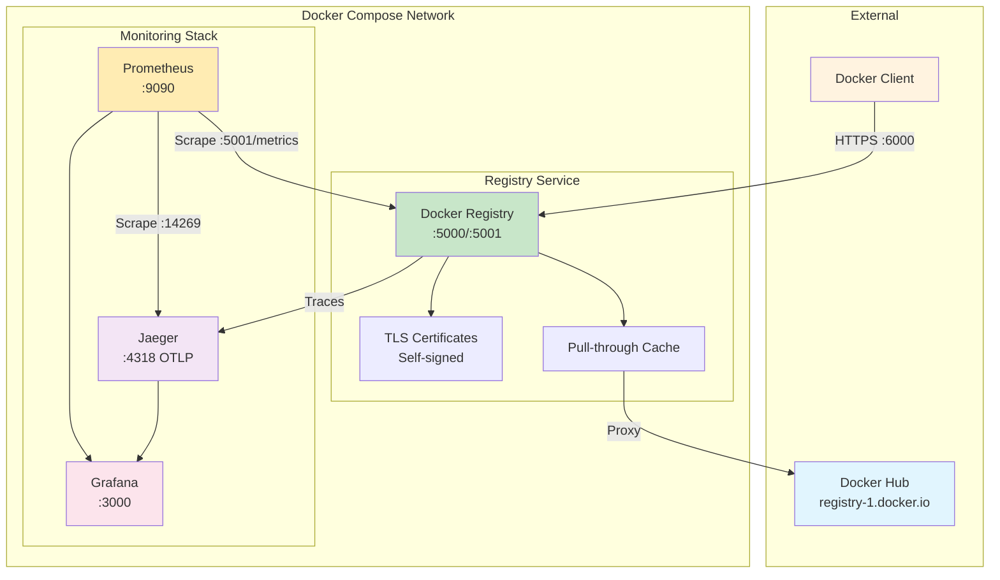

# Local Docker Registry with TLS and Monitoring Stack

This repository provides a complete setup for a local Docker registry secured with TLS using self-signed certificates. The registry is configured as a pull-through cache for Docker Hub and includes a full monitoring stack with Prometheus, Jaeger, and Grafana.

## Overview

This setup creates a production-ready local Docker registry with:

- **TLS Security**: Self-signed certificates using CFSSL with proper certificate chain
- **Pull-through Cache**: Caches images from Docker Hub to reduce bandwidth and improve speed
- **Distributed Tracing**: OpenTelemetry integration with Jaeger
- **Metrics Collection**: Prometheus scraping with pre-configured dashboards
- **Visualization**: Grafana dashboards for monitoring registry performance

## Architecture



## Quick Start

1. **Generate TLS certificates** (see Certificate Generation section below)
2. **Set up environment variables**:

   ```bash
   cp .env.example .env
   # Edit .env with your Docker Hub credentials
   ```

3. **Start the stack**:

   ```bash
   docker-compose up -d
   ```

4. **Access services**:
   - Registry API: <https://localhost:6000>
   - Grafana: <http://localhost:3000> (admin/admin)
   - Prometheus: <http://localhost:9090>
   - Jaeger: <http://localhost:16686>

## Certificate Generation with CFSSL

This setup uses a proper PKI hierarchy with root and intermediate CAs:

```bash
# 1. Generate the root CA
cfssl gencert -initca cfssl/ca.json | cfssljson -bare certs/ca

# 2. Generate the intermediate CA
cfssl gencert -initca cfssl/intermediate-ca.json | cfssljson -bare certs/intermediate_ca

# 3. Sign the intermediate CA with the root CA
cfssl sign -ca certs/ca.pem -ca-key certs/ca-key.pem -config cfssl/cfssl.json -profile intermediate_ca certs/intermediate_ca.csr | cfssljson -bare certs/intermediate_ca

# 4. Generate registry certificates (all three profiles)
cfssl gencert -ca certs/intermediate_ca.pem -ca-key certs/intermediate_ca-key.pem -config cfssl/cfssl.json -profile=peer cfssl/registry.json | cfssljson -bare certs/registry-peer
cfssl gencert -ca certs/intermediate_ca.pem -ca-key certs/intermediate_ca-key.pem -config cfssl/cfssl.json -profile=server cfssl/registry.json | cfssljson -bare certs/registry-server
cfssl gencert -ca certs/intermediate_ca.pem -ca-key certs/intermediate_ca-key.pem -config cfssl/cfssl.json -profile=client cfssl/registry.json | cfssljson -bare certs/registry-client

# 5. Create certificate chain for the registry
cat certs/registry-server.pem certs/intermediate_ca.pem > certs/registry.crt
cp certs/registry-server-key.pem certs/registry.key
```

## Registry Configuration

The Docker Registry is configured via `config.yaml`. For detailed configuration options, see the [official registry documentation](https://distribution.github.io/distribution/about/configuration/).

### Key Configuration Settings

Our configuration (`config.yaml`) includes:

#### Storage Configuration

```yaml
storage:
  delete:
    enabled: true          # Allows deletion of image blobs
  cache:
    blobdescriptor: inmemory  # In-memory cache for blob metadata
  filesystem:
    rootdirectory: /var/lib/registry
```

#### HTTP/TLS Configuration

```yaml
http:
  addr: :5000             # Main API port
  debug:
    addr: :5001          # Debug/metrics endpoint
    prometheus:
      enabled: true      # Expose Prometheus metrics
      path: /metrics
  tls:
    certificate: /etc/ssl/certs/domain.crt
    key: /etc/ssl/private/domain.key
    minimumtls: tls1.2   # Enforce TLS 1.2 minimum
```

#### Proxy Cache Configuration

```yaml
proxy:
  remoteurl: https://registry-1.docker.io  # Docker Hub
  username: ${DOCKER_HUB_USERNAME}         # From environment
  password: ${DOCKER_HUB_PASSWORD}         # From environment
```

#### Health Checks

```yaml
health:
  storagedriver:
    enabled: true
    interval: 10s
    threshold: 3
```

## Services Architecture

### Docker Registry (port 6000)

- **Purpose**: Local Docker image storage and Docker Hub proxy cache
- **Features**:
  - TLS encryption with self-signed certificates
  - Pull-through cache for Docker Hub
  - OpenTelemetry tracing to Jaeger
  - Prometheus metrics exposure
- **Internal endpoints**:
  - `:5000` - Main API (mapped to host port 6000)
  - `:5001` - Debug/metrics (internal only)

### Jaeger (port 16686)

- **Purpose**: Distributed tracing for registry operations
- **Features**:
  - Collects traces via OTLP protocol
  - Provides trace visualization and analysis
- **Internal endpoints**:
  - `:4317` - OTLP gRPC
  - `:4318` - OTLP HTTP
  - `:14269` - Metrics for Prometheus

### Prometheus (port 9090)

- **Purpose**: Metrics collection and storage
- **Scrape targets**:
  - Docker Registry metrics (HTTPS with skip verify)
  - Jaeger metrics
  - Self-monitoring
- **Configuration**: `prometheus/prometheus.yml`

### Grafana (port 3000)

- **Purpose**: Metrics visualization and dashboards
- **Features**:
  - Pre-configured datasources (Prometheus, Jaeger)
  - Docker Registry dashboard included
  - Anonymous viewer access enabled
- **Default credentials**: Configured in `.env`

## Testing the Registry

1. **Trust the CA certificate** (macOS):

   ```bash
   sudo security add-trusted-cert -d -r trustRoot -k /Library/Keychains/System.keychain certs/ca.pem
   ```

2. **Configure Docker to use the registry**:

   ```bash
   # Test pulling an image through the cache
   docker pull localhost:6000/library/alpine:latest
   
   # The image is now cached locally
   docker images | grep localhost:6000
   ```

3. **Push a local image**:

   ```bash
   # Tag a local image
   docker tag myapp:latest localhost:6000/myapp:latest
   
   # Push to registry
   docker push localhost:6000/myapp:latest
   ```

## Monitoring and Observability

### Grafana Dashboard

1. Access at <http://localhost:3000>
2. Login with configured credentials
3. Navigate to **Dashboards → Docker Registry**
4. Monitor:
   - HTTP request rates and latencies
   - Cache hit ratios
   - Response code distribution
   - Storage metrics

### Prometheus Queries

Access at <http://localhost:9090> and try these queries:

```promql
# Request rate by method
rate(registry_http_requests_total[5m])

# 99th percentile latency
histogram_quantile(0.99, rate(registry_http_request_duration_seconds_bucket[5m]))

# Cache hit ratio
rate(registry_storage_cache_hits_total[5m]) / rate(registry_storage_cache_requests_total[5m])
```

### Jaeger Traces

1. Access at <http://localhost:16686>
2. Select service: `docker-registry`
3. View traces for:
   - Image pulls/pushes
   - Manifest operations
   - Blob uploads/downloads

## Management Commands

### Docker Compose Operations

```bash
# Start all services
docker-compose up -d

# View logs
docker-compose logs -f registry
docker-compose logs -f

# Restart a service
docker-compose restart registry

# Stop all services
docker-compose down

# Clean up (including volumes)
docker-compose down -v
```

### Registry Maintenance

```bash
# Garbage collection (remove unused blobs)
docker exec registry registry garbage-collect /etc/distribution/config.yml

# Check registry health
curl -k https://localhost:6000/v2/_health
```

## Security Considerations

1. **Self-signed certificates**: Not suitable for production environments
2. **Credentials**: Stored in `.env` file - ensure it's in `.gitignore`
3. **Network isolation**: Internal service ports not exposed to host
4. **TLS enforcement**: Minimum TLS 1.2 with strong cipher suites
5. **Access control**: Consider implementing token authentication for production

## Troubleshooting

### Certificate Issues

```bash
# Verify certificate chain
openssl verify -CAfile certs/ca.pem -untrusted certs/intermediate_ca.pem certs/registry.crt

# Test TLS connection
openssl s_client -connect localhost:6000 -CAfile certs/ca.pem
```

### Registry Connection Issues

```bash
# Check if registry is responding
curl -k https://localhost:6000/v2/

# View detailed logs
docker logs registry --tail 100 -f
```

### Metrics Not Appearing

1. Check Prometheus targets: <http://localhost:9090/targets>
2. Verify registry metrics endpoint: `docker exec registry wget -O- http://localhost:5001/metrics`
3. Check Prometheus logs: `docker-compose logs prometheus`

## File Structure

```text
.
├── cfssl/                    # Certificate configurations
│   ├── ca.json              # Root CA config
│   ├── intermediate-ca.json # Intermediate CA config
│   ├── cfssl.json          # Certificate profiles
│   └── registry.json       # Registry certificate config
├── certs/                   # Generated certificates (git ignored)
├── prometheus/              # Prometheus configuration
│   └── prometheus.yml      # Scrape configurations
├── grafana/                 # Grafana provisioning
│   └── provisioning/
│       ├── datasources/    # Pre-configured datasources
│       └── dashboards/     # Pre-configured dashboards
├── config.yaml             # Registry configuration
├── docker-compose.yaml     # Service definitions
├── .env.example           # Environment template
└── .gitignore            # Git ignore patterns
```

## Performance Tuning

- **Cache size**: Adjust blob descriptor cache size for larger deployments
- **Concurrent operations**: Modify `tag.concurrencylimit` based on load
- **Storage driver**: Consider S3 or other drivers for production
- **Resource limits**: Add CPU/memory limits in docker-compose.yaml

## References

- [Docker Registry Configuration Reference](https://distribution.github.io/distribution/about/configuration/)
- [CFSSL Documentation](https://github.com/cloudflare/cfssl)
- [OpenTelemetry Registry Instrumentation](https://opentelemetry.io/)
