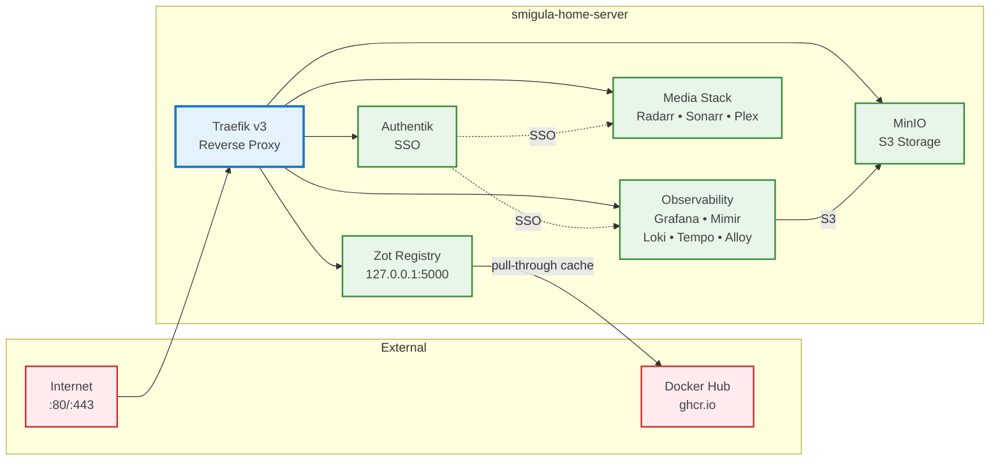
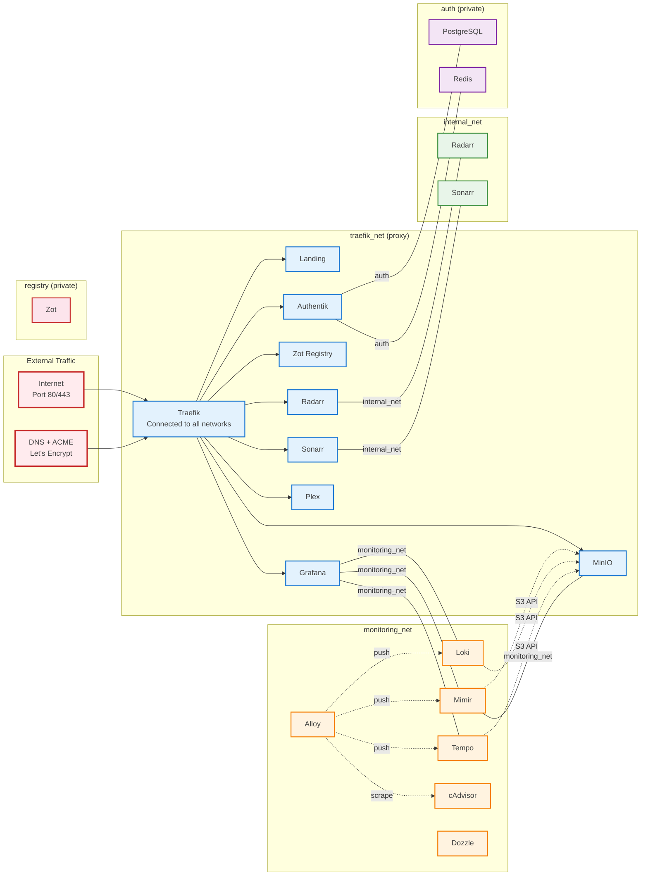

# smigula-home-server

A containerized ecosystem orchestrating media automation, localized image caching, and full-stack observability. This architecture implements the **TRaSH Guides** media server with a hardened **Zero-Trust security model**, optimized for rootless execution on Linux and Proxmox environments.

## Architecture Overview

The system is built around a modular **Infrastructure as Code** approach, utilizing **Docker Compose v2.20+ `include`** to compose services from isolated definitions into a single orchestrated stack.

```yaml
# compose.yaml (root)
name: smigula-home-server
include:
  - path: services/traefik.yaml
  - path: services/auth.yaml
  - path: services/storage.yaml
  - path: services/monitoring.yaml
  - path: services/mediaserver.yaml
```

### Infrastructure Diagram


```mermaid
graph LR
    subgraph External
        Internet["Internet<br/>:80/:443"]
        Registries["Docker Hub<br/>ghcr.io"]
    end

    subgraph "smigula-home-server"
        Traefik["Traefik v3<br/>Reverse Proxy"]
        Auth["Authentik<br/>SSO"]
        Monitoring["Observability<br/>Grafana &bull; Mimir<br/>Loki &bull; Tempo &bull; Alloy"]
        Storage["MinIO<br/>S3 Storage"]
        Media["Media Stack<br/>Radarr &bull; Sonarr &bull; Plex"]
        Registry["Zot Registry<br/>127.0.0.1:5000"]
    end

    Internet --> Traefik
    Traefik --> Auth
    Traefik --> Monitoring
    Traefik --> Storage
    Traefik --> Media
    Traefik --> Registry

    Auth -.->|SSO| Monitoring
    Auth -.->|SSO| Media
    Monitoring -->|S3| Storage
    Registry -->|pull-through cache| Registries

    classDef external fill:#ffebee,stroke:#d32f2f,stroke-width:2px,color:#424242
    classDef proxy fill:#e3f2fd,stroke:#1976d2,stroke-width:3px,color:#424242
    classDef service fill:#e8f5e9,stroke:#388e3c,stroke-width:2px,color:#424242

    class Internet,Registries external
    class Traefik proxy
    class Auth,Monitoring,Storage,Media,Registry service
```

### Service Domains

- **Registry (Zot):** Local OCI mirror and pull-through cache (Docker Hub, ghcr.io), bound to `127.0.0.1:5000` for loopback-only access. Uses cfssl-generated TLS and stores blobs on local SSD for high-throughput pulls.
- **Media (Starr Apps + Plex):** Fully compliant with TRaSH Guides' "One Folder to Rule Them All" philosophy. A single `/data` mount point facilitates **Hardlinks and Atomic Moves**, eliminating redundant disk I/O.
- **Observability (LGTM):** Centralized telemetry pipeline (Loki, Grafana, Tempo, Mimir) with **Grafana Alloy** and **cAdvisor** collectors. Long-term storage backed by **MinIO S3**. Includes **Dozzle** for real-time log viewing.
- **Identity (Authentik):** Centralized SSO and user management (PostgreSQL 16 + Redis 8.2 backend).
- **Proxy (Traefik v3):** Hardened reverse proxy with file-based dynamic configuration, OpenTelemetry tracing, and automatic HTTPS via Let's Encrypt.

## Project Structure

```
.
├── compose.yaml                 # Root orchestrator (include-based)
├── Taskfile.yml                 # Task runner (replaces Makefile/run.sh)
├── .env                         # Non-sensitive base environment variables
├── .sops.yaml                   # SOPS encryption rules (AGE key)
│
├── services/                    # Compose service definitions
│   ├── registry.yaml            #   Zot OCI registry
│   ├── traefik.yaml             #   Traefik + landing page
│   ├── auth.yaml                #   Authentik (postgres, redis, server, worker)
│   ├── storage.yaml             #   MinIO S3 storage
│   ├── monitoring.yaml          #   LGTM stack + cAdvisor + Dozzle
│   ├── mediaserver.yaml         #   Radarr, Sonarr, Plex
│   ├── certs/                   #   Generated TLS certificates (gitignored)
│   └── cfssl/                   #   Certificate authority configs
│
├── config/                      # Unified configuration
│   ├── zot/                     #   Registry config + daemon.json
│   ├── traefik/                 #   Static config + dynamic/ providers
│   ├── grafana/                 #   Provisioning, dashboards, alerts
│   ├── alloy/                   #   Telemetry collector config
│   ├── loki/                    #   Log aggregator config
│   └── mimir/                   #   Metrics backend config + nginx
│
├── secrets/                     # SOPS-encrypted environment files
│   ├── *.env.enc                #   Encrypted (committed to git)
│   └── *.env.dec                #   Decrypted (gitignored, transient)
│
├── shared/                      # Shared resources (Tempo config, landing HTML)
├── cfssl/                       # Certificate authority definitions
├── docs/                        # Documentation (guides, stacks, configuration)
└── scripts/                     # Helper scripts (MinIO setup, etc.)
```

## Network Architecture

Three core networks isolate traffic domains, defined centrally in `compose.yaml`:

| Network | Name | Type | Purpose |
|---------|------|------|---------|
| `proxy` | `traefik_net` | External | Public-facing services routed through Traefik |
| `internal` | `internal_net` | Local | Inter-service communication (Starr apps) |
| `monitoring` | `monitoring_net` | External | Observability stack isolation |

Individual service files also define stack-private networks (e.g., `auth`, `registry`) for internal dependencies like PostgreSQL and Redis.


```mermaid
graph LR
    subgraph "External Traffic"
        Internet["Internet<br/>Port 80/443"]
        DNS["DNS + ACME<br/>Let's Encrypt"]
    end

    subgraph "traefik_net (proxy)"
        direction TB
        TraefikSvc["Traefik<br/>Connected to all networks"]
        LandingSvc["Landing"]
        GrafanaSvc["Grafana"]
        ZotSvc["Zot Registry"]
        MinIOSvc["MinIO"]
        RadarrSvc["Radarr"]
        SonarrSvc["Sonarr"]
        PlexSvc["Plex"]
        AuthentikSvc["Authentik"]
    end

    subgraph "monitoring_net"
        MimirSvc["Mimir"]
        LokiSvc["Loki"]
        TempoSvc["Tempo"]
        AlloySvc["Alloy"]
        cAdvisorSvc["cAdvisor"]
        DozzleSvc["Dozzle"]
    end

    subgraph "internal_net"
        RadarrInt["Radarr"]
        SonarrInt["Sonarr"]
    end

    subgraph "auth (private)"
        PostgresSvc["PostgreSQL"]
        RedisSvc["Redis"]
    end

    subgraph "registry (private)"
        ZotInt["Zot"]
    end

    %% External ingress
    Internet --> TraefikSvc
    DNS --> TraefikSvc

    %% Traefik routes to proxy-network services
    TraefikSvc --> LandingSvc
    TraefikSvc --> GrafanaSvc
    TraefikSvc --> ZotSvc
    TraefikSvc --> MinIOSvc
    TraefikSvc --> AuthentikSvc
    TraefikSvc --> RadarrSvc
    TraefikSvc --> SonarrSvc
    TraefikSvc --> PlexSvc

    %% Cross-network connections
    GrafanaSvc ---|monitoring_net| MimirSvc
    GrafanaSvc ---|monitoring_net| LokiSvc
    GrafanaSvc ---|monitoring_net| TempoSvc
    MinIOSvc ---|monitoring_net| MimirSvc

    %% Auth private network
    AuthentikSvc ---|auth| PostgresSvc
    AuthentikSvc ---|auth| RedisSvc

    %% Internal media network
    RadarrSvc ---|internal_net| RadarrInt
    SonarrSvc ---|internal_net| SonarrInt

    %% Telemetry collection
    AlloySvc -.->|scrape| cAdvisorSvc
    AlloySvc -.->|push| MimirSvc
    AlloySvc -.->|push| LokiSvc
    AlloySvc -.->|push| TempoSvc

    %% S3 storage
    MimirSvc -.->|S3 API| MinIOSvc
    LokiSvc -.->|S3 API| MinIOSvc
    TempoSvc -.->|S3 API| MinIOSvc

    %% Styling
    classDef external fill:#ffebee,stroke:#c62828,stroke-width:3px,color:#424242
    classDef proxy fill:#e3f2fd,stroke:#1976d2,stroke-width:2px,color:#424242
    classDef monitoring fill:#fff3e0,stroke:#f57c00,stroke-width:2px,color:#424242
    classDef internal fill:#e8f5e9,stroke:#388e3c,stroke-width:2px,color:#424242
    classDef auth fill:#f3e5f5,stroke:#7b1fa2,stroke-width:2px,color:#424242
    classDef registry fill:#fce4ec,stroke:#c62828,stroke-width:2px,color:#424242

    class Internet,DNS external
    class TraefikSvc,LandingSvc,GrafanaSvc,ZotSvc,MinIOSvc,RadarrSvc,SonarrSvc,PlexSvc,AuthentikSvc proxy
    class MimirSvc,LokiSvc,TempoSvc,AlloySvc,cAdvisorSvc,DozzleSvc monitoring
    class RadarrInt,SonarrInt internal
    class PostgresSvc,RedisSvc auth
    class ZotInt registry
```

## Storage Strategy

The architecture uses a **Single-Drive Mount** strategy for data consistency while keeping performance-critical registry blobs on local SSD.

| Location | Purpose | Strategy |
|----------|---------|----------|
| `~/.config/containers/storage` | OCI Registry Blobs | Local SSD (high IOPS) |
| `/mnt/media/data` | Torrents, Configs, Media Library | Atomic Moves / Hardlinks |
| `/mnt/media/monitoring` | LGTM Backend Data (Loki, Tempo, Mimir, Grafana, Alloy) | Persistent telemetry storage |
| `/mnt/media/logs/traefik` | Access Logs | JSON-formatted |
| `/tmp/plex_transcode` | Plex Transcode Cache | RAM Disk / tmpfs |

## Security & Identity

- **Rootless Orchestration:** Native support for rootless **Podman** (default) or Docker, reducing the host attack surface.
- **PKI Management:** Tiered certificate chain (Root CA &rarr; Intermediate CA &rarr; Server) managed via **cfssl**. Certificates stored in `services/certs/` (gitignored).
- **Secret Management:** Integrated **SOPS + Age** workflow. Individual `*.env.enc` files are decrypted and aggregated into a transient `secrets/all.env.dec` master file at runtime only.
- **Network Isolation:** Services communicate only through explicitly declared Docker networks. Zot binds to loopback only (`127.0.0.1:5000`).

## Getting Started

### Prerequisites

- **Container Runtime:** Podman 5.0+ or Docker CE 28.3+
- **Utilities:** [Task](https://taskfile.dev/), [SOPS](https://github.com/getsops/sops), [cfssl](https://github.com/cloudflare/cfssl), and [Age](https://github.com/FiloSottile/age)
- **Environment:** Age key located at `~/.config/sops/age/keys.txt`
- **Hardware:** Minimum 8GB RAM, 50GB free disk space. Intel QuickSync optional (Plex transcoding).

### Initialization

Run the master initialization task to prepare the environment. This detects your host IP (from `vmbr0` or `eth0`), creates data directories, generates the PKI chain, and decrypts secrets.

```bash
# Default interface is vmbr0; override with HOST_IFACE=eth0 if needed
task init
```

### Deployment

The deployment follows a strictly sequenced bootstrap to ensure image availability through the local registry cache.

```bash
task up
```

The `up` task performs:
1. **Zot registry** starts and waits for health check (`/v2/`)
2. **MinIO** starts, waits for liveness, then runs bucket setup script
3. **Remaining services** start together (`traefik`, `auth`, `monitoring`, `mediaserver`)

### Teardown

```bash
task down   # Stops all services and securely purges plaintext secrets
```

## Taskfile Commands

| Command | Action |
|---------|--------|
| `task init` | Full initialization: directories, PKI chain, secret aggregation |
| `task up` | Sequenced deploy: Registry &rarr; MinIO &rarr; full stack |
| `task down` | Stop all services and purge decrypted secrets |
| `task certs:all` | Generate full SSL certificate chain (CA &rarr; Intermediate &rarr; Server) |
| `task trust-ca` | Install CA cert into container runtime trust store |
| `task secrets:decrypt` | Decrypt all `*.env.enc` files in `secrets/` |
| `task secrets:collect` | Decrypt and merge all secrets into `secrets/all.env.dec` |
| `task registry:list` | Query the Zot catalog (`/v2/_catalog`) |
| `task logs SERVICE=grafana` | Follow logs for a specific service |
| `task shell SERVICE=sonarr` | Shell into a running container |

## Service Inventory

| Service | Image | Port | Network(s) |
|---------|-------|------|------------|
| Zot Registry | `ghcr.io/project-zot/zot-linux-amd64:v2.1.15` | 5000 (loopback) | proxy, registry |
| Traefik | `traefik:v3.6.9` | 80, 443, 8080 | proxy |
| Authentik | `authentik:2026.2.1` | 9008, 9443 | proxy, auth |
| PostgreSQL | `postgres:16` | &mdash; | auth |
| Redis | `redis:8.2` | &mdash; | auth |
| MinIO | `minio/minio` | 9000, 9001 | proxy, monitoring |
| Mimir | `grafana/mimir:v3.0.3` | 9009 | monitoring |
| Loki | `grafana/loki:v3.6.7` | 3100 | monitoring |
| Tempo | `grafana/tempo:v2.10.1` | 3200, 4317, 4318 | monitoring |
| Alloy | `grafana/alloy:v1.14.0` | 12345 | monitoring |
| cAdvisor | `gcr.io/cadvisor/cadvisor:v0.54.1` | &mdash; | monitoring |
| Dozzle | `amir20/dozzle:v9` | 9080 | monitoring |
| Grafana | `grafana/grafana:v12.4` | 3000 | proxy, monitoring |
| Radarr | `linuxserver/radarr:6.0.4` | 7878 | proxy, internal |
| Sonarr | `linuxserver/sonarr:4.0.16` | 8989 | proxy, internal |
| Plex | `linuxserver/plex:1.43.0` | 32400 | proxy |

## TRaSH Compliance

| Service | Internal Path | External Map | Logic |
|---------|---------------|--------------|-------|
| **Radarr/Sonarr** | `/data` | `/mnt/media/data` | Maps both downloads & media to 1 filesystem |
| **qBittorrent** | `/data/torrents` | `/mnt/media/data/torrents` | Ensures Starr apps can see completed files |
| **Plex** | `/data/media` | `/mnt/media/data/media` | Read-only access to organized libraries |

### Hardware Acceleration

Intel QuickSync is passed to Plex via `/dev/dri` device mapping. The orchestration layer handles the `VIDEO_GID` mapping and permissions required for rootless hardware transcoding.

## Environment Variable Flow

```
.env (base, non-sensitive)
    ↓
secrets/*.env.enc (encrypted, committed)
    ↓  task secrets:collect
secrets/*.env.dec (decrypted, transient)
    ↓  aggregated
secrets/all.env.dec (master env, injected into services)
```

## Documentation

- **[Quick Start Guide](docs/guides/quick-start.md)** &mdash; Getting started walkthrough
- **[VM Setup Guide](docs/guides/vm-setup.md)** &mdash; Host/VM preparation
- **[Authentik Setup](docs/guides/authentik-setup.md)** &mdash; Identity provider configuration
- **[Monitoring Guide](docs/guides/monitoring.md)** &mdash; Observability setup and queries
- **[Testing Guide](docs/guides/testing.md)** &mdash; Registry and service testing procedures
- **[Troubleshooting](docs/guides/troubleshooting.md)** &mdash; Common issues and solutions
- **[SOPS Configuration](docs/configuration/sops.md)** &mdash; Secret management details
- **[Traefik Configuration](docs/configuration/traefik.md)** &mdash; Reverse proxy setup
- **[Zot Registry](docs/configuration/zot-registry.md)** &mdash; Registry configuration
- **[Zot OIDC](docs/configuration/zot-oidc.md)** &mdash; Registry SSO with Authentik
- **[Rootless Docker](docs/configuration/rootless-docker.md)** &mdash; Rootless runtime setup

## References

- [Zot Registry](https://zotregistry.dev) | [OCI Distribution Spec](https://github.com/opencontainers/distribution-spec)
- [Grafana Alloy](https://grafana.com/docs/alloy/) | [Loki LogQL](https://grafana.com/docs/loki/latest/logql/)
- [Rootless Docker](https://docs.docker.com/engine/security/rootless/) | [Rootless Podman](https://github.com/containers/podman/blob/main/docs/tutorials/rootless_tutorial.md)
- [TRaSH Guides](https://trash-guides.info/) | [cfssl](https://github.com/cloudflare/cfssl)
- [Taskfile](https://taskfile.dev/) | [SOPS](https://github.com/getsops/sops) | [Age](https://github.com/FiloSottile/age)
