# Multi-Stack Container Infrastructure

This repository provides a comprehensive, production-ready container infrastructure with six integrated Docker Compose stacks for identity management, observability, storage, registry services, and media automation. The architecture emphasizes security, observability, and operational excellence.

## Infrastructure Stacks

- **Authentication Stack** (`auth/`): Authentik identity provider with PostgreSQL and Redis
- **Traefik Stack** (`traefik/`): Reverse proxy with automatic SSL termination and service discovery
- **Monitoring Stack** (`monitoring/`): Complete observability platform with Mimir cluster, Grafana, Loki, Tempo, and Alloy
- **Storage Stack** (`minio/`): S3-compatible object storage for monitoring backends
- **Registry Stack** (`zot/`): OCI-compliant container registry with pull-through caching
- **Media Stack** (`mediaserver/`): Automated media server with Plex and content management

The infrastructure uses external Docker networks for service isolation, Traefik for centralized ingress, and Authentik for unified authentication across all services.

## Table of Contents

- [Architecture Overview](#architecture-overview)
- [Stack Documentation](#stack-documentation)
  - [Traefik Stack - Reverse Proxy](#traefik-stack---reverse-proxy)
  - [Authentication Stack - Authentik IdP](#authentication-stack---authentik-idp)
  - [Monitoring Stack - Observability Platform](#monitoring-stack---observability-platform)
  - [Storage Stack - MinIO S3](#storage-stack---minio-s3)
  - [Registry Stack - Zot OCI Registry](#registry-stack---zot-oci-registry)
  - [Media Stack - Plex Automation](#media-stack---plex-automation)
- [Network Architecture](#network-architecture)
- [Quick Start Guide](#quick-start-guide)
- [Management Commands](#management-commands)
- [Security Considerations](#security-considerations)
- [Troubleshooting](#troubleshooting)
- [References](#references)

## Architecture Overview

This infrastructure provides a comprehensive, enterprise-grade container platform with the following capabilities:

### Overall Infrastructure Architecture

```mermaid
graph LR
    subgraph "External"
        Internet[🌐 Internet<br/>Port 80/443]
        Users[👥 Users]
    end

    subgraph "Ingress"
        Traefik[🚦 Traefik<br/>Reverse Proxy<br/>+ SSL]
    end

    subgraph "Core Services"
        Auth[🔐 Authentik<br/>Identity Provider]
        Monitor[📊 Monitoring<br/>Grafana + LGTM Stack]
        Registry[📦 Zot Registry<br/>Container Images]
        Storage[💾 MinIO<br/>S3 Storage]
        Media[🎬 Plex Stack<br/>Media Automation]
    end

    subgraph "External Sources"
        DockerHub[🐳 Docker Hub]
        MediaSources[📺 Media Sources]
    end

    %% Main flow
    Internet --> Traefik
    Users --> Traefik

    %% Service routing
    Traefik --> Auth
    Traefik --> Monitor
    Traefik --> Registry
    Traefik --> Storage
    Traefik --> Media

    %% Authentication flow
    Auth -.->|SSO| Monitor
    Auth -.->|SSO| Registry
    Auth -.->|SSO| Storage
    Auth -.->|SSO| Media

    %% Data dependencies
    Monitor --> Storage
    Registry --> DockerHub
    Media --> MediaSources

    %% Styling
    classDef external fill:#ffebee,stroke:#d32f2f,stroke-width:2px,color:#424242
    classDef ingress fill:#e3f2fd,stroke:#1976d2,stroke-width:3px,color:#424242
    classDef core fill:#e8f5e8,stroke:#388e3c,stroke-width:2px,color:#424242
    classDef sources fill:#fff3e0,stroke:#f57c00,stroke-width:2px,color:#424242

    class Internet,Users external
    class Traefik ingress
    class Auth,Monitor,Registry,Storage,Media core
    class DockerHub,MediaSources sources
```



### Key Features

- **Unified Authentication**: Authentik provides SSO across all services
- **Automatic HTTPS**: Traefik with Let's Encrypt certificate automation
- **Complete Observability**: Grafana LGTM stack with Mimir clustering
- **Container Registry**: OCI-compliant registry with pull-through caching
- **S3 Storage**: MinIO provides scalable object storage
- **Media Automation**: Complete Plex-based media management pipeline
- **Production-Ready**: Resource limits, health checks, and persistent storage

## Prerequisites

### System Requirements

- **Hardware**: Minimum 8GB RAM, 50GB free disk space
- **Operating System**: Linux (Ubuntu 20.04+ recommended) or macOS with Docker support
- **Docker**: Docker Engine 24.0+ with Docker Compose v2
- **Network**: Internet connectivity for image pulls and certificate generation

### Required Software

- **Docker Engine**: Latest stable version with compose plugin
- **Git**: For repository management
- **Make**: For automation commands (optional)

### Port Requirements

The following ports should be available on your system:

| Port      | Service   | Description             |
| --------- | --------- | ----------------------- |
| 80/443    | Traefik   | HTTP/HTTPS ingress      |
| 8080      | Traefik   | Dashboard               |
| 9008/9443 | Authentik | Identity provider       |
| 3000      | Grafana   | Visualization dashboard |
| 9009      | Mimir     | Metrics storage         |
| 3100      | Loki      | Log aggregation         |
| 3200      | Tempo     | Distributed tracing     |
| 5000      | Zot       | Container registry      |
| 9000/9001 | MinIO     | Object storage          |
| 32400     | Plex      | Media server            |

### Storage Structure

The infrastructure expects the following directory structure:

```bash
/mnt/data/
├── postgres/         # PostgreSQL data
├── redis/            # Redis data
├── authentik/        # Authentik media/templates
├── mimir-{1,2,3}/    # Mimir cluster data
├── grafana/          # Grafana dashboards/config
├── loki/             # Loki log data
├── zot/              # Registry storage
├── minio/            # MinIO object storage
└── logs/             # Application logs
```

## Rootless Docker Setup

### 1. Remove Regular Docker (if installed)

```bash
sudo systemctl stop docker
sudo systemctl disable docker
sudo apt remove docker docker-engine docker.io containerd runc
```

### 2. Install Docker CE

```bash
# Add Docker's official GPG key
curl -fsSL https://download.docker.com/linux/ubuntu/gpg | sudo gpg --dearmor -o /usr/share/keyrings/docker-archive-keyring.gpg

# Add repository
echo "deb [arch=$(dpkg --print-architecture) signed-by=/usr/share/keyrings/docker-archive-keyring.gpg] https://download.docker.com/linux/ubuntu $(lsb_release -cs) stable" | sudo tee /etc/apt/sources.list.d/docker.list > /dev/null

# Install Docker
sudo apt update
sudo apt install docker-ce docker-ce-cli containerd.io docker-buildx-plugin docker-compose-plugin
```

### 3. Install Rootless Docker

```bash
# Install rootless Docker
dockerd-rootless-setuptool.sh install

# Add to shell profile
echo 'export PATH=$HOME/bin:$PATH' >> ~/.bashrc
echo 'export DOCKER_HOST=unix://$XDG_RUNTIME_DIR/docker.sock' >> ~/.bashrc
source ~/.bashrc
```

### 4. Start Rootless Docker

```bash
systemctl --user enable --now docker

# Verify installation
docker version
docker info
```

### 5. Configure Docker Daemon

```bash
# Create Docker configuration directory
mkdir -p ~/.config/docker

# Create daemon.json configuration
tee ~/.config/docker/daemon.json << 'EOF'
{
  "data-root": "/home/madmin/.config/containers/storage",
  "builder": {
    "gc": {
      "defaultKeepStorage": "20GB",
      "enabled": true
    }
  },
  "experimental": false,
  "insecure-registries": [ "localhost:5000" ],
  "log-driver": "json-file",
  "log-opts": {
    "max-size": "10m",
    "max-file": "3",
    "compress": "true"
  },
  "features": {
    "buildkit": true
  },
  "registry-mirrors": ["http://localhost:5000"]
}
EOF

# Restart Docker to apply configuration
systemctl --user restart docker
docker info  # Verify configuration
```

## Stack Documentation

### Traefik Stack - Reverse Proxy

**Purpose**: Central ingress controller with automatic HTTPS and service discovery

```mermaid
graph TB
    subgraph "External"
        Internet[Internet :80/:443]
        LE[Let's Encrypt<br/>DNS Challenge]
    end

    subgraph "Traefik Stack"
        Traefik[Traefik v3.4<br/>:80/:443<br/>Dashboard :8080]
        Landing[Landing Page<br/>Static HTML]
        Config[Dynamic Config<br/>File Provider]
    end

    subgraph "Routing Rules"
        Rules["`Host-based Routing:
        auth.domain → Authentik
        grafana.domain → Grafana
        minio.domain → MinIO
        registry.domain → Zot
        plex.domain → Plex`"]
    end

    Internet --> Traefik
    LE --> Traefik
    Traefik --> Landing
    Traefik --> Config
    Config --> Rules

    classDef external fill:#ffebee,stroke:#c62828,stroke-width:2px,color:#424242
    classDef proxy fill:#e1f5fe,stroke:#0277bd,stroke-width:3px,color:#424242
    classDef config fill:#f3e5f5,stroke:#7b1fa2,stroke-width:2px,color:#424242

    class Internet,LE external
    class Traefik,Landing proxy
    class Config,Rules config
```



**Key Features**:

- Automatic SSL certificate management via Let's Encrypt
- Host-based routing with middleware support
- Dashboard and metrics endpoints
- Docker label-based service discovery

**Services**:

- `traefik`: Main reverse proxy container
- `landing`: Static landing page with subdomain redirects

### Authentication Stack - Authentik IdP

**Purpose**: Unified identity provider with SSO capabilities

```mermaid
graph TB
    subgraph "Auth Stack"
        Authentik[Authentik IdP<br/>:9008 HTTP<br/>:9443 HTTPS]
        Worker[Authentik Worker<br/>Background Tasks]

        subgraph "Database Layer"
            PostgreSQL[PostgreSQL 16<br/>:5432<br/>User Database]
            Redis[Redis 7<br/>:6379<br/>Session Cache]
        end

        subgraph "Storage"
            Media[Media Volume<br/>Static Assets]
            Templates[Templates Volume<br/>Custom Templates]
            PGData[PostgreSQL Data<br/>Persistent Volume]
        end
    end

    subgraph "SSO Integration"
        Services["`Protected Services:
        • Grafana
        • MinIO Console
        • Registry UI
        • Media Services`"]
    end

    Authentik --> PostgreSQL
    Authentik --> Redis
    Worker --> PostgreSQL
    Worker --> Redis
    Authentik --> Media
    Authentik --> Templates
    PostgreSQL --> PGData

    Authentik -.->|OIDC/SAML| Services

    classDef auth fill:#f3e5f5,stroke:#7b1fa2,stroke-width:3px,color:#424242
    classDef database fill:#e8f5e8,stroke:#2e7d32,stroke-width:2px,color:#424242
    classDef storage fill:#fff3e0,stroke:#ef6c00,stroke-width:2px,color:#424242
    classDef services fill:#e3f2fd,stroke:#1976d2,stroke-width:2px,color:#424242

    class Authentik,Worker auth
    class PostgreSQL,Redis database
    class Media,Templates,PGData storage
    class Services services
```



**Key Features**:

- OAuth2, SAML, LDAP protocol support
- User management and group-based access control
- Custom branding and templates
- Background task processing

**Services**:

- `postgresql`: Primary database for user data
- `redis`: Session cache and task queue
- `server`: Main Authentik web application
- `worker`: Background task processor

### Monitoring Stack - Observability Platform

**Purpose**: Complete observability with metrics, logs, and traces


**Key Features**:

- Grafana LGTM stack (Loki, Grafana, Tempo, Mimir)
- High-availability Mimir cluster with load balancing
- Unified data collection via Alloy
- Container metrics collection with cAdvisor
- Real-time log viewing with Dozzle

**Services**:

- `mimir-1/2/3`: 3-node Mimir cluster for metrics
- `mimir-lb`: Nginx load balancer for cluster
- `grafana`: Visualization and dashboards
- `loki`: Log aggregation and querying
- `tempo`: Distributed tracing
- `alloy`: Unified observability collector
- `cadvisor`: Container metrics collection
- `dozzle`: Real-time log viewer

### Storage Stack - MinIO S3

**Purpose**: S3-compatible object storage for monitoring backends


**Key Features**:

- S3-compatible API for broad compatibility
- Web-based management console
- Automated bucket creation and policies
- Service user management

**Services**:

- `minio`: Main storage server
- `mc`: MinIO client for setup and administration

### Registry Stack - Zot OCI Registry

**Purpose**: OCI-compliant container registry with pull-through caching


**Key Features**:

- OCI Distribution Specification compliance
- Pull-through caching for improved performance
- Web UI for registry management
- Vulnerability scanning and image signing support

**Services**:

- `registry`: Main Zot registry server

### Media Stack - Plex Automation

**Purpose**: Complete media server with automated content management


**Key Features**:

- Complete media automation pipeline
- Request management with approval workflows
- Multiple content source integration
- Automated subtitle management

**Services**:

- `plex`: Media server and streaming platform
- `sonarr`: TV series management and automation
- `radarr`: Movie management and automation
- `prowlarr`: Indexer and search management
- `qbittorrent`: Download client for torrents
- `overseerr`: User request management interface
- `bazarr`: Subtitle download and management

## Network Architecture

The infrastructure uses external Docker networks for service isolation:


## Registry Authentication

Authentication is handled externally by Authentik through Traefik. The Zot registry itself does not require local authentication.

### Accessing the Registry

#### Via HTTPS (External Access)

```bash
# Pull images through the registry (authentication handled by Traefik/Authentik)
docker pull registry.smigula.io/docker/nginx:latest

# Push images to the registry
docker tag myapp:latest registry.smigula.io/myapp:latest
docker push registry.smigula.io/myapp:latest
```

#### Via HTTP (Local Access)

```bash
# For local development, you can also use localhost:5000
docker pull localhost:5000/docker/nginx:latest
```

### Authentication Flow

1. **External Access**: Traefik handles authentication via Authentik
1. **Local Access**: Direct access to port 5000 bypasses authentication
1. **Metrics Access**: Prometheus can access `/metrics` endpoint without authentication

## Available Commands

### Zot Registry Commands

```bash
# From the zot/ directory
docker-compose up -d        # Start Zot registry
docker-compose down         # Stop Zot registry
docker-compose logs -f      # View Zot logs
docker-compose ps           # Check Zot status

# Registry API commands
curl http://localhost:5000/v2/_catalog                    # List all repositories
curl http://localhost:5000/v2/docker/nginx/tags/list      # List tags for a repository
```

### Monitoring Stack Commands

```bash
# From the monitoring/ directory
docker-compose up -d        # Start monitoring stack
docker-compose down         # Stop monitoring stack
docker-compose logs -f      # View all monitoring logs
docker-compose ps           # Check monitoring services status

# View specific service logs
docker-compose logs -f mimir
docker-compose logs -f grafana
docker-compose logs -f loki
docker-compose logs -f tempo
```

## Quick Start

1. **Set up credentials** (optional):

   ```bash
   # Create credentials file for upstream registries (optional)
   cat <<EOF > zot/config/credentials.yaml
   registry-1.docker.io:
     username: <your_docker_hub_username>
     password: <your_docker_hub_password>
   ghcr.io:
     username: <your_github_username>
     password: <your_github_token>
   EOF

   # Set up Grafana credentials in monitoring directory
   cat <<EOF > monitoring/.env
   GF_SECURITY_ADMIN_USER=admin
   GF_SECURITY_ADMIN_PASSWORD=admin
   EOF
   ```

1. **Setup rootless Docker** (if not already done):

   Follow the [Rootless Docker Setup](#rootless-docker-setup) section above.

1. **Start all services**:

   ```bash
   # Start Zot registry
   cd zot
   docker-compose up -d

   # Start Caddy reverse proxy
   cd ../caddy
   docker-compose up -d

   # Start monitoring stack
   cd ../monitoring
   docker-compose up -d
   ```

1. **Configure Docker to use the registry**:

   ```bash
   # For external HTTPS access (authentication handled by Traefik/Authentik)
   docker login registry.smigula.io

   # For local HTTP access (no authentication required)
   # First add to insecure registries - see "Configure Docker for Insecure Registry" section below
   docker pull localhost:5000/docker/nginx:latest
   ```

1. **Access services**:

   ```bash
   # Check all running services
   docker ps
   ```

   Service URLs:

   - Zot Registry API (local): <http://localhost:5000/v2/> (no auth)
   - Zot Registry API (external): <https://registry.smigula.io/v2/> (auth via Traefik/Authentik)
   - Zot Web UI: <http://localhost:5000/home> or <https://registry.smigula.io/home>
   - Grafana: <http://localhost:3000> (admin/admin)
   - Mimir: <http://localhost:9009> (metrics storage)
   - Tempo: <http://localhost:3200> (tracing)
   - MinIO Console: <http://localhost:9001> (object storage)
   - Loki: <http://localhost:3100> (logs)
   - Alloy: <http://localhost:12345> (Grafana Alloy UI)

1. **View logs in Grafana**:

   - Navigate to <http://localhost:3000>
   - Login with admin/admin
   - Go to Explore → Select Loki datasource
   - Try queries like `{container="registry"}` or `{job="docker_logs"}`

## CFSSL Configuration

Before generating certificates, you need to customize the CFSSL configuration files for your environment. The following files contain default values that should be updated:

### 1. Root CA Configuration (`cfssl/ca.json`)

Edit the following fields in `cfssl/ca.json`:

```json
{
  "CN": "Smigula Root CA",     // Replace with your root CA name
  "names": [{
    "C": "US",                           // Your country code
    "L": "Tampa",                    // Your city
    "O": "Smigula",            // Your organization name
    "OU": "development",             // Your department/unit
    "ST": "FL"                   // Your state/province
  }]
}
```

### 2. Intermediate CA Configuration (`cfssl/intermediate-ca.json`)

Update the same fields in `cfssl/intermediate-ca.json`:

```json
{
  "CN": "Smigula Intermediate CA",
  "names": [{
    "C": "US",
    "L": "Tampa",
    "O": "Smigula",
    "OU": "development",
    "ST": "FL"
  }],
  "ca": {
    "expiry": "42720h"    // 5 years - adjust as needed
  }
}
```

### 3. Registry Certificate Configuration (`cfssl/registry.json`)

This is the most important configuration to customize:

```json
{
  "CN": "registry.smigula.io",        // Your registry's FQDN
  "hosts": [
    "registry.smigula.io",            // Your registry's domain
    "registry",                           // Short hostname
    "localhost",                          // Keep for local testing
    "127.0.0.1",                          // Localhost IP
    "10.0.0.100"                          // Your registry's IP (if static)
  ],
  "names": [{
    "C": "US",
    "L": "Tampa",
    "O": "Smigula",
    "OU": "development",
    "ST": "FL"
  }]
}
```

### 4. Certificate Profiles (`cfssl/cfssl.json`)

The default profiles are suitable for most use cases, but you can adjust certificate expiry times:

```json
{
  "signing": {
    "profiles": {
      "intermediate_ca": {
        "expiry": "8760h",    // 1 year - adjust as needed
        ...
      },
      "server": {
        "expiry": "8760h",    // 1 year for server certs
        ...
      }
    }
  }
}
```

### Common Customizations

1. **For Local Development**:

   - Keep "localhost" and "127.0.0.1" in the hosts array
   - Add your machine's hostname
   - Use a simple organization name like "Development"

1. **For Production**:

   - Use proper FQDN for the registry
   - Add all possible access names (load balancer DNS, service names, etc.)
   - Set appropriate certificate expiry times
   - Use official organization details

1. **For Kubernetes**:

   - Add service names: `registry.namespace.svc.cluster.local`
   - Add service IPs if using ClusterIP
   - Include any ingress hostnames

### Example for Local Development

Here's a complete example for local development:

```bash
# Edit ca.json
sed -i '' 's/Smigula Root CA/My Local Root CA/g' cfssl/ca.json
sed -i '' 's/Smigula/My Organization/g' cfssl/ca.json
sed -i '' 's/Tampa/My City/g' cfssl/ca.json
sed -i '' 's/FL/My State/g' cfssl/ca.json

# Edit registry.json for local use
cat > cfssl/registry.json <<EOF
{
  "CN": "localhost",
  "hosts": [
    "localhost",
    "127.0.0.1",
    "registry",
    "registry.local",
    "*.local"
  ],
  "key": {
    "algo": "rsa",
    "size": 2048
  },
  "names": [{
    "C": "US",
    "L": "My City",
    "O": "My Organization",
    "OU": "Development",
    "ST": "My State"
  }]
}
EOF
```

## Certificate Generation with CFSSL

After customizing the configuration files, you can generate the certificates. This setup uses a proper PKI hierarchy with root and intermediate CAs:

```bash
# Generate all certificates at once
make certs

# Or generate them step by step:
make cert-ca              # Generate root CA
make cert-intermediate    # Generate intermediate CA
make cert-registry        # Generate registry certificates

# Verify the certificate chain
make verify-certs
```

The Makefile automates the following steps:

1. Generates root CA certificate
1. Generates intermediate CA certificate
1. Signs intermediate CA with root CA
1. Generates registry certificates (peer, server, client profiles)
1. Creates certificate chain for the registry

## Zot Registry Configuration

Zot is configured via `zot/config/zot-config.yaml`. For detailed configuration options, see the [Zot documentation](https://zotregistry.dev).

### Key Configuration Settings

Our configuration (`zot/config/zot-config.yaml`) includes:

#### Storage Configuration

```yaml
storage:
  rootDirectory: /var/lib/zot
  gc: true                               # Enable garbage collection
```

#### HTTP Configuration

```yaml
http:
  address: 0.0.0.0
  port: '5000'                           # Main API port
  externalUrl: https://registry.smigula.io  # External URL for reverse proxy
  # Authentication is now handled externally by Authentik through Traefik
  # No local authentication is configured
log:
  level: info
```

#### Multi-Registry Sync Configuration

```yaml
extensions:
  sync:
    enable: true
    credentialsFile: /etc/zot/credentials.yaml
    registries:
      - urls: ['https://registry-1.docker.io']
        onDemand: true                   # Pull images only when requested
        content:
          - prefix: '**'
            destination: /docker         # Access via localhost:5000/docker/<image>
      - urls: ['https://ghcr.io']
        onDemand: true
        content:
          - prefix: '**'
            destination: /ghcr           # Access via localhost:5000/ghcr/<image>
      - urls: ['https://gcr.io']
        onDemand: true
        content:
          - prefix: '**'
            destination: /gcr            # Access via localhost:5000/gcr/<image>
      # Additional registries: quay.io, registry.k8s.io
```

#### Extensions

```yaml
extensions:
  search:
    enable: true                         # Enable search functionality
  ui:
    enable: true                         # Enable web UI
  metrics:
    enable: true                         # Prometheus metrics
    prometheus:
      path: /metrics
  scrub:
    enable: true                         # Enable image vulnerability scanning
    interval: "24h"
```

## Services Architecture

### Zot Registry (port 5000)

- **Purpose**: Multi-registry pull-through cache and local image storage
- **Features**:
  - OCI-compliant registry with distribution spec v1.1.0
  - Pull-through cache for multiple registries with prefix routing
  - Built-in web UI and search functionality
  - External authentication through Traefik/Authentik
  - External URL support for reverse proxy deployments
  - Prometheus metrics exposure
  - Image vulnerability scanning with scrub extension
- **Registry Prefixes**:
  - `/docker/` - Docker Hub images
  - `/ghcr/` - GitHub Container Registry images
  - `/gcr/` - Google Container Registry images
  - `/quay/` - Quay.io images
  - `/k8s/` - Kubernetes registry images
- **API Endpoints**:
  - Local: `http://localhost:5000`
  - External: `https://registry.smigula.io` (via Caddy)
  - `/v2/` - API version check (auth required for external access via Traefik/Authentik)
  - `/v2/_catalog` - List all repositories
  - `/v2/{name}/tags/list` - List tags for a repository
  - `/v2/{name}/manifests/{reference}` - Get/Put/Delete manifests
  - `/v2/{name}/blobs/{digest}` - Get/Put/Delete blobs
  - `/home` - Web UI interface
  - `/v2/_zot/ext/search` - Search API
- **Metrics endpoint**:
  - `/metrics` - Prometheus metrics

### Grafana Mimir (port 9009)

- **Purpose**: Horizontally scalable metrics storage system
- **Features**:
  - Long-term metrics storage with S3/MinIO backend
  - Prometheus-compatible query API
  - High availability and horizontal scaling
  - Multi-tenant architecture (disabled for dev simplicity)
- **Configuration**: `mimir/config.yaml`
- **Storage**: Uses MinIO S3-compatible storage for blocks and metadata
- **Deployment Mode**: Monolithic for dev environment
- **API Endpoints**:
  - `/prometheus/api/v1/query` - PromQL queries
  - `/prometheus/api/v1/push` - Metrics ingestion
  - `/ready` - Health check
- **Multi-tenancy**: Requires `X-Scope-OrgID: "1"` header for dev tenant

### Grafana Tempo (ports 4317, 4318, 3200)

- **Purpose**: Distributed tracing system
- **Features**:
  - Collects traces via OTLP protocol (gRPC and HTTP)
  - Trace visualization and analysis
  - Integration with Grafana for trace-to-logs correlation
- **Internal endpoints**:
  - `:4317` - OTLP gRPC receiver
  - `:4318` - OTLP HTTP receiver
  - `:3200` - Tempo query API
- **Storage**: Uses filesystem storage for dev environment

### MinIO (ports 9000, 9001)

- **Purpose**: S3-compatible object storage for Mimir
- **Features**:
  - S3-compatible API for Mimir blocks and metadata
  - Built-in web console for storage management
  - High performance for local development
- **Configuration**:
  - API endpoint: `:9000`
  - Web console: `:9001`
  - Bucket: `mimir` (created automatically)
  - Credentials: `mimiruser` / `SuperSecret1`
- **Access**: Web console available at <http://localhost:9001>

### Loki (port 3100)

- **Purpose**: Log aggregation system for collecting and querying logs
- **Features**:
  - Collects logs from Docker containers via Grafana Alloy
  - Supports LogQL query language for log searching
  - Uses TSDB (Time Series Database) index for efficient storage
  - Schema v13 with structured metadata support
  - 7-day retention policy with automatic cleanup
  - Integrates seamlessly with Grafana for visualization
- **Configuration**: `loki/loki-config.yaml`
  - Storage: Filesystem-based with TSDB shipper
  - Retention: 168 hours (7 days)
  - Ingestion limits: 4MB/s rate, 6MB burst
- **Internal endpoints**:
  - `:3100/ready` - Health check endpoint
  - `:3100/loki/api/v1/push` - Log ingestion endpoint
  - `:3100/loki/api/v1/query_range` - Query endpoint for log ranges
- **Rootless considerations**: Uses init container to set proper permissions (UID 10001)

### Grafana Alloy (port 12345) - Native Installation

- **Purpose**: Modern observability collector running as native systemd user service
- **Features**:
  - Automatically discovers Docker containers via rootless Docker socket
  - Collects and processes container logs from `~/.local/share/docker/containers`
  - Extracts metadata and labels from containers
  - Parses JSON log format and extracts fields
  - Provides a web UI for monitoring collection status
  - Supports complex processing pipelines
- **Configuration**: `monitoring/config/alloy/config.alloy`
- **Service Management**: Managed via Docker Compose
- **UI Access**: <http://localhost:12345>
- **Container advantages**:
  - Integrated with Docker Compose stack management
  - Automatic restart and health monitoring
  - Consistent deployment across environments
  - Simplified configuration and updates

### Grafana (port 3000)

- **Purpose**: Observability visualization and dashboards
- **Features**:
  - Pre-configured datasources (Mimir, Tempo, Loki)
  - Docker Registry dashboard included
  - Log exploration with Loki integration
  - Distributed tracing with Tempo integration
  - Trace-to-logs and trace-to-metrics correlation
  - Anonymous viewer access enabled
- **Data Sources**:
  - **Mimir**: `http://mimir:9009/prometheus` (default)
  - **Tempo**: `http://tempo:3200`
  - **Loki**: `http://loki:3100`
- **Default credentials**: Configured in `.grafana-secrets.env`

## Docker Compose Configuration

The project uses two separate docker-compose files:

### Zot Registry (`zot/docker-compose.yaml`)

```yaml
services:
  registry:
    image: ghcr.io/project-zot/zot-linux-amd64:v2.1.5
    container_name: registry
    ports:
      - "5000:5000"
    volumes:
      - ./config/config.yaml:/etc/zot/config.yaml:ro
      - ./config/credentials.yaml:/etc/zot/credentials.yaml:ro
      # Authentication handled externally, no local auth files needed
      - zot-data:/var/lib/zot
    networks:
      - zot_registry
```

### Monitoring Stack (`monitoring/docker-compose.yaml`)

The monitoring stack has been optimized for rootless Docker with init containers:

```yaml
services:
  # Init containers for permissions
  prometheus-init:
    image: localhost:5000/docker/alpine:latest
    volumes:
      - prometheus-data:/prometheus
    command: chown -R 65534:65534 /prometheus

  loki-init:
    image: localhost:5000/docker/alpine:latest
    volumes:
      - loki-data:/loki
    command: chown -R 10001:10001 /loki
```

**Key features**:

- All monitoring images pulled through Zot registry
- Init containers fix volume permissions for rootless Docker
- Alloy runs as native systemd service (not in Docker)

## Testing the Registry

### Using Zot Registry

Zot uses prefix-based routing for different registries. Unlike a traditional Docker registry mirror, you need to specify the registry prefix when pulling images:

#### Pull Images from Different Registries

```bash
# Docker Hub images
docker pull localhost:5000/docker/nginx:latest
docker pull localhost:5000/docker/alpine:latest
docker pull localhost:5000/docker/redis:7

# GitHub Container Registry
docker pull localhost:5000/ghcr/project-zot/zot-linux-amd64:v2.1.5

# Google Container Registry
docker pull localhost:5000/gcr/cadvisor/cadvisor:v0.52.0
docker pull localhost:5000/gcr/kaniko-project/executor:latest

# Quay.io
docker pull localhost:5000/quay/coreos/etcd:latest

# Kubernetes Registry
docker pull localhost:5000/k8s/pause:3.9
docker pull localhost:5000/k8s/coredns/coredns:v1.11.1
```

#### Configure Docker for Insecure Registry

Since Zot runs on HTTP (not HTTPS) by default, configure Docker to allow insecure access:

##### Rootless Docker

```bash
# Edit daemon configuration
nano ~/.config/docker/daemon.json

# Add localhost:5000 to insecure registries:
{
  "insecure-registries": ["localhost:5000"]
}

# Restart Docker
systemctl --user restart docker
```

##### Regular Docker

```bash
# Edit daemon configuration
sudo nano /etc/docker/daemon.json

# Add configuration:
{
  "insecure-registries": ["localhost:5000"]
}

# Restart Docker
sudo systemctl restart docker
```

### Test Registry Access

1. **Access the Zot Web UI**:

   Navigate to <http://localhost:5000/home> to access the Zot web interface where you can:

   - Search for images
   - View repository details
   - Check image tags and manifests
   - Monitor sync status

1. **Test pulling images**:

   ```bash
   # Pull nginx from Docker Hub through Zot
   docker pull localhost:5000/docker/nginx:latest

   # Pull from other registries
   docker pull localhost:5000/ghcr/project-zot/zot-linux-amd64:v2.1.5
   docker pull localhost:5000/gcr/cadvisor/cadvisor:v0.52.0

   # Check cached repositories
   curl http://localhost:5000/v2/_catalog
   # Should show: {"repositories":["docker/nginx","ghcr/project-zot/zot-linux-amd64","gcr/cadvisor/cadvisor"]}
   ```

1. **Push your own images**:

   ```bash
   # Tag and push to Zot
   docker tag myapp:latest localhost:5000/myapp:latest
   docker push localhost:5000/myapp:latest
   ```

1. **Access the Registry API**:

   Zot implements the [OCI Distribution Specification](https://github.com/opencontainers/distribution-spec). Common endpoints:

   ```bash
   # Check registry availability
   curl http://localhost:5000/v2/

   # List all repositories
   curl http://localhost:5000/v2/_catalog

   # List tags for a repository
   curl http://localhost:5000/v2/docker/nginx/tags/list

   # Search for images (Zot-specific)
   curl -X POST http://localhost:5000/v2/_zot/ext/search \
        -H "Content-Type: application/json" \
        -d '{"query": "nginx"}'

   # Get image manifest
   curl http://localhost:5000/v2/docker/nginx/manifests/latest
   ```

## Monitoring and Observability

### Grafana Dashboard

1. Access at <http://localhost:3000>
1. Login with configured credentials
1. Navigate to **Dashboards → Docker Registry**
1. Monitor:
   - HTTP request rates and latencies
   - Cache hit ratios
   - Response code distribution
   - Storage metrics
1. For log exploration:
   - Navigate to **Explore → Loki**
   - Query registry logs using LogQL

### Mimir Queries

Access Mimir through Grafana at <http://localhost:3000> (Explore → Mimir datasource) and try these PromQL queries:

```promql
# Request rate by method
rate(zot_http_requests_total[5m])

# 99th percentile latency
histogram_quantile(0.99, rate(zot_http_request_duration_seconds_bucket[5m]))

# Cache hit ratio
rate(zot_storage_cache_hits_total[5m]) / rate(zot_storage_cache_requests_total[5m])

# Container CPU usage
rate(container_cpu_usage_seconds_total{container_name="registry"}[5m])

# Container memory usage
container_memory_usage_bytes{container_name="registry"}
```

### Tempo Traces

1. Access through Grafana at <http://localhost:3000>
1. Navigate to Explore → Select Tempo datasource
1. View traces for:
   - Registry operations (image pulls/pushes)
   - OTLP trace collection
   - Service dependencies and latencies
1. Use trace-to-logs correlation to see related log entries

### Loki Log Queries

Access Loki through Grafana's Explore interface or use these example LogQL queries:

```logql
# View all Docker container logs
{job="docker_logs"}

# View logs from the registry container
{container="registry"}

# Filter by compose service
{service="registry"}

# Filter registry logs by level
{container="registry"} |= "level=error"

# Search for sync operations in Zot
{container="registry"} |= "sync" |= "syncing image"

# View logs from all monitoring stack containers
{compose_project="registry"} |~ "registry|prometheus|grafana|loki"

# Filter Zot logs by specific registry
{container="registry"} |= "remote" |~ "docker|ghcr|gcr"

# Show logs for specific image pulls
{container="registry"} |= "docker/nginx"

# Monitor authentication errors
{container="registry"} |= "error" |= "auth"

# Rate of errors over time
rate({container="registry"} |= "error" [5m])
```

## Management Commands

### Zot Registry Operations

```bash
# From the zot/ directory
docker-compose up -d            # Start Zot
docker-compose down             # Stop Zot
docker-compose restart          # Restart Zot
docker-compose logs -f          # View Zot logs

# Check registry health
curl http://localhost:5000/v2/

# List repositories
curl http://localhost:5000/v2/_catalog

# Get repository tags
curl http://localhost:5000/v2/docker/nginx/tags/list

# Access Web UI
open http://localhost:5000/home
```

### Monitoring Stack Operations

```bash
# From the monitoring/ directory
docker-compose up -d            # Start monitoring
docker-compose down             # Stop monitoring
docker-compose restart          # Restart services

# View logs for specific services
docker-compose logs -f mimir
docker-compose logs -f grafana
docker-compose logs -f loki
docker-compose logs -f tempo
docker-compose logs -f alloy

# Clean up (including volumes)
docker-compose down -v
```

### Alloy Management

```bash
# Alloy is managed as part of the monitoring stack
cd monitoring/
docker-compose logs -f alloy      # View Alloy logs
docker-compose restart alloy      # Restart Alloy container

# Access Alloy UI
curl http://localhost:12345
# Or open http://localhost:12345 in browser
```

## Security Considerations

1. **Rootless Docker**: Provides better security isolation with user-namespace separation
1. **Self-signed certificates**: Not suitable for production environments
1. **Credentials**: Stored in `.env` file - ensure it's in `.gitignore`
1. **Network isolation**: Internal service ports not exposed to host
1. **TLS enforcement**: Minimum TLS 1.2 with strong cipher suites
1. **Mutual TLS**: Prometheus authenticates to registry using client certificates
1. **User services**: Alloy runs as user service with limited privileges
1. **Socket access**: Rootless Docker socket has restricted access
1. **Volume permissions**: Init containers ensure proper ownership

## Troubleshooting

### Rootless Docker Issues

1. **Docker daemon not starting**:

   ```bash
   # Check rootless Docker status
   systemctl --user status docker

   # Check for namespace issues
   echo $XDG_RUNTIME_DIR
   ls -la /run/user/$(id -u)/docker.sock

   # Restart rootless Docker
   systemctl --user restart docker
   ```

1. **Resource control warnings**:

   ```bash
   # Expected warnings in docker info (these are normal)
   WARNING: No cpuset support
   WARNING: No io.weight support

   # Enable cgroup delegation if needed
   sudo mkdir -p /etc/systemd/system/user@.service.d
   sudo tee /etc/systemd/system/user@.service.d/delegate.conf << 'EOF'
   [Service]
   Delegate=cpu cpuset io memory pids
   EOF
   sudo systemctl daemon-reload
   sudo systemctl restart user@$(id -u).service
   ```

### Alloy Issues

1. **Cannot connect to Docker socket**:

   ```bash
   # Check socket path and permissions (for native setup)
   ls -la /run/user/$(id -u)/docker.sock

   # Check Alloy container logs
   docker-compose logs -f alloy

   # Verify container configuration
   docker-compose exec alloy cat /etc/alloy/config.alloy
   ```

1. **Container fails to start**:

   ```bash
   # Check container logs
   docker-compose logs -f alloy

   # Check container status
   docker-compose ps alloy

   # Restart the container
   docker-compose restart alloy
   ```

1. **No containers discovered**:

   ```bash
   # Access Alloy UI to debug
   curl http://localhost:12345

   # Check if Docker is running containers
   docker ps

   # Verify socket access
   docker version
   ```

### Volume Permission Issues

1. **Prometheus/Loki permission denied**:

   ```bash
   # Check init containers ran successfully
   docker-compose logs prometheus-init
   docker-compose logs loki-init

   # Manual permission fix if needed
   docker run --rm -v prometheus-data:/data alpine chown -R 65534:65534 /data
   docker run --rm -v loki-data:/data alpine chown -R 10001:10001 /data
   ```

1. **Volume ownership issues**:

   ```bash
   # Remove and recreate volumes
   docker-compose down
   docker volume rm $(docker-compose config --volumes)
   docker-compose up -d
   ```

### Certificate Issues

```bash
# Verify certificate chain
make verify-certs

# Test TLS connection
make test-tls

# Check Docker certificate configuration
ls -la ~/.docker/certs.d/localhost:5000/  # Rootless
ls -la /etc/docker/certs.d/localhost:5000/ # Regular Docker
```

### Authentication Issues

1. **401 Unauthorized errors**:

   ```bash
   # Test authentication through external URL (handled by Traefik/Authentik)
   curl https://registry.smigula.io/v2/

   # For local access (no authentication required)
   curl http://localhost:5000/v2/

   # Verify Zot configuration
   docker exec registry cat /etc/zot/config.yaml
   ```

1. **Update authentication**:

   Authentication is managed externally through Authentik. To update access:

   - Configure users and groups in Authentik
   - Update Traefik middleware configuration as needed
   - No local registry restart required for auth changes

1. **Docker login issues**:

   ```bash
   # For external access
   docker login registry.smigula.io

   # For local access (add to insecure registries first)
   docker login localhost:5000
   ```

### Registry Connection Issues

```bash
# Check if Zot is responding
curl http://localhost:5000/v2/

# Test Zot Web UI
curl http://localhost:5000/home

# View detailed logs
docker logs registry

# Check specific registry sync
docker logs registry 2>&1 | grep -i "docker\|ghcr\|gcr"

# Test image pull with specific prefix
docker pull localhost:5000/docker/alpine:latest
```

### Zot-Specific Issues

1. **Images not found**: Remember to use registry prefixes

   - Wrong: `docker pull localhost:5000/nginx`
   - Right: `docker pull localhost:5000/docker/nginx`

1. **Authentication errors**: Check credentials.yaml format

   ```yaml
   registry-1.docker.io:
     username: <user>
     password: <pass>
   ```

1. **Sync not working**: Check logs for sync errors

   ```bash
   docker logs registry 2>&1 | grep -i "sync\|error"
   ```

### Metrics Not Appearing

1. Check Mimir ingestion:

   ```bash
   # Check Mimir health
   curl http://localhost:9009/ready

   # Check Alloy is pushing metrics to Mimir
   docker-compose logs -f alloy | grep -i "remote_write\|mimir"
   ```

1. Verify registry metrics endpoint:

   ```bash
   # Registry metrics should be accessible
   curl http://localhost:5000/metrics
   ```

1. Check Mimir logs:

   ```bash
   docker-compose logs -f mimir
   ```

1. Verify Alloy configuration and connectivity:

   ```bash
   # Check Alloy configuration
   docker exec alloy cat /etc/alloy/config.alloy

   # Check Alloy targets
   curl http://localhost:12345/api/v1/targets
   ```

1. Check MinIO connectivity (Mimir storage backend):

   ```bash
   # Verify MinIO is accessible
   curl http://localhost:9000/minio/health/live

   # Check MinIO console
   open http://localhost:9001
   ```

## File Structure

```text
.
├── zot/                          # Zot registry directory
│   ├── docker-compose.yaml       # Zot service definition
│   ├── auth/                     # Authentication files (if using local auth)
│   │   └── (empty - auth handled externally)
│   └── config/                   # Zot configuration files
│       ├── config.yaml           # Main Zot configuration
│       └── credentials.yaml      # Registry credentials (git ignored)
├── monitoring/                   # Monitoring stack directory
│   ├── docker-compose.yaml       # Monitoring services definition
│   ├── .grafana-secrets.env      # Grafana credentials (git ignored)
│   ├── .alloy-secrets.env        # Alloy secrets (git ignored)  
│   ├── mimir/                    # Mimir configuration
│   │   └── config.yaml           # Mimir server configuration
│   ├── loki/                     # Loki configuration
│   │   └── loki-config.yaml      # Loki server configuration
│   ├── grafana/                  # Grafana provisioning
│   │   └── provisioning/
│   │       ├── datasources/      # Pre-configured datasources
│   │       └── dashboards/       # Pre-configured dashboards
│   └── alloy/                    # Alloy configuration
│       └── config.alloy          # Alloy collection config
├── caddy/                        # Caddy reverse proxy
│   ├── docker-compose.yaml       # Caddy service definition
│   ├── Caddyfile                 # Caddy configuration
│   └── logs/                     # Caddy access logs
├── cfssl/                        # Certificate configurations (if needed)
│   ├── ca.json                   # Root CA config
│   ├── intermediate-ca.json      # Intermediate CA config
│   ├── cfssl.json                # Certificate profiles
│   └── registry.json             # Registry certificate config
├── certs/                        # Generated certificates (git ignored)
├── .gitignore                    # Git ignore patterns
├── Makefile                      # Make commands (if using)
└── README.md                     # This file

# User-specific files (rootless Docker)
~/.config/docker/daemon.json  # Docker daemon configuration
~/.local/share/docker/        # Docker data directory
```

## Migration from Prometheus to Grafana Mimir

This section documents the completed migration from Prometheus to Grafana Mimir for metrics storage and collection.

### Migration Overview

The monitoring stack has been migrated from a traditional Prometheus setup to a modern, scalable architecture using Grafana Mimir. This migration provides:

- **Scalable Metrics Storage**: Mimir handles large-scale metrics with S3 backend storage
- **Long-term Retention**: Metrics are stored in MinIO with configurable retention policies
- **Better Performance**: Optimized for high-cardinality metrics and query performance
- **Future-proof Architecture**: Horizontally scalable design ready for production

### Key Changes Made

#### 1. Replaced Prometheus with Grafana Mimir

**Before:**

```yaml
# Prometheus service in docker-compose.yaml
prometheus:
  image: prom/prometheus:latest
  ports:
    - "9090:9090"
  volumes:
    - ./prometheus/prometheus.yml:/etc/prometheus/prometheus.yml
```

**After:**

```yaml
# Mimir service with S3 storage
mimir:
  image: grafana/mimir:latest
  ports:
    - "9009:9009"
  volumes:
    - ./mimir/config.yaml:/etc/mimir/config.yaml:ro
  command:
    - --config.file=/etc/mimir/config.yaml
```

#### 2. Added MinIO for S3-Compatible Storage

```yaml
# MinIO provides S3 backend for Mimir
minio:
  image: minio/minio:latest
  ports:
    - "9000:9000"  # API
    - "9001:9001"  # Console
  command: server --console-address ":9001" /data
```

#### 3. Updated Grafana Alloy Configuration

**Key Changes in Alloy:**

- Changed remote_write endpoint from Prometheus to Mimir
- Added required `X-Scope-OrgID: "1"` header for Mimir multi-tenancy
- Updated scraping targets and relabeling rules

```alloy
// Before (Prometheus)
prometheus.remote_write "metrics" {
  endpoint {
    url = "http://prometheus:9090/api/v1/write"
  }
}

// After (Mimir) 
prometheus.remote_write "metrics" {
  endpoint {
    url = "http://mimir:9009/api/v1/push"
    headers = {
      "X-Scope-OrgID" = "1"
    }
  }
}
```

#### 4. Updated Grafana Data Sources

**Before:**

```yaml
datasources:
  - name: Prometheus
    url: http://prometheus:9090
```

**After:**

```yaml
datasources:
  - name: Mimir
    type: prometheus
    url: http://mimir:9009/prometheus
```

#### 5. Replaced Jaeger with Grafana Tempo

**Migration Benefits:**

- Better integration with Grafana ecosystem
- More efficient trace storage and querying
- Built-in trace-to-logs and trace-to-metrics correlation
- OTLP native support

### Configuration Details

#### Mimir Configuration (`monitoring/mimir/config.yaml`)

- **Deployment Mode**: Monolithic for dev simplicity
- **Storage Backend**: S3 (MinIO) with automatic bucket creation
- **Multi-tenancy**: Disabled for dev environment
- **Retention**: 14 days (336h) for development
- **Credentials**: `mimiruser` / `SuperSecret1` for MinIO access

#### MinIO Configuration

- **Bucket**: `mimir` (auto-created)
- **Access**: Web console at <http://localhost:9001>
- **API**: Available at <http://localhost:9000>
- **Security**: Dev credentials (change for production)

#### Grafana Data Source Updates

- **Primary**: Mimir at `http://mimir:9009/prometheus`
- **Tracing**: Tempo at `http://tempo:3200`
- **Logs**: Loki at `http://loki:3100` (unchanged)
- **Correlations**: Trace-to-logs and trace-to-metrics enabled

### Migration Benefits

1. **Scalability**: Mimir scales horizontally vs Prometheus vertical scaling
1. **Storage**: S3 backend enables unlimited storage capacity
1. **Performance**: Better handling of high-cardinality metrics
1. **Reliability**: Component separation increases fault tolerance
1. **Features**: Advanced query capabilities and multi-tenancy support

### Troubleshooting the New Setup

#### Common Issues and Solutions

1. **Mimir not starting**: Check MinIO connectivity and credentials
1. **Metrics not appearing**: Verify Alloy `X-Scope-OrgID` header
1. **Storage errors**: Check MinIO bucket permissions and accessibility
1. **Query performance**: Monitor Mimir query-frontend and query-scheduler logs

#### Health Checks

```bash
# Mimir health
curl http://localhost:9009/ready

# MinIO health  
curl http://localhost:9000/minio/health/live

# Tempo health
curl http://localhost:3200/ready

# Grafana data source health
curl http://localhost:3000/api/datasources/proxy/uid/prometheus/api/v1/query?query=up
```

### Future Enhancements

The current setup provides a foundation for:

- **Multi-tenancy**: Enable tenant isolation for different environments
- **High Availability**: Deploy multiple Mimir instances with load balancing
- **Remote Storage**: Use cloud S3 instead of local MinIO
- **Advanced Queries**: Leverage Mimir's enhanced PromQL features
- **Alerting**: Integrate with Mimir's alerting capabilities

## Performance Tuning

- **Cache size**: Adjust blob descriptor cache size for larger deployments
- **Concurrent operations**: Modify `tag.concurrencylimit` based on load
- **Storage driver**: Consider S3 or other drivers for production
- **Resource limits**: Add CPU/memory limits in docker-compose.yaml
- **Rootless optimizations**:
  - Use cgroup delegation for better resource control
  - Consider running critical services natively (like Alloy)
  - Monitor resource usage with `docker stats`

## References

- [Zot Registry Documentation](https://zotregistry.dev)
- [OCI Distribution Specification](https://github.com/opencontainers/distribution-spec)
- [Rootless Docker Documentation](https://docs.docker.com/engine/security/rootless/)
- [CFSSL Documentation](https://github.com/cloudflare/cfssl)
- [Grafana Alloy Documentation](https://grafana.com/docs/alloy/)
- [OpenTelemetry Registry Instrumentation](https://opentelemetry.io/)
- [Loki LogQL Documentation](https://grafana.com/docs/loki/latest/logql/)
