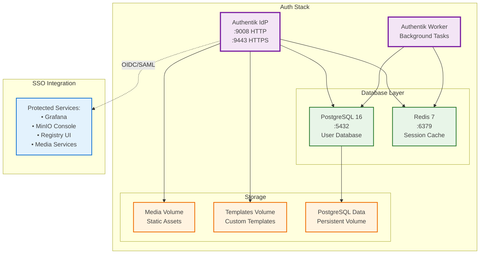

# Authentication Stack - Authentik IdP

**Purpose**: Unified identity provider with SSO capabilities



## Key Features

- OAuth2, SAML, LDAP protocol support
- User management and group-based access control
- Custom branding and templates
- Background task processing

## Services

- `postgresql`: Primary database for user data
- `redis`: Session cache and task queue
- `server`: Main Authentik web application
- `worker`: Background task processor

## Configuration

See [`auth/docker-compose.yaml`](../../auth/docker-compose.yaml) for the complete configuration.

For detailed setup and configuration instructions, see the [Authentik Setup Guide](../guides/authentik-setup.md).

## Secret Management

This stack uses SOPS for managing sensitive configuration. See the [SOPS Configuration Guide](../configuration/sops.md) for:

- Encrypting/decrypting `.secrets.env` files
- AGE key management
- Best practices for secret handling

## Management

```bash
# From the auth/ directory
docker-compose up -d        # Start authentication stack
docker-compose down         # Stop authentication stack
docker-compose logs -f      # View logs
```

## Access Points

- **Admin Interface**: https://auth.yourdomain.com (or http://localhost:9008)
- **User Portal**: https://auth.yourdomain.com/if/user/

## Related Documentation

- **[Complete Setup Guide](../guides/authentik-setup.md)** - Detailed configuration instructions
- **[SOPS Configuration](../configuration/sops.md)** - Secret management guide
- **[Traefik Integration](traefik.md)** - Reverse proxy configuration