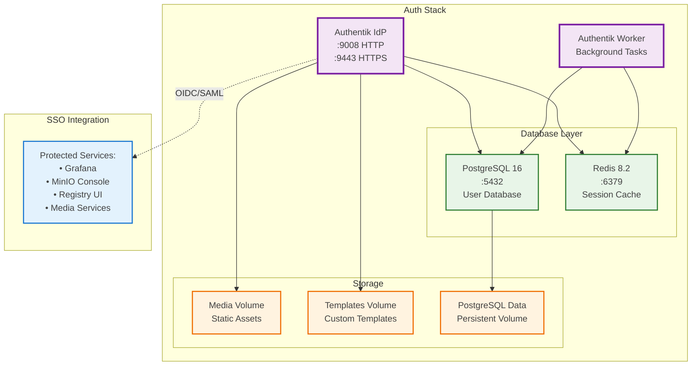

# Authentication Stack - Authentik IdP

**Purpose**: Unified identity provider with SSO capabilities


```mermaid
graph TB
    subgraph "Auth Stack"
        Authentik[Authentik IdP<br/>:9008 HTTP<br/>:9443 HTTPS]
        Worker[Authentik Worker<br/>Background Tasks]

        subgraph "Database Layer"
            PostgreSQL[PostgreSQL 16<br/>:5432<br/>User Database]
            Redis[Redis 8.2<br/>:6379<br/>Session Cache]
        end

        subgraph "Storage"
            Media[Media Volume<br/>Static Assets]
            Templates[Templates Volume<br/>Custom Templates]
            PGData[PostgreSQL Data<br/>Persistent Volume]
        end
    end

    subgraph "SSO Integration"
        Services["`Protected Services:
        • Grafana
        • MinIO Console
        • Registry UI
        • Media Services`"]
    end

    Authentik --> PostgreSQL
    Authentik --> Redis
    Worker --> PostgreSQL
    Worker --> Redis
    Authentik --> Media
    Authentik --> Templates
    PostgreSQL --> PGData

    Authentik -.->|OIDC/SAML| Services

    classDef auth fill:#f3e5f5,stroke:#7b1fa2,stroke-width:3px,color:#424242
    classDef database fill:#e8f5e8,stroke:#2e7d32,stroke-width:2px,color:#424242
    classDef storage fill:#fff3e0,stroke:#ef6c00,stroke-width:2px,color:#424242
    classDef services fill:#e3f2fd,stroke:#1976d2,stroke-width:2px,color:#424242

    class Authentik,Worker auth
    class PostgreSQL,Redis database
    class Media,Templates,PGData storage
    class Services services
```

## Key Features

- OAuth2, SAML, LDAP protocol support
- User management and group-based access control
- Custom branding and templates
- Background task processing

## Services

- `auth-db`: PostgreSQL database for user data
- `auth-redis`: Redis 8.2 session cache and task queue
- `auth-server`: Main Authentik web application
- `auth-worker`: Background task processor

## Configuration

See [`services/auth.yaml`](../../services/auth.yaml) for the complete configuration.

For detailed setup and configuration instructions, see the [Authentik Setup Guide](../guides/authentik-setup.md).

## Secret Management

This stack uses SOPS for managing sensitive configuration. Secrets are stored as `secrets/*.env.enc` files and decrypted at deploy time. See the [SOPS Configuration Guide](../configuration/sops.md) for:

- Encrypting/decrypting `secrets/*.env.enc` files
- AGE key management
- Best practices for secret handling

## Management

```bash
# Start/stop authentication stack
task up                             # Start all services (includes auth)
podman compose up -d auth-server    # Start auth server only
podman compose down auth-server     # Stop auth server

# View logs
task logs SERVICE=auth-server       # Follow auth server logs
podman logs auth-server             # View auth server container logs
podman logs auth-worker             # View auth worker container logs
```

## Access Points

- **Admin Interface**: <https://auth.yourdomain.com> (or <http://localhost:9008>)
- **User Portal**: <https://auth.yourdomain.com/if/user/>

## Related Documentation

- **[Complete Setup Guide](../guides/authentik-setup.md)** - Detailed configuration instructions
- **[SOPS Configuration](../configuration/sops.md)** - Secret management guide
- **[Traefik Integration](traefik.md)** - Reverse proxy configuration
