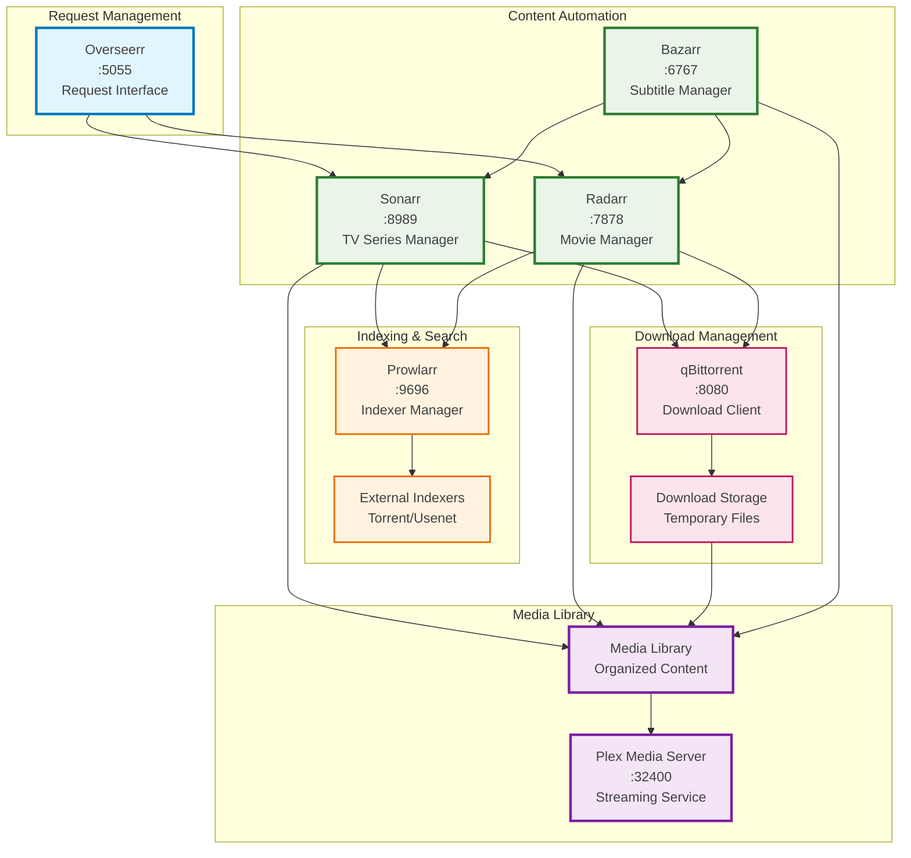

# Media Stack - Plex Automation

**Purpose**: Complete media server with automated content management



## Key Features

- Complete media automation pipeline
- Request management with approval workflows
- Multiple content source integration
- Automated subtitle management

## Services

- `plex`: Media server and streaming platform
- `sonarr`: TV series management and automation
- `radarr`: Movie management and automation
- `prowlarr`: Indexer and search management
- `qbittorrent`: Download client for torrents
- `overseerr`: User request management interface
- `bazarr`: Subtitle download and management

## Configuration

See [`mediaserver/docker-compose.yaml`](../../mediaserver/docker-compose.yaml) for the complete configuration.

## Management

```bash
# From the mediaserver/ directory
docker-compose up -d        # Start media stack
docker-compose down         # Stop media stack
docker-compose logs -f      # View logs
```

## Access Points

- **Plex**: <http://localhost:32400>
- **Sonarr**: <http://localhost:8989>
- **Radarr**: <http://localhost:7878>
- **Prowlarr**: <http://localhost:9696>
- **qBittorrent**: <http://localhost:8080>
- **Overseerr**: <http://localhost:5055>
- **Bazarr**: <http://localhost:6767>
