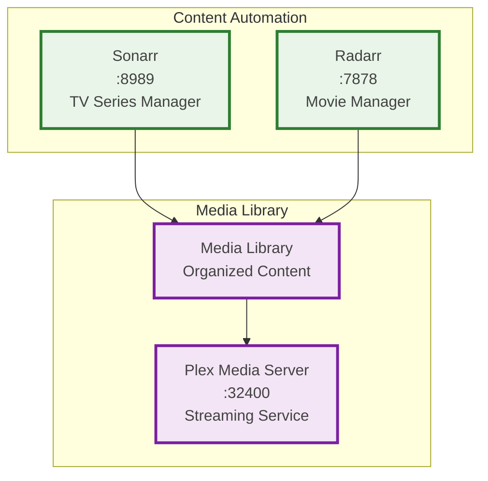

# Media Stack - Plex Automation

**Purpose**: Media server with automated content management


```mermaid
graph TB
    subgraph "Content Automation"
        Sonarr[Sonarr<br/>:8989<br/>TV Series Manager]
        Radarr[Radarr<br/>:7878<br/>Movie Manager]
    end

    subgraph "Media Library"
        Plex[Plex Media Server<br/>:32400<br/>Streaming Service]
        Library[Media Library<br/>Organized Content]
    end

    Sonarr --> Library
    Radarr --> Library

    Library --> Plex

    classDef automation fill:#e8f5e8,stroke:#2e7d32,stroke-width:3px,color:#424242
    classDef media fill:#f3e5f5,stroke:#7b1fa2,stroke-width:3px,color:#424242

    class Sonarr,Radarr automation
    class Plex,Library media
```

## Key Features

- Media streaming via Plex
- Automated TV series management with Sonarr
- Automated movie management with Radarr

## Services

- `plex`: Media server and streaming platform
- `sonarr`: TV series management and automation
- `radarr`: Movie management and automation

## Configuration

See [`services/mediaserver.yaml`](../../services/mediaserver.yaml) for the complete configuration.

## Management

```bash
# Start/stop media stack
task up                             # Start all services (includes media)
podman compose up -d plex           # Start Plex only
podman compose down plex            # Stop Plex

# View logs
task logs SERVICE=plex              # Follow Plex logs
task logs SERVICE=sonarr            # Follow Sonarr logs
task logs SERVICE=radarr            # Follow Radarr logs
podman logs plex                    # View Plex container logs
```

## Access Points

- **Plex**: <http://localhost:32400>
- **Sonarr**: <http://localhost:8989>
- **Radarr**: <http://localhost:7878>
