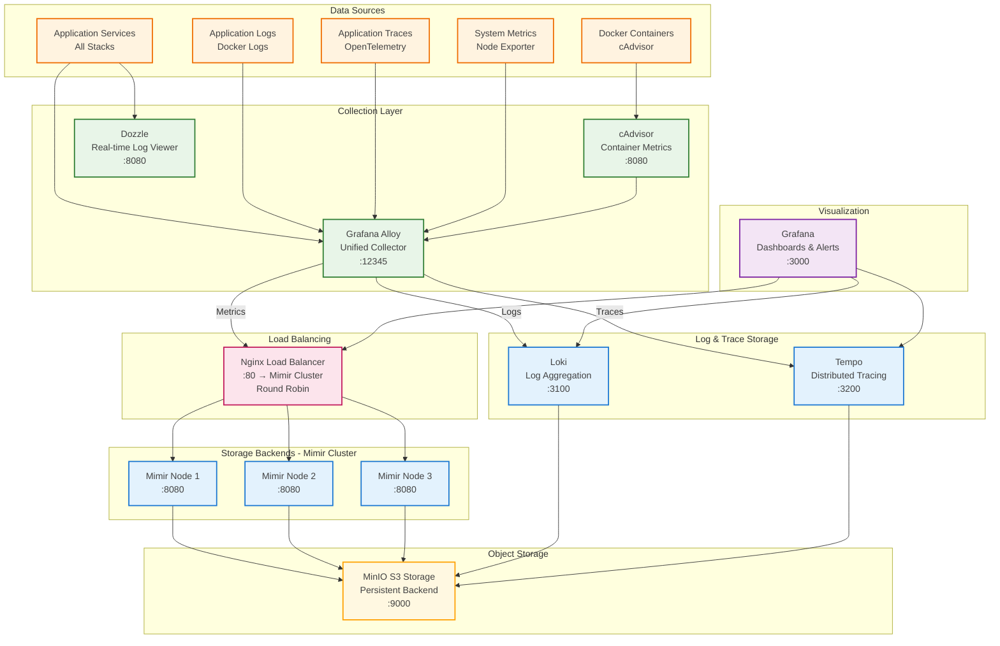

# Monitoring Stack - Observability Platform

**Purpose**: Complete observability with metrics, logs, and traces



## Key Features

- Grafana LGTM stack (Loki, Grafana, Tempo, Mimir)
- High-availability Mimir cluster with load balancing
- Unified data collection via Alloy
- Container metrics collection with cAdvisor
- Real-time log viewing with Dozzle

## Services

- `mimir-1/2/3`: 3-node Mimir cluster for metrics
- `mimir-lb`: Nginx load balancer for cluster
- `grafana`: Visualization and dashboards
- `loki`: Log aggregation and querying
- `tempo`: Distributed tracing
- `alloy`: Unified observability collector
- `cadvisor`: Container metrics collection
- `dozzle`: Real-time log viewer

## Configuration

See [`monitoring/docker-compose.yaml`](../../monitoring/docker-compose.yaml) for the complete configuration.

## Management

```bash
# From the monitoring/ directory
docker-compose up -d        # Start monitoring stack
docker-compose down         # Stop monitoring stack
docker-compose logs -f      # View all monitoring logs

# View specific service logs
docker-compose logs -f mimir
docker-compose logs -f grafana
docker-compose logs -f loki
docker-compose logs -f tempo
```

## Access Points

- **Grafana**: <http://localhost:3000> (admin/admin)
- **Mimir**: <http://localhost:9009> (metrics storage)
- **Tempo**: <http://localhost:3200> (tracing)
- **Loki**: <http://localhost:3100> (logs)
- **Alloy**: <http://localhost:12345> (Grafana Alloy UI)

## Sample Queries

### Mimir (PromQL)

```bash
# Request rate by method
rate(zot_http_requests_total[5m])

# 99th percentile latency
histogram_quantile(0.99, rate(zot_http_request_duration_seconds_bucket[5m]))

# Container CPU usage
rate(container_cpu_usage_seconds_total{container_name="registry"}[5m])
```

### Loki (LogQL)

```bash
# View all Docker container logs
{job="docker_logs"}

# View logs from the registry container
{container="registry"}

# Filter registry logs by level
{container="registry"} |= "level=error"
```
