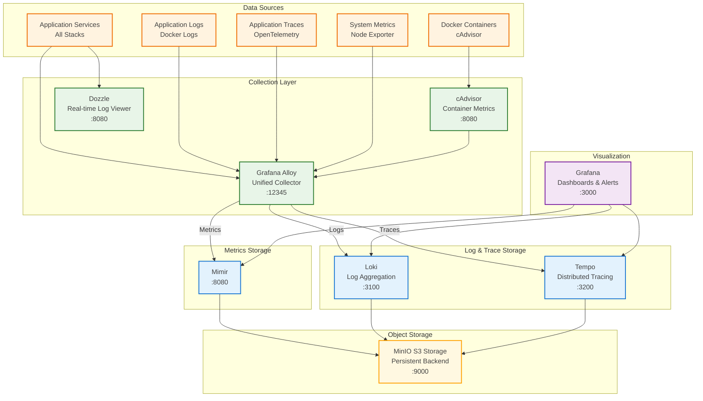

# Monitoring Stack - Observability Platform

**Purpose**: Complete observability with metrics, logs, and traces


```mermaid
graph TB
    subgraph "Data Sources"
        Apps[Application Services<br/>All Stacks]
        Containers[Docker Containers<br/>cAdvisor]
        Logs[Application Logs<br/>Docker Logs]
        Traces[Application Traces<br/>OpenTelemetry]
        Metrics[System Metrics<br/>Node Exporter]
    end

    subgraph "Collection Layer"
        Alloy[Grafana Alloy<br/>Unified Collector<br/>:12345]
        cAdvisor[cAdvisor<br/>Container Metrics<br/>:8080]
        Dozzle[Dozzle<br/>Real-time Log Viewer<br/>:8080]
    end

    subgraph "Metrics Storage"
        Mimir1[Mimir<br/>:8080]
    end

    subgraph "Log & Trace Storage"
        Loki[Loki<br/>Log Aggregation<br/>:3100]
        Tempo[Tempo<br/>Distributed Tracing<br/>:3200]
    end

    subgraph "Visualization"
        Grafana[Grafana<br/>Dashboards & Alerts<br/>:3000]
    end

    subgraph "Object Storage"
        MinIO[MinIO S3 Storage<br/>Persistent Backend<br/>:9000]
    end

    Apps --> Alloy
    Containers --> cAdvisor
    Logs --> Alloy
    Traces --> Alloy
    Metrics --> Alloy
    Apps --> Dozzle

    Alloy -->|Metrics| Mimir1
    Alloy -->|Logs| Loki
    Alloy -->|Traces| Tempo
    cAdvisor --> Alloy

    Mimir1 --> MinIO
    Loki --> MinIO
    Tempo --> MinIO

    Grafana --> Mimir1
    Grafana --> Loki
    Grafana --> Tempo

    classDef source fill:#fff3e0,stroke:#ef6c00,stroke-width:2px,color:#424242
    classDef collector fill:#e8f5e8,stroke:#2e7d32,stroke-width:2px,color:#424242
    classDef storage fill:#e3f2fd,stroke:#1976d2,stroke-width:2px,color:#424242
    classDef visualization fill:#f3e5f5,stroke:#7b1fa2,stroke-width:2px,color:#424242
    classDef backend fill:#fff8e1,stroke:#ffa000,stroke-width:2px,color:#424242

    class Apps,Containers,Logs,Traces,Metrics source
    class Alloy,cAdvisor,Dozzle collector
    class Mimir1,Loki,Tempo storage
    class Grafana visualization
    class MinIO backend
```

## Key Features

- Grafana LGTM stack (Loki, Grafana, Tempo, Mimir)
- Single-node Mimir instance for metrics storage
- Unified data collection via Alloy
- Container metrics collection with cAdvisor
- Real-time log viewing with Dozzle

## Services

- `mimir-1`: Single-node Mimir instance for metrics
- `grafana`: Visualization and dashboards
- `loki`: Log aggregation and querying
- `tempo`: Distributed tracing
- `alloy`: Unified observability collector
- `cadvisor`: Container metrics collection
- `dozzle`: Real-time log viewer

## Configuration

See [`services/monitoring.yaml`](../../services/monitoring.yaml) for the complete configuration.

## Management

```bash
# Start/stop monitoring stack
task up                             # Start all services (includes monitoring)
podman compose up -d grafana        # Start Grafana only
podman compose down grafana         # Stop Grafana

# View logs
task logs SERVICE=grafana           # Follow Grafana logs
task logs SERVICE=mimir-1           # Follow Mimir logs
task logs SERVICE=loki              # Follow Loki logs
task logs SERVICE=tempo             # Follow Tempo logs
podman logs grafana                 # View Grafana container logs
```

## Access Points

- **Grafana**: <http://localhost:3000> (admin/admin)
- **Mimir**: <http://localhost:9009> (metrics storage)
- **Tempo**: <http://localhost:3200> (tracing)
- **Loki**: <http://localhost:3100> (logs)
- **Alloy**: <http://localhost:12345> (Grafana Alloy UI)

## Sample Queries

### Mimir (PromQL)

```bash
# Request rate by method
rate(zot_http_requests_total[5m])

# 99th percentile latency
histogram_quantile(0.99, rate(zot_http_request_duration_seconds_bucket[5m]))

# Container CPU usage
rate(container_cpu_usage_seconds_total{container_name="registry"}[5m])
```

### Loki (LogQL)

```bash
# View all Docker container logs
{job="docker_logs"}

# View logs from the registry container
{container="registry"}

# Filter registry logs by level
{container="registry"} |= "level=error"
```
