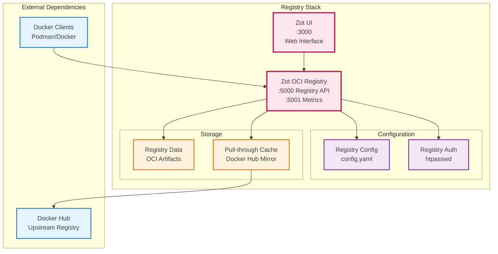

# Registry Stack - Zot OCI Registry

**Purpose**: OCI-compliant container registry with pull-through caching



## Key Features

- OCI Distribution Specification compliance
- Pull-through caching for improved performance
- Web UI for registry management
- Vulnerability scanning and image signing support

## Services

- `registry`: Main Zot registry server

## Configuration

See [`zot/docker-compose.yaml`](../../zot/docker-compose.yaml) for the complete configuration.

For OIDC authentication setup with Authentik, see the [Zot OIDC Configuration Guide](../configuration/zot-oidc.md).

## Registry Prefixes

Zot uses prefix-based routing for different registries:

- `/docker/` - Docker Hub images
- `/ghcr/` - GitHub Container Registry images
- `/gcr/` - Google Container Registry images
- `/quay/` - Quay.io images
- `/k8s/` - Kubernetes registry images

## Usage Examples

```bash
# Docker Hub images
docker pull localhost:5000/docker/nginx:latest

# GitHub Container Registry
docker pull localhost:5000/ghcr/project-zot/zot-linux-amd64:v2.1.5

# Google Container Registry
docker pull localhost:5000/gcr/cadvisor/cadvisor:v0.52.0
```

## Management

```bash
# From the zot/ directory
docker-compose up -d        # Start Zot registry
docker-compose down         # Stop Zot registry
docker-compose logs -f      # View Zot logs

# Registry API commands
curl http://localhost:5000/v2/_catalog                    # List all repositories
curl http://localhost:5000/v2/docker/nginx/tags/list      # List tags for a repository
```

## Access Points

- **Registry API (local)**: http://localhost:5000/v2/ (no auth)
- **Registry API (external)**: https://registry.yourdomain.com/v2/ (auth via Traefik/Authentik)
- **Web UI**: http://localhost:5000/home
- **Metrics**: http://localhost:5000/metrics