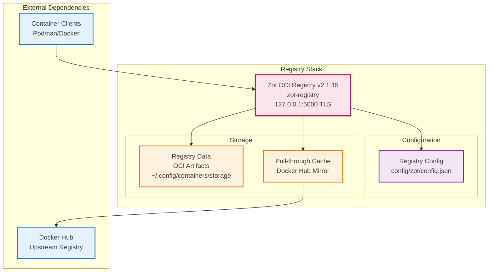

# Registry Stack - Zot OCI Registry

**Purpose**: OCI-compliant container registry with pull-through caching


```mermaid
graph TB
    subgraph "Registry Stack"
        Zot[Zot OCI Registry v2.1.15<br/>zot-registry<br/>127.0.0.1:5000 TLS]

        subgraph "Configuration"
            Config[Registry Config<br/>config/zot/config.json]
        end

        subgraph "Storage"
            RegData[Registry Data<br/>OCI Artifacts<br/>~/.config/containers/storage]
            Cache[Pull-through Cache<br/>Docker Hub Mirror]
        end
    end

    subgraph "External Dependencies"
        DockerHub[Docker Hub<br/>Upstream Registry]
        Clients[Container Clients<br/>Podman/Docker]
    end

    Zot --> Config
    Zot --> RegData
    Zot --> Cache

    Cache --> DockerHub
    Clients --> Zot

    classDef registry fill:#fce4ec,stroke:#c2185b,stroke-width:3px,color:#424242
    classDef config fill:#f3e5f5,stroke:#7b1fa2,stroke-width:2px,color:#424242
    classDef storage fill:#fff3e0,stroke:#ef6c00,stroke-width:2px,color:#424242
    classDef external fill:#e3f2fd,stroke:#1976d2,stroke-width:2px,color:#424242

    class Zot registry
    class Config config
    class RegData,Cache storage
    class DockerHub,Clients external
```

## Key Features

- OCI Distribution Specification compliance
- Pull-through caching for improved performance
- Built-in web UI for registry management
- TLS-enabled with cfssl certificates
- Vulnerability scanning and image signing support

## Services

- `zot-registry`: Main Zot registry server (v2.1.15)

## Configuration

See [`services/registry.yaml`](../../services/registry.yaml) for the complete configuration.

Registry configuration is stored in `config/zot/config.json`.

For OIDC authentication setup with Authentik, see the [Zot OIDC Configuration Guide](../configuration/zot-oidc.md).

## Registry Prefixes

Zot uses prefix-based routing for different registries:

- `/docker/` - Docker Hub images
- `/ghcr/` - GitHub Container Registry images
- `/gcr/` - Google Container Registry images
- `/quay/` - Quay.io images
- `/k8s/` - Kubernetes registry images

## Usage Examples

```bash
# Docker Hub images
podman pull 127.0.0.1:5000/docker/nginx:latest

# GitHub Container Registry
podman pull 127.0.0.1:5000/ghcr/project-zot/zot-linux-amd64:v2.1.15

# Google Container Registry
podman pull 127.0.0.1:5000/gcr/cadvisor/cadvisor:v0.52.0
```

## Management

```bash
# Start/stop Zot registry
task up                             # Start all services (includes registry)
podman compose up -d zot-registry   # Start Zot only
podman compose down zot-registry    # Stop Zot

# View logs
task logs SERVICE=zot               # Follow Zot logs
podman logs zot-registry            # View Zot container logs

# List repositories
task registry:list

# Registry API commands (TLS)
curl -sk https://127.0.0.1:5000/v2/_catalog                    # List all repositories
curl -sk https://127.0.0.1:5000/v2/docker/nginx/tags/list      # List tags for a repository
```

## Access Points

- **Registry API (local)**: <https://127.0.0.1:5000/v2/> (TLS)
- **Registry API (external)**: <https://registry.yourdomain.com/v2/> (auth via Traefik/Authentik)
- **Web UI**: <https://127.0.0.1:5000/home>
- **Metrics**: <https://127.0.0.1:5000/metrics>
