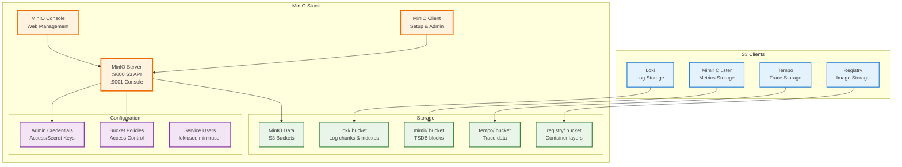

# MinIO Object Storage Stack

This document covers the MinIO object storage configuration that provides S3-compatible storage for various services in the infrastructure.

## Overview

MinIO is configured as a single-node deployment with:

- S3-compatible API endpoint accessible at `https://api.minio.smigula.io`
- Web console accessible at `https://minio.smigula.io`
- Storage persisted at `/mnt/data/minio` on the host
- Integration with Traefik for TLS termination and routing
- Prometheus metrics enabled for monitoring

## Architecture



## Services Using MinIO

Currently configured to provide object storage for:

- **Loki**: Log aggregation and storage
- **Mimir**: Prometheus long-term metrics storage
- **Tempo**: Distributed tracing backend
- **Registry**: Docker registry storage backend (future)

## Quick Start

1. **Start MinIO**:

   ```bash
   docker compose up -d
   ```

2. **Verify MinIO is running**:

   ```bash
   docker compose ps
   docker logs minio
   ```

3. **Initial Setup** (automated via run.sh):

   The `run.sh` script automatically handles MinIO setup as part of the infrastructure deployment.

## Docker Compose Configuration

The [`minio/docker-compose.yaml`](../../minio/docker-compose.yaml) defines two services:

1. **minio**: The MinIO server

   - Runs on ports 9000 (API) and 9001 (Console)
   - Connected to the `monitoring` network for service integration
   - Health checks via `/minio/health/live` endpoint
   - Resource limits: 2 CPUs, 2GB memory

2. **mc**: MinIO Client (initialization container)

   - Automatically creates buckets and users on startup
   - Configures policies for service-specific access
   - Exits after initialization

## Network Configuration

MinIO is attached to the `monitoring` external network to allow communication with:

- Loki for log storage
- Grafana for data source queries
- Mimir for metrics storage
- Tempo for trace storage

## Storage Layout

```bash
/mnt/data/minio/
├── loki/          # Loki log chunks and indexes
├── mimir/         # Prometheus TSDB blocks
├── tempo/         # Trace data
├── registry/      # Docker registry layers (future)
└── backups/       # General backup storage
```

## Credentials and Access

### Root Credentials

- Username: `minioadmin`
- Password: Configured via environment variables (see `.env` files)

### Service Users

Each service has its own user with bucket-specific permissions:

| Service | Username  | Bucket | Policy       | Purpose                   |
| ------- | --------- | ------ | ------------ | ------------------------- |
| Loki    | lokiuser  | loki   | loki-policy  | Log chunk storage         |
| Mimir   | mimiruser | mimir  | mimir-policy | Metrics TSDB blocks       |
| Tempo   | tempouser | tempo  | tempo-policy | Distributed trace storage |

## External Access

MinIO is accessible through Traefik with automatic TLS certificates:

- **API Endpoint**: <https://api.minio.smigula.io>

  - Used by S3-compatible clients
  - CORS headers configured for browser access

- **Console**: <https://minio.smigula.io>

  - Web-based management interface
  - File browser and bucket management

## Monitoring

MinIO exposes Prometheus metrics on the API port at `/minio/v2/metrics/cluster`.

Integration with the monitoring stack:

```yaml
- job_name: 'minio'
  static_configs:
    - targets: ['minio:9000']
  metrics_path: '/minio/v2/metrics/cluster'
```

## Manual Administration

### Using mc (MinIO Client)

The `mc` command is available on the host system. Common operations:

```bash
# List buckets
mc ls local/

# List objects in a bucket
mc ls local/loki/

# Check disk usage
mc du local/

# Add a new user
mc admin user add local newuser newsecret

# Create and attach a policy
mc admin policy create local policy-name policy.json
mc admin policy attach local policy-name --user username

# Check server info
mc admin info local
```

### Policy Examples

Each service has a policy granting full access to its specific bucket:

```json
{
  "Version": "2012-10-17",
  "Statement": [
    {
      "Effect": "Allow",
      "Action": ["s3:*"],
      "Resource": [
        "arn:aws:s3:::bucketname",
        "arn:aws:s3:::bucketname/*"
      ]
    }
  ]
}
```

## Backup and Recovery

### Backup MinIO Data

```bash
# Using mc mirror
mc mirror --overwrite local/loki /backup/minio/loki

# Using rsync
rsync -av /mnt/data/minio/ /backup/minio/
```

### Restore from Backup

```bash
# Stop MinIO
docker compose down

# Restore data
rsync -av /backup/minio/ /mnt/data/minio/

# Start MinIO
docker compose up -d
```

## Troubleshooting

### Check MinIO Health

```bash
curl -f http://localhost:9000/minio/health/live
```

### View Logs

```bash
docker logs minio
docker logs minio-mc
```

### Common Issues

1. **Access Denied Errors**

   - Verify user has correct policy attached: `mc admin user info local username`
   - Check policy permissions: `mc admin policy info local policy-name`

2. **Connection Refused**

   - Ensure MinIO is on correct network: `docker inspect minio`
   - Verify service is healthy: `docker ps`

3. **DNS Resolution Issues**

   - Services must be on same Docker network
   - Use container name (minio) not localhost for inter-container communication

## Security Considerations

1. **Change default credentials** in production using environment variables or `.env` file
2. **Enable TLS** for MinIO API (currently handled by Traefik)
3. **Implement bucket lifecycle policies** for data retention
4. **Regular backups** of critical data
5. **Monitor access logs** for unauthorized access attempts

## Management Commands

```bash
# From the minio/ directory
docker-compose up -d        # Start MinIO
docker-compose down         # Stop MinIO
docker-compose logs -f      # View logs
docker-compose ps           # Check status
```

## Access Points

- **S3 API**: <http://localhost:9000> (local), <https://api.minio.smigula.io> (external)
- **Console**: <http://localhost:9001> (local), <https://minio.smigula.io> (external)
- **Health Check**: <http://localhost:9000/minio/health/live>
- **Metrics**: <http://localhost:9000/minio/v2/metrics/cluster>
