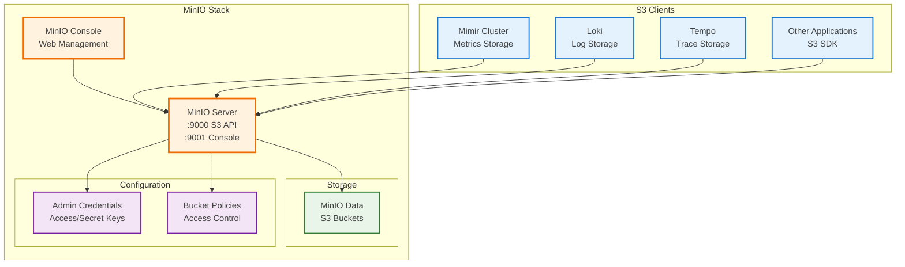

# Storage Stack - MinIO S3

**Purpose**: S3-compatible object storage for monitoring backends



## Key Features

- S3-compatible API for broad compatibility
- Web-based management console
- Automated bucket creation and policies
- Service user management

## Services

- `minio`: Main storage server
- `mc`: MinIO client for setup and administration

## Configuration

See [`storage/docker-compose.yaml`](../../storage/docker-compose.yaml) for the complete configuration.

## Management

```bash
# From the storage/ directory
docker-compose up -d        # Start MinIO
docker-compose down         # Stop MinIO
docker-compose logs -f      # View logs
```

## Access Points

- **S3 API**: http://localhost:9000
- **Console**: http://localhost:9001
- **Default Credentials**: Check environment variables in docker-compose.yaml