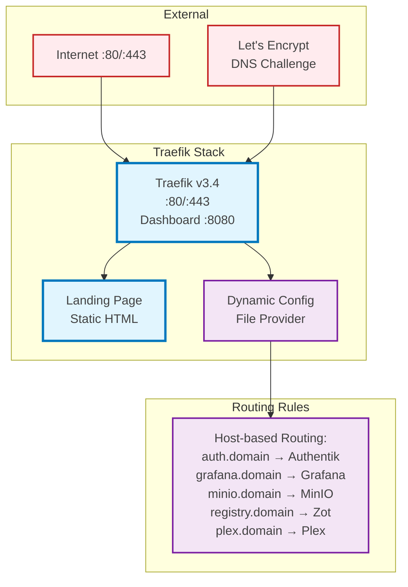

# Traefik Stack - Reverse Proxy

**Purpose**: Central ingress controller with automatic HTTPS and service discovery



## Key Features

- Automatic SSL certificate management via Let's Encrypt
- Host-based routing with middleware support
- Dashboard and metrics endpoints
- Docker label-based service discovery

## Services

- `traefik`: Main reverse proxy container
- `landing`: Static landing page with subdomain redirects

## Configuration

See [`traefik/docker-compose.yaml`](../../traefik/docker-compose.yaml) for the complete configuration.

For detailed Traefik setup and configuration, see the [Traefik Configuration Guide](../configuration/traefik.md).

## Management

```bash
# From the traefik/ directory
docker-compose up -d        # Start Traefik
docker-compose down         # Stop Traefik
docker-compose logs -f      # View logs
```

## Access Points

- **Dashboard**: http://localhost:8080
- **Main Routes**: Port 80/443 (automatic HTTPS redirect)
- **Metrics**: http://localhost:8082