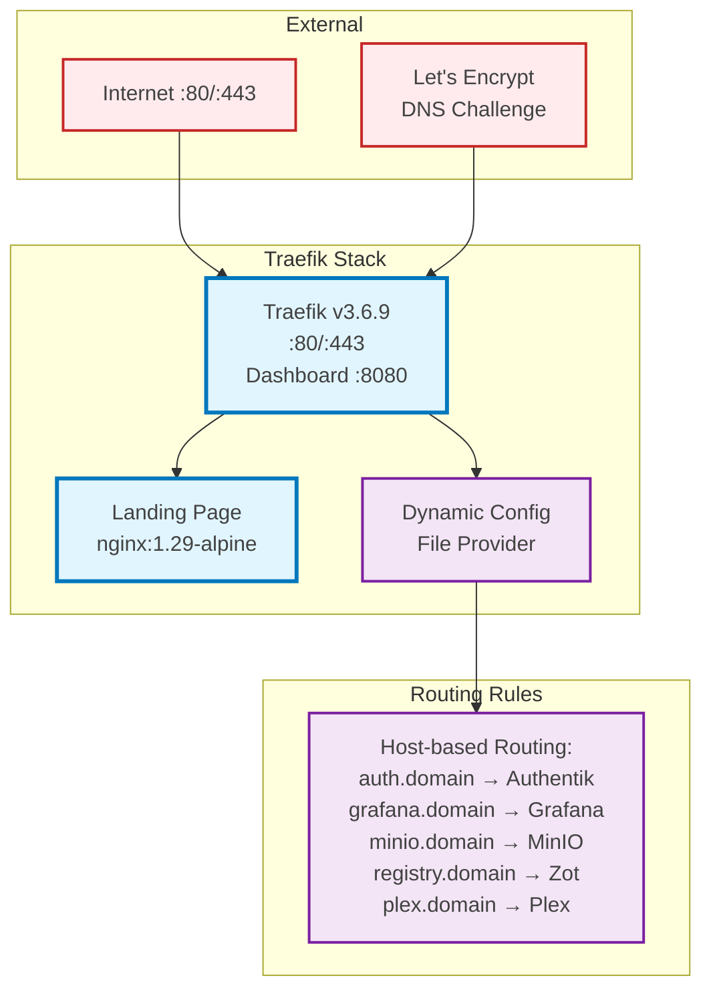

# Traefik Stack - Reverse Proxy

**Purpose**: Central ingress controller with automatic HTTPS and service discovery


```mermaid
graph TB
    subgraph "External"
        Internet[Internet :80/:443]
        LE[Let's Encrypt<br/>DNS Challenge]
    end

    subgraph "Traefik Stack"
        Traefik[Traefik v3.6.9<br/>:80/:443<br/>Dashboard :8080]
        Landing[Landing Page<br/>nginx:1.29-alpine]
        Config[Dynamic Config<br/>File Provider]
    end

    subgraph "Routing Rules"
        Rules["`Host-based Routing:
        auth.domain → Authentik
        grafana.domain → Grafana
        minio.domain → MinIO
        registry.domain → Zot
        plex.domain → Plex`"]
    end

    Internet --> Traefik
    LE --> Traefik
    Traefik --> Landing
    Traefik --> Config
    Config --> Rules

    classDef external fill:#ffebee,stroke:#c62828,stroke-width:2px,color:#424242
    classDef proxy fill:#e1f5fe,stroke:#0277bd,stroke-width:3px,color:#424242
    classDef config fill:#f3e5f5,stroke:#7b1fa2,stroke-width:2px,color:#424242

    class Internet,LE external
    class Traefik,Landing proxy
    class Config,Rules config
```

## Key Features

- Automatic SSL certificate management via Let's Encrypt
- Host-based routing with middleware support
- Dashboard and metrics endpoints
- Docker label-based service discovery

## Services

- `traefik`: Main reverse proxy container
- `landing`: Static landing page (nginx:1.29-alpine) with subdomain redirects

## Configuration

See [`services/traefik.yaml`](../../services/traefik.yaml) for the complete configuration.

For detailed Traefik setup and configuration, see the [Traefik Configuration Guide](../configuration/traefik.md).

## Management

```bash
# Start/stop Traefik
task up                             # Start all services (includes Traefik)
podman compose up -d traefik        # Start Traefik only
podman compose down traefik         # Stop Traefik

# View logs
task logs SERVICE=traefik           # Follow Traefik logs
podman logs traefik                 # View Traefik container logs
```

## Access Points

- **Dashboard**: <http://localhost:8080>
- **Main Routes**: Port 80/443 (automatic HTTPS redirect)
- **Metrics**: <http://localhost:8082>
